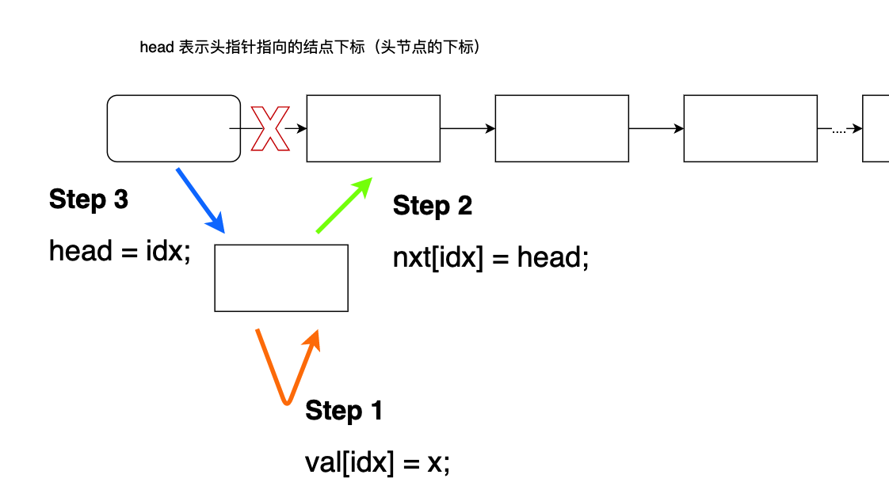

# 链表与邻接表

## 简介

方式有很多 

```c++
// 结构体模拟链表

Struct Node
{
	int val;
	Node *next
}

new Node()
```

上面这种不讲（new时间太慢），主要讲数组模拟链表

1. 单链表 ——邻接表
    + 存树
    + 存图
2. 双链表  前驱和后继


## Method

### 单链表

形象的理解Code，如下面这个插入头节点的做法：



```c++
// 在头节点位置插入一个节点
void insert_to_head(int x)
{
  val[idx] = x;
  nxt[idx] = head;
  head = idx;
  
  idx++;
}
```

### 双链表


## Code

### 单链表

```c++
/*
* val[x] 表示下标为x的结点的值
* nxt[x] 表示下标为x的结点的下一个结点
* head 表示头指针指向的结点下标（头节点的下标）
* idx 表示下一个且还未用的结点下标
*/
int val[N];
int nxt[N];
int head;
int idx;


// 初始化
void init()
{
  // -1 表示
  head = -1;
  idx = 0;
}

// 在头节点位置插入一个节点
void insert_to_head(int x)
{
  val[idx] = x;
  nxt[idx] = head;
  head = idx;
  
  idx++;
}


// 在k个节点后插入一个节点
void insert(int k, int x)
{
  val[idx] = x;
  nxt[idx] = nxt[k];
  nxt[k] = idx;
  
  idx++;
}

// 将下标为k的点的下一个结点删除
void remove(int k)
{
  nxt[k] = nxt[nxt[k]];
}


// 遍历
for (int i = head; i != -1; i = nxt[i]) cout << val[i] << " ";
```

### 双链表

```c++
/*
* pre 前驱
* nxt 后继
* val 值
* idx 未使用的第一个下标
*/
int pre[N], nxt[N], val[N], idx;


// 初始化
void init()
{
    pre[1] = 0;
    nxt[0] = 1;
    idx = 2;
}

// 在k的右边插入一个
void insert(int k, int x)
{
  val[idx] = x;
  
  pre[idx] = k;
  nxt[idx] = nxt[k];
  
  pre[nxt[k]] = idx;
  nxt[k] = idx;
  
  idx++;
}

// 删除k
void remove(int k)
{
  nxt[pre[k]] = nxt[k];
  pre[nxt[k]] = pre[k];
}

//  遍历
for (int i = nxt[0]; i != 1; i = nxt[i]) cout << val[i] << " ";

```

