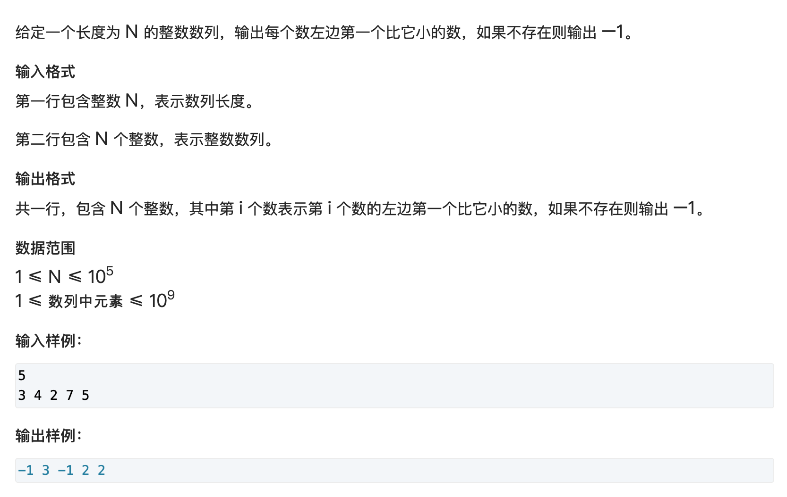
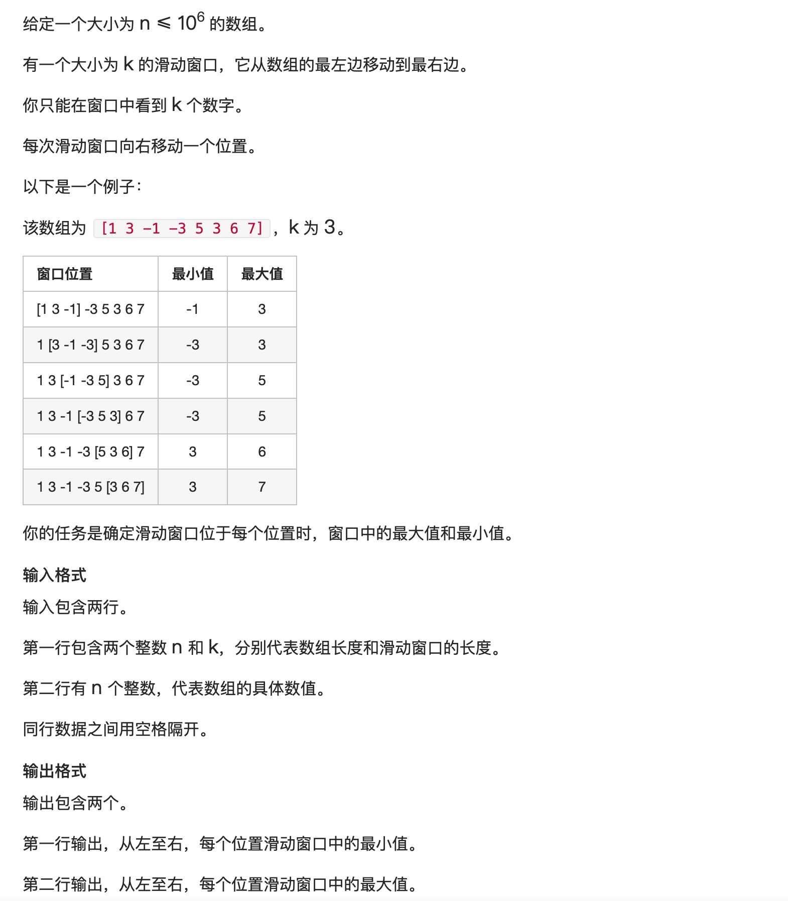
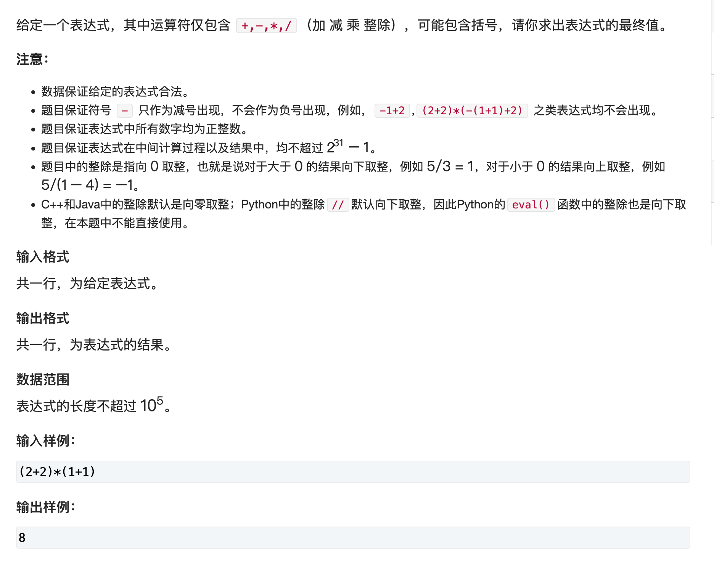

# 栈和队列


## 数组模拟

### 模拟栈

```c++
const int N = 1e5 + 10;

// 这里设计的栈顶指针表示目前最高位的下标，和408中讲的栈顶差一个（408中的栈顶表示当前最高位的下一个的下标）
int s[N], top_s;

// push
s[++top_s] = x;

// pop
top_s--;

// 判断为空
if (top_s > 0)   //not empty
else    //empty

// 栈顶
s[top_s];
```

### 模拟队列

```c++
const int N = 1e5 + 10;

int q[N], fron = 0, end = -1;

// push
s[++end] = x;

// pop
fron++;

// 判断为空
if (fron <= end)   //not empty
else    //empty

// 队首，队尾
s[fron];
s[end];
```


## 单调栈和单调队列

单调栈和单调队列涉及的题目类型很固定。有些时候还负责为其他算法做优化（多重背包...）

### 单调栈

#### 解决什么问题？

给定一个序列，在这个序列当中求**每一个数**距离它最近比它小（左）/大（右）的数是

#### Method

暴力

+ 第一层整个序列
+ 第二层从`i`向左，找到第一个比他小的数即可

再考虑优化

+ 如果一个栈，保存了`i`左边所有的数字。那么暴力正如上面所说的，弹出来找到合适的就可以了。
+ 那么有没有什么性质，可以不用弹出来这么多次，或者栈里面没有这么多没用的元素？
+ 如果$a_3 >= a_5$，那么$a_3$在下标为$5$的后面还会被使用吗？显然不会。那么所以这个序列就严格满足一种单调关系。

#### Code



```c++
#include <iostream>
#include <stack>

using namespace std;

const int N = 1e5 + 10;

stack<int> s;
int n;
int seq[N];

int main()
{
    cin >> n;

    for (int i = 0; i < n; i++)
    {
        cin >> seq[i];
    }

    for (int i = 0; i < n; i++)
    {
        while(!s.empty() && seq[i] <= s.top())
        {
            s.pop();
        }
        if (s.empty()) cout << -1 << " ";
        else cout << s.top() << " ";
        s.push(seq[i]);
    }

    return 0;
}
```

#### 时间复杂度

关注一下时间复杂度，可以看到的确是有两层循环。但是对于每一个元素，他最多只会进栈一次，出栈一次，所以时间复杂度一定是$O(2n)$的，也就是$O(n)$的。

### 单调队列

#### 解决什么问题？

最经典的就是 **滑动窗口**

给定一个序列，序列上一个固定大小的区间（窗口）自序列左端移动向右端，求这个区间内最大/最小的数。

#### Method

维护一个单调的队列来模拟滑动窗口（这句话并不严谨）。如果求窗口内最小值，那么一个数`x`如果需要进队列，且该数比它左边的数`y`都要小，那么我们可以肯定：`y`已经不被需要了。

单调栈和单调队列这点很像：

+ 首先，我队列中值一定是单调的
+ 其次，我队列中的下标也是单调的

##### 那单调队列和单调栈有什么不同？

很明显，单调队列前段要有开口，保证窗口容量满时要从前门出去。

但是，单调队列想要单调，一定也得有后门，因为不满足单调性的元素要从后面出去。这点和单调栈很相似。所以说，如果你想使用`STL`的队列，你需要使用`双端队列 dequeue`。

##### 不满足单调性的后门出，不满足容量的前门出，怎么判断容量？

判断容量无法使用队列中的元素个数和窗口容量对比，因为队列并不是和滑动窗口一模一样，窗口中有些元素早已经被弹出了（由于单调性问题）。所以队列中元素个数与窗口元素个数可以说是一点关系也没有。

那怎么判断什么时候一个元素需要前门出呢？要记录这个元素的下标，用它和当前遍历到的下标作差与窗口长度比大小就行了。

**也就是说，我们的队列里，还要存下标才行，那为什么不直接存下标呢？何乐而不为。**

##### 输出？

输出个数一定是 n - k + 1

输出队头，那就有讲究了。为什么一定输出队头呢，因为求`最大/最小`元素，对应的就是队列中`单调递减/单调递增`（为什么是这样的？），所以队头才是满足条件的。

#### Code



```c++
#include <iostream>
#include <queue>
#include <algorithm>

using namespace std;

const int N = 1e6 + 10;

int n, k;
int w[N];
deque<int> q;

int main()
{
    cin >> n >> k;

    for (int i = 0; i < n; i++)
        scanf("%d", &w[i]);

    for (int i = 0; i < n; i++)
    {
        if (!q.empty() && i - q.front() + 1 > k) q.pop_front();
        while (!q.empty() && w[q.back()] >= w[i]) q.pop_back();

        q.push_back(i);
        if (k <= i + 1) printf("%d ", w[q.front()]);
    }

    printf("\n");
    
    q.clear();
    for (int i = 0; i < n; i++)
    {
        if (!q.empty() && i - q.front() + 1 > k) q.pop_front();
        while (!q.empty() && w[q.back()] <= w[i]) q.pop_back();

        q.push_back(i);
        if (k <= i + 1) printf("%d ", w[q.front()]);
    }

    printf("\n");

    return 0;
}

```


## Correlation

### 栈

#### 表达式求值



##### Method

其实表达式求值涉及的东西挺多。这道题目是一个中序的表达式求值，可以使用栈来模仿递归的操作。

申请两个栈，一个专门存数字，一个专门存运算符。括号要进行特判。

###### 从前向后，对于每一个字符，考虑每一种可能：

+ 数字：数字有几位？全部压入数字栈。
+ 运算符：我这个运算符的优先级比运算符栈顶的优先级高吗
    + 如果是，一直做**计算**直到该条件不满足
    + 否则，压入运算符栈
+ 括号：特判，要是左括号，进栈然后下一位；要是右括号，一直做**计算**直到左括号。

所有都做完成后，最后再做一次**计算**输出结果就行

###### 那么计算函数怎么写呢？

就是把数字栈的后两个数取出来，然后取出一个运算符栈中的运算符做运算即可。

###### 计算函数从后向前取值做运算，可能吗？

的确，对于同级运算符，从左向右算才是正确答案。$1-5+4$要是先算$5+4$​那可是就错误了。但是为什么这里能这样做，因为这句话==我这个运算符的优先级比运算符栈顶的优先级高吗？如果是，一直做计算直到该条件不满足==，它保证了只要入栈：栈内的运算符顺序**一定是**是从后向前保持降低的。

###### 括号里面的运算怎么保证正确？

初步看下来，困惑确实应该很多，但是要是结合代码看一下应该会好。

现在有一个运算$(2*3+5)$，它真的能算对吗？要理解两点：

+ 即便是括号里面的运算，由于左括号不起任何作用，所以它里面的运算符也会像其他运算符那样符合规则，包括但不限于运算符顺序一定是是从后向前保持降低的。
+ 括号里面的第一个运算符，`*`也会匹配前面的`(`来比较优先级的问题，那么所以要做一个特判栈顶不是左括号即可。

看代码：

##### Code

```c++
#include <iostream>
#include <stack>
#include <cstring>
#include <map>

using namespace std;

const int N = 1e5 + 10;

stack<char> op;
stack<int> num;
string exp;
map<char, int> m = {{'+', 1}, {'-', 1}, {'*', 2}, {'/', 2}};

void eval()
{
    int b = num.top();
    num.pop();
    int a = num.top();
    num.pop();
    char c = op.top();
    op.pop();

    if (c == '+') num.push(a + b);
    else if (c == '-') num.push(a - b);
    else if (c == '*') num.push(a * b);
    else if (c == '/') num.push(a / b);
}

int main()
{
    cin >> exp;

    int len = exp.length();

    for (int i = 0; i < len; i++) {
        if (isdigit(exp[i]))
        {
            int x = 0;
            int j;
            for (j = i; j <= len && isdigit(exp[j]); j++)
            {
                x = x * 10 + (exp[j] - '0');
            }
            i = j - 1;
            num.push(x);
        }
        else if (exp[i] == '(')
        {
            op.push(exp[i]);
        }
        else if (exp[i] == ')')
        {
            while (op.top() != '(') eval();
            op.pop();
        }
        else
        {
            while (!op.empty() && op.top()!='(' && m[op.top()] >= m[exp[i]])
                eval();
            op.push(exp[i]);
        }
    }

    while (!op.empty()) eval();
    cout << num.top() << "\n";

    return 0;
}
```


### 队列


