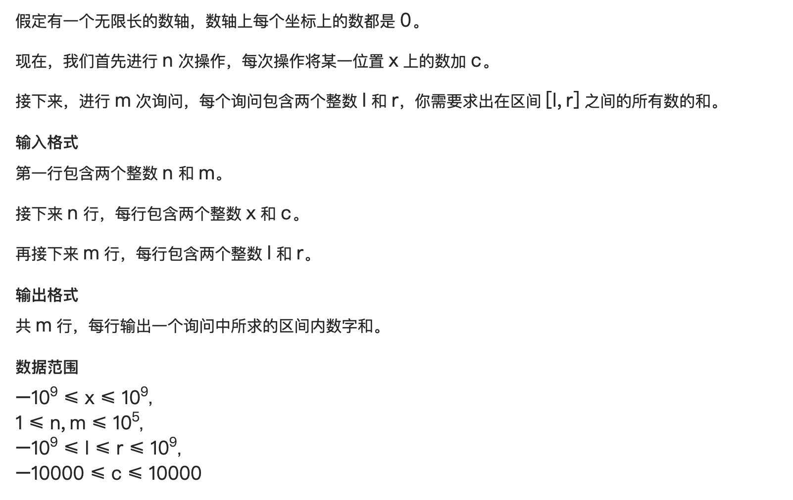

# 离散化

## 简介

离散化本质上可以看成是一种 [哈希](https://oi-wiki.org/string/hash/)，其保证数据在哈希以后仍然保持原来的全/偏序关系。

通俗地讲就是当有些数据因为本身很大或者类型不支持，自身无法作为数组的下标来方便地处理，而影响最终结果的只有元素之间的相对大小关系时，我们可以将原来的数据按照从大到小编号来处理问题，即离散化。

用来离散化的可以是大整数、浮点数、字符串等等。

## Method

所谓离散化，就是将值进行**映射**
如：    1 5 60 300
映射：  0 1  2  3

现在有两个问题需要解决：

1. 有元素是重复的，需要去重；  
1. 已知x，如何算出离散化后的值（二分）

**离散化的典型应用就是：值域跨度很大，但是用到的数字很少。看看数据范围，n超级大10^9，但是m可能很小**

## Code

```c++
// 模板
  vector <int> v;
  sort(v.begin, b.end)  // 先排序
  // unique函数可以将vector的相邻重复的元素，全部移到vector的最后，然后返回去重后的序列尾部。然后再用erase把重复部分直接删除完成去重。
  v.erase(unique(v.begin, v.end), v.end)
  // 二分也就是离散化
  int find(int x)
  {
       int l = 0, r = v.size() - 1;
       while(l < r)
       {
           int mid = (l + r) >> 1;
           if (v[mid] >= x) r = mid;
           else l = mid + 1;
       }
       return r + 1; // 从1开始映射要r + 1，一般都是映射到1比较多用，因为有时候结合前缀和把0空出来了
```

## Correlation



```c++
#include <iostream>
#include <vector>
#include <algorithm>

using namespace std;

const int N = 1e5 + 10;
const int M = 1e5 + 10;
const int NUM = 2 * N + M;

typedef pair<int, int> PII;


int n, m;
vector<int> v;
vector<PII> add;
vector<PII> query;
int a[NUM];
int prefix_sum[NUM];

int find(int x)
{
    int l = 0, r = v.size() - 1;
    int mid;

    while (l < r) {
        mid = (l + r) >> 1;
        if (v[mid] >= x) r = mid;
        else l = mid + 1;
    }

    return r + 1;
}

int main()
{
    scanf("%d%d", &n, &m);
    for (int i = 0; i < n; i++) {
        int x, c;
        scanf("%d%d", &x, &c);

        add.emplace_back(x, c);
        v.emplace_back(x);
    }
    for (int i = 0; i < m; i++) {
        int l, r;
        scanf("%d%d", &l, &r);

        v.emplace_back(l);
        v.emplace_back(r);
        query.emplace_back(l, r);
    }

    sort(v.begin(), v.end());
    v.erase(unique(v.begin(), v.end()), v.end());

    for (auto item: add)
        a[find(item.first)] += item.second;

    for (auto i = 1; i <= v.size(); i++)
        prefix_sum[i] += prefix_sum[i - 1] + a[i];

    for (auto item: query) {
        printf("%d\n", prefix_sum[find(item.second)] - prefix_sum[find(item.first) - 1]);
    }
    return 0;
}
```

