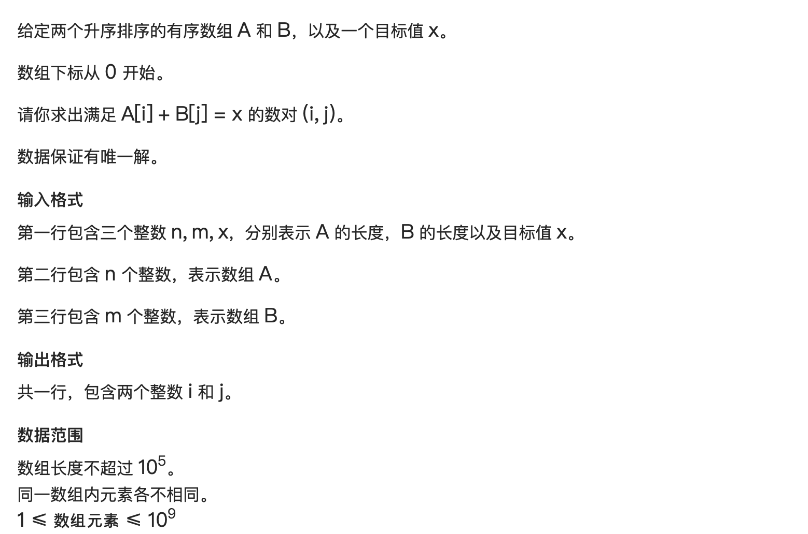
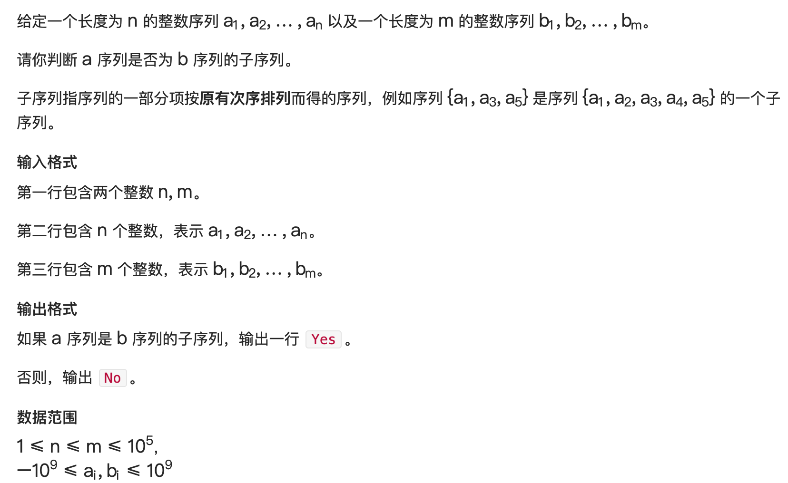

# 双指针算法

## 简介

双指针是一种简单而又灵活的技巧和思想，单独使用可以轻松解决一些特定问题，和其他算法结合也能发挥多样的用处。

双指针顾名思义，就是同时使用两个指针，在序列、链表结构上指向的是位置，在树、图结构中指向的是节点，通过或同向移动，或相向移动来维护、统计信息。

## Method & Code

 双指针算法经常被忽视，其实它是一种很好的优化算法

 双指针的模板都是：
 ```c++
 for (int i = 0; i < n; i++)
 {
     while (j < i && check(i, j)) j++

     //处理
 }
 ```
 那么双指针的核心是什么呢？ 其实就是做优化
 一般的，我们两个指针进行单序列的两层循环时间复杂度都是o(n^2)的
 而双指针基本可以达到o(n)同级的

 双指针算法，见到题目先想暴力，再进行优化。例如：
 给定一个长度为 n 的整数序列，请找出最长的不包含重复的数的连续区间，输出它的长度。
 那么先说暴力：

 ```c++
 for (int i = 0; i < n; i++)
 {
     for (int j = 0; j <= i; j++)
     {
         if (check(j, i))
             res = max(res, j - i + 1)
     }
 }
 ```

 显然暴力是$O(n^2)$的
 怎么做优化？显然需要找到两个指针间的关系，然后砍掉一维循环。
 怎么找关系，这就要根据题目的序列来看了。
 这道题中，我们看暴力做法中的`i`和`j`的关系：
 ------j-----i-----
 当前我们找到了这样一个位置，他是我们从头开始找到的最长的区间了。
 那么下一步我们i向右移动，请问这时候j是不是一定只能向右动？
 答案是肯定的，因为如果j还可以向左动，那么在这一步的区间就一定不是最大的，矛盾
 所以我们可以看到，两个指针满足都单调的关系，只能前进不能后退。
 看优化：

 ```c++
 for (int i = 0; i < n; i++)
 {
     while (j < i && check(i, j)) j++

      res = max(res, j - i + 1)
 }
 ```
 但是就本题而言，其实还有个地方非常棘手啊，就是这个check函数
 这个check函数本质上就是想确定该区间没有重复元素，那要是遍历区间，时间复杂度立马上来了
 我们这样想：
 我维护的区间已经是最大的区间了，也就是里面没有重复元素了，那么新来了一个就有重复，
 那么就是新来的问题了。那判定重复就简单了啊，我只要看新来的值有没有多的。
 直接使用一个标记数组就行了`sign[q[i]++] > 1` ?

最后：

```c++
#include <iostream>

using namespace std;

const int N = 1e5 + 10;
int n;
int res;
int q[N], s[N];

int main()
{
    scanf("%d", &n);
    for (int i = 0; i < n; i++) scanf("%d", &q[i]);

    int j = 0;
    for (int i = 0; i < n; i++)
    {
        s[q[i]]++;
        while (j < i && s[q[i]] > 1)
        {
            s[q[j]]--;
            j++;
        }

        res = max(res, i - j + 1);
    }

    cout << res << "\n";

    return 0;
}
```

## Correlation

使用双指针算法处理的问题非常的多

维护区间信息，子序列匹配，单项列表中找到环...

### 1 数组元素的目标和



```c++
#include <iostream>

using namespace std;
const int N = 1e5 + 10;
int n, m, x;
int a[N], b[N];

int main()
{
    scanf("%d%d%d", &n, &m, &x);
    for (int i = 0; i < n; i++) scanf("%d", &a[i]);
    for (int i = 0; i < m; i++) scanf("%d", &b[i]);

    int j = m - 1;
    for (int i = 0; i < n; i++)
    {
        // while (j < m - 1 && a[i] + b[j] < x) j++;
        while (j > 0 && a[i] + b[j] > x) j--;
        if (j < m && a[i] + b[j] == x) 
        {
            cout << i << " " << j << "\n";
            return 0;
        }
    }
    return 0;
}
```

### 2 判断子序列



```c++
#include <iostream>

using namespace std;

const int N = 1e5 + 10;
int n, m, temp;
bool flag = false;
int s[N], f[N];

int main()
{
    scanf("%d%d", &n, &m);
    for (int i = 0; i < n; i++) scanf("%d", &s[i]);
    for (int i = 0; i < m; i++) scanf("%d", &f[i]);
    
    int i = 0, j = 0;
    while (i < n && j < m)
    {
        if (s[i] == f[j]) i++;
        j++;
    }
    if (i == n) cout << "Yes" << "\n";
    else cout << "No" << "\n";
    return 0;
 
}

```

