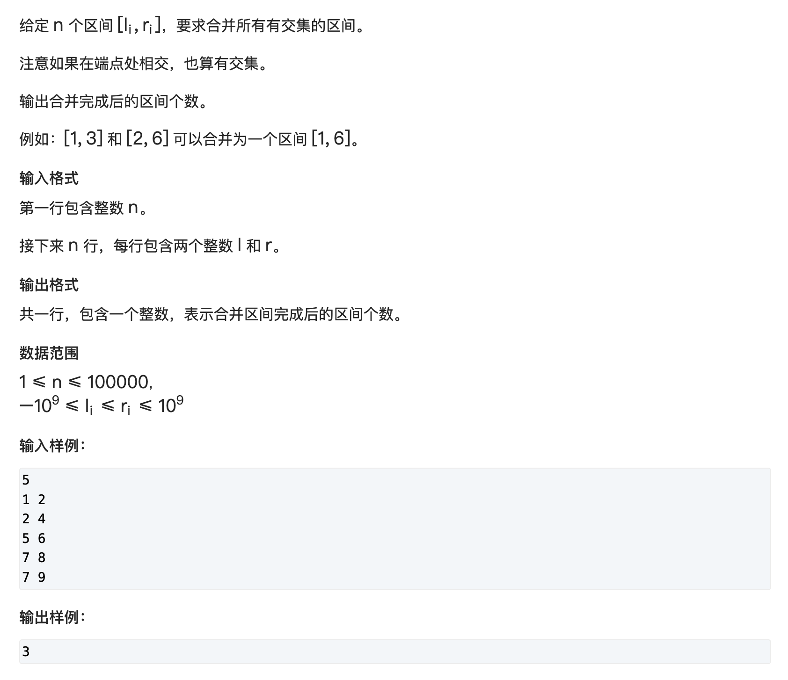

# 区间合并

## Introduction



## Method

这个是老朋友了，区间合并当初有道题是生产线问题，标准的排序 + 贪心
先按照左端点排序，然后遍历区间。

已有一个区间后，会出现三种情况：

```
已有区间:
-----------
三种情况：
1.   -----------
2.  -----
3.             ----------
```

那么对于前两种情况，就是区间合并。说白了就是把右端点取最大值

对于最后一种情况，就是不能合并，重新开辟下一个区间

## Code

```c++ 
#include <iostream>
#include <algorithm>
#include <vector>

using namespace std;

typedef pair<int, int> PII;

int n;
vector<PII> segs;

void interval_merge(vector<PII> &segs)
{
    int st = -2e9, ed = -2e9;
    vector<PII> res;

    for (auto seg: segs) {
        if (ed < seg.first) {
            if (st != -2e9) res.emplace_back(st, ed);
            st = seg.first;
            ed = seg.second;
        } else ed = max(ed, seg.second);
    }
    res.emplace_back(st, ed);

    segs = res;

}

int main()
{
    cin >> n;
    for (int i = 0; i < n; i++) {
        int l, r;
        scanf("%d%d", &l, &r);

        segs.emplace_back(l, r);
    }

    // sort排序pair会先排序first，再排序second。
    sort(segs.begin(), segs.end());

    interval_merge(segs);

    cout << segs.size() << "\n";

    return 0;
}
```

