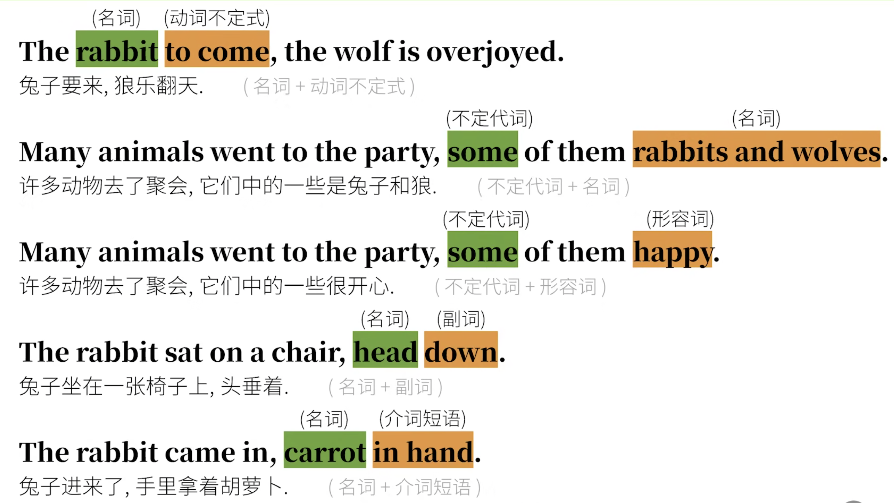

# 独立主格结构（absolute_construction）5

我们上一节讲了非谓语动词，并且挖了一个坑，这里填一下独立主格的基础问题。

我们看下面的句子：

+ Because he was invited by the wolf, the rabbit decided to go to the party.

我们说过非谓语动词可以简化从句：

+ Invited by the wolf, the rabbit decided to go to the party.

这在前面也提到了，invite是被动关系，所以用过去分词的非谓语动词。不过对于句子的主语，原来从句中的主语he 和 rabbit 是同一个人。

那么下面的如何？

+ Because the wolf invite him, the rabbit decided to go to the party.

那我们怎么简化，直接去掉从句中的主语，好像不对啊。Invited him，谁invite啊？那加上wolf，也不行啊，这可就是两个完整的句子了。正解是：

+ The wolf inviting him, the rabbit decided to go to the party.

这就是**独立主格**的真面目。这个句子的主干是`the rabbit decided to go to the party.`而前面的`The wolf inviting him`中invite的这个动作是wolf发出的，并不是rabbit发出的，所以我们用现在分词。此时这个`the wolf`并不是真正意义上的主语，所以我们称之为逻辑主语——**主格**，

**上面的两个例子的不同之处就是逗号前后的两个句子的“主语”是不相同的。**

我们多看两个独立主格的表达：

+ If the weather permits, the rabbit will go out.     If 引导的条件状语从句.
    + 转化成独立主格结构：The weather permitting, the rabbit will go out.
+ After the work was finished, the rabbit went home.   After引导的时间状语从句.
    + 转化成独立主格结构：The work finished, the rabbit went home.
+ The rabbit is lying in bed and a carrot is still held in his hand.  这是由and组成的两个不同主语的并列句
    +  独立主格：The rabbit is lying in bed, a carrot still held in his hand.

说了这么多，其实只说了独立主格的两种模式，名词 + 现在分词    名词 + 过去分词。

还有下面这样的形式

1. 名词 + 动词不定式   **不定式表示将要**
2. 不定代词 + 名词
3. 不定代词 + 形容词
4. 名词 + 副词
5. 名词 + 介词短语

但其实你发现没有，后面4种他们更像是包含be动词的独立主格，也就是名词/代词 + being，然后把being省略掉。

+ 注：不定代词(短语)后才能省略being;如只有人称代词，则不能省略.
    + 如：It being Sunday, many animals went to the party. 中的being不能省略.

那么到这里，我们就已经把独立主格的大部分知识内容都走了一遍了。他们大致可以这样分：

1. 名词 + 现在分词（主动/进行）
2. 名词 + 过去分词 （被动/完成）
3. 名词 + 不定式（将要）
4. 名词 + being

当然，你可能常见或者听说过“**with复合结构（with + 宾语 + 宾语补足语）**”，其实他就是一种重要的独立主格结构。

+ With the work finished, thewbbit went home.

直接加上with就行，或者你可以说这里是可以省略with构成的独立主格。以后有机会深入探究！（挖坑）