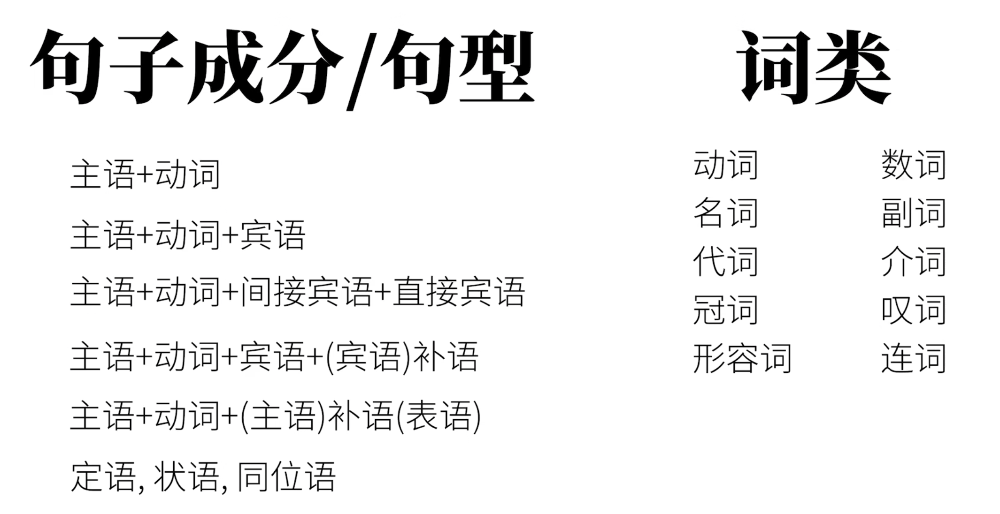

# 从句（Clause） 8

1. 从句的原理
2. 从句的分类

## 从句的原理

一个句子是另一个句子的成分，就出现了一种主从关系。主句（Main Clause）和从句（Subordinate Clause）一同构成**复杂句**。

我们在语法综述中讲过这个复杂句的概念。一起回顾一下英语的三种句子。

1. 简单句 Simple Sentences               不能继续拆分
2. 复合句 Compound Sentences        不分主次
3. 复杂句 Complex Sentences            主从关系

ps: 有些书上，喜欢将Complex Sentence称为复合句，而将Compound Sentence称为并列句，这可能会造成一些误导。如果一定要这样讲，请将 `component sentence`称为**并列复合句**，将`Complex Sentence`称为**主从复合句**。

## 从句的分类

给句子分类，可以按照从句充当的句子成分划分：

+ 其实除了句子中的谓语动词，其他任何成分都可以用从句充当：
    + 主语从句，宾语从句，宾语补语从句，主语补语从句（表语从句），定语从句，表语从句，同位语从句。

当然，也可以使用词类进行划分，**一共三大类**：

1. 名词性从句

    + 主语从句，宾语从句，宾语补语从句，主语补语从句（表语从句），同位语从句。这些一般相当于一个大名词，所以叫名词性从句。

    + 国内教学往往忽略宾语补语从句，因为他出现较少。

2. 形容词性从句

    + 定语从句。往往相当于一个大形容词。

    + 定语从句需要用到**关系词**，所以也叫做关系从句。

    + 关系从句 == 形容词性从句 == 定语从句

3. 副词性从句
    + 状语从句
        + 时间、地点、条件、方式、原因、比较...

那就从三大类入手：

### 一、形容词性从句 （定语从句）

>像这样：
>
>The rabbit is eating a carrot ==that I bought==.
>The teacher ==who ate a carrot== is a rabbit.
>The teacher ==whom I saw yesterday== is a rabbit.
>The teacher ==whose favorite food== is carrot is a rabbit.
>The food ==which the teacher likes== is a carrot.

+ 我们先说最重要的**关系词**。其实在这些从句中，除去关系词`that`, `who`, `whom`, `whose`, `which`，其他词在陈述句的语序是一样的。所以你可以想象：先将一个陈述句的某个成分替代成关系词，然后将关系词全部前置就构成了从句。**关系词**分为**关系代词**和**关系副词**

    1. 关系代词：`which` 和 `that`

        + Which 和 That 这两个关系词经常可以互换，他们的区别是：
        + 如果先行词唯一没有其他可能时：that
        + 如果先行词多选一：which
            > The rabbit ate **the largest carrot** that I've ever seen.
            > **all the rabbits** that ate a carrot
            > **the only rabbit** that ate a carrot
            > **the first rabbit** that ate a carrot
            
            + 这些`all`, `the only`, `the first`, `the largest表明了很明确的对象(兔子)，所以用that
            
            + The rabbit ate a **carrot** which I bought.
                + 世上萝卜千千万，carrot是哪一个？？？然后从句限定一下：是我买的那个。这时用which。当然也可以用that。
        + 如果你在从句之前，没有发问：你说的是哪一个萝卜啊？那么就说明可以用that。相反的，如果你可以在从句出现之前发问，那么which和that都行。

    2. 关系副词：`where`, `why`, `when`

        > This was the place ==where== the rabbit ate the carrot.
        > This is the reason ==why== the rabbit ate the carrot.
        > That was the day ==when== the rabbit ate the carrot for the first time.

        + 你肯定看出来了，既然是副词，那么一定有修饰的对象：  where 修饰 place，why 修饰 reason，when 修饰 day。这些关系词和上面的关系代词不同，他们在从句中的**词类**不是代词，而是副词。所以叫**关系副词**。当然我们可以将关系副词转化成关系代词。

        > This was the place ==at which== the rabbit ate the carrot.
        > This is the reason ==for which== the rabbit ate the carrot.
        > That was the day ==on which== the rabbit ate the carrot for the first time.

        + 很容易看出：关系副词 == 介词 + 关系代词

+ 然后我们说说形容词性从句的两种类型：**限定性从句**和**非限定性从句**

    1. 限定性
        + The rabbit ate  a carrot which was on the table.
        + 兔子吃了个在桌子上的胡萝卜。
    2. 非限定性
        + The rabbit ate a carrot, which was on the table.
        + 兔子吃了个胡萝卜，胡萝卜在桌子上。
        + 你甚至可以这样感受这句话：The rabbit ate a carrot, the carrot was on the table （虽然语法不对，你可以这样理解：这是两句没有关系的话）  完全可能只有一根胡萝卜，而且恰好在桌子上。

    + 你如果没弄清，请比较：

    > I have a head which is round.   限定性
    > I have a head==,== which is round.  非限定性
    >
    > 第一句言下之意是：我有好几个头，有方的有扁的，但是这个是圆的。
    >
    > 第二句言下之意是：我有一个头，而我这个头是圆的。

    + 我认为“限定”这两个词需要绕一个弯：所谓**限定**不是指 限定完成后的状态（就剩一个了）或者说 此**限定**不是代表 ==我的从句是用来（或者说是限定）这个词的== 的意思，而是指 限定过程中的状态（一种“多选一”的意思，限定ing）或者说 **限定**代表的是==限定万千这种词中的一个==。（限定的是这么多词代表的那么多事物中的某一个事物，而不是限定这个词，“我修饰的就是她”。）
    + 非限定性这种“句子带有并列感，非限定的、接着补充”的性质，往往可以用来做句子的**插入语**。
        + My head, which is big, is useful when it rains.
        + The biggest carrot, which the rabbit ate, was on the table.
            + 这一句正是因为非限定的，前面加`biggest`一点问题没有，如果这样说~~The biggest carrot which the rabbit ate, was on the table.~~就是错的了（`the biggest` 和 `which`是冲突的）

    + 非限定性还有一个强大的功能，就是代指前面的整个句子。
        + The rabbit ate the carrot, which was not surprising.   兔子吃胡萝卜，这事一点也不奇怪。
        + 这里的which，既不代指rabbit，也不代指carrot。而是前面的句子The rabbit ate the carrot这个事 一点也不吃惊。

### 二、名词性从句

#### ①主语从句

+ ==That== the rabbit ate a carrot is obvious.

    + 翻译成中文：兔子吃胡萝卜是明显的。这样翻译可能会让你断句失败，因为中文中我们没有像英文中**从属连词**(上述句子中that)这样的标志。当英美人士听到这句话的that，他们会本能反应出这是个从句，使句子的一部分而已。而对于我们中文，我们往往这样翻译比较好理解：兔子吃胡萝卜这件事是明显的。

+ 不确定信息也可当主语：

    >==*Whether* the rabbit ate the carrot== is obvious.    兔子**是否**吃了胡萝卜是明显的.
    >==*Where* the rabbit ate the carrot== is obvious.       兔子**哪里**吃的胡萝卜是明显的.
    >==*When* the rabbit ate the carrot== is obvious.        兔子**什么时候**吃的胡萝卜是明显的.
    >==*How* the rabbit ate the carrot== is obvious.          兔子**怎样**吃地胡萝卜是明显的.
    >==*Who* ate the carrot== is obvious.                           **谁**吃了胡萝卜是明显的
    >==*What* the rabbit ate== is obvious.                          兔子吃的**什么**是明显的

+ 形式主语

    + 上述的从句，说了半天才知道：原来就是某件事很明显啊。这样头重脚轻的问题，在英文中常用形式主语来解决。

    + It is obvious that the rabbit ate a carrot.

    + `It`这里本身没有实际意义，只是代指后面的句子。也就是说放在后面的从句才是真正的主语。

        >That the rabbit ate a carrot is a secret.           $\rightarrow$     It is a secret that the rabbit ate a carrot.
        >That the rabbit ate a carrot was discussed.    $\rightarrow$     It was discussed that the rabbit ate a carrot.
        >That the rabbit ate a carrot happened.            $\rightarrow$    It happened that the rabbit ate a carrot.
        >
        >**Whether the rabbit ate the carrot** is obvious.   $\rightarrow$    It is obvious **whether the rabbit ate the carrot**.
        >**Where the rabbit ate the carrot** is obvious.      $\rightarrow$    It is obvious **where the rabbit ate the carrot**.
        >**When the rabbit ate the carrot** is obvious.       $\rightarrow$   It is obvious **when the rabbit ate the carrot**
        >**How the rabbit ate the carrot** is obvious.         $\rightarrow$   It is obvious **how the rabbit ate the carrot**.
        >**Who ate the carrot** is obvious.                         $\rightarrow$    It is obvious **who ate the carrot**.
        >**What the rabbit ate** Is obvious.                       $\rightarrow$    It is obvious **what the rabbit ate**.

#### ②宾语从句

1. 确定信息&不确定信息

    + 确定信息：

        + I saw that the rabbit ate a carrot.
        + 这里的that the rabbit ate a carrot是一个确定信息。

    + 不确定信息：

        > I saw ==whether== the rabbit ate the carrot.
        >
        > I saw ==who== ate the carrot.
        >
        > I saw ==what== the rabbit ate.
        >
        > I saw ==where== the rabbit ate the carrot.
        >
        > I saw ==when== the rabbit ate the carrot.
        >
        > I saw ==how== the rabbit ate the carrot.
        >
        > 除了某些介词参与的情况，引导词基本都在从句开头。

2. 宾语从句`that`的省略

    + I know (that) the rabbit ate a carrot.
        + 这种省略往往会使人觉得：为什么一个句子有两个谓语动词？这需要你判断出这里有个宾语从句，两个谓语动词分别是主句的动词和从句的动词。
    + 引导词 `what`, `who`, `how`, `which`, `where`等不能省略。
    + 有时`that`也不能省略，省略会使句子产生歧义。
        + I didn't konw that the rabbit ate the carrot and that you saw it.
        + I didn't know the rabbit ate the carrot and you saw it.
            + 请比较上述两句话，第一句是两个宾语从句，含义是：首先我不知道兔子吃了胡萝卜，其次我不知道你看见了。
            + 第二句是省略两个`that`,第一个从句省略了还好，但是第二个从句的衔接处有一个`and`，可能会被误解为一种确定的陈述`you saw it`，这不是原文想表达的didn't konw。
        + 当有插入语的情况是也不要省略：I know, just like you do, that the rabbit ate the carrot.   这里如果省略了`that`，会使人一下子反应不过来是一个从句，让人觉得有语病

3. 某些词后的宾语从句的否定。

    > 正确示范：
    >
    > I don't think (that) the rabbit is smart.
    > I don't believe (that) you will give me some coins.
    > I don't expect (that) you will give this video a thumbs-up.
    >
    > 错误示范：
    >
    > I think(that) the rabbit isn't smart.
    > I believe (that) you won't give me some coins.
    > l expect (that) you won't give this video a thumbs-up.

4. 主从时态一致

    + 主句时态 == 宾语从句时态
    + I knew (that) the rabbit liked carrots.
        + 虽然`liked`表示一种习惯，但是由于主句使用了一般过去时态，从句`like`要进行变位。
    + I knew that the sun rises in the east.
        + 只有描述客观规律，永恒现象时可以不用变位。

5. be + 形容词 + that

    + **ps:** 首先说明：词类句型存在归类上的极大争议。

        > I am sure that there's a carrot on the table.
        > I am happy that there's a carrot on the table.
        > I am afraid that there's no carrot on the table.
        >
        > 大约有三种争议：
        >
        > 1. 宾语从句：这类句子翻译成中文：我很确定...... 我很高兴..... 这样的用法和谓语动词后接动作的承受者十分相似。就相当于` I confirm that....` 我很确定.....
        > 2. 同位语从句：上述句子可以相当于：`I am sure of the fact that... `, `I am happy about the fact that...`这样看that引导的从句就是一个同位语从句
        > 3. 状语从句：I am happy because ...像是原因状语从句。
        >
        > 不过是什么分类不重要，我是为了学习知识，不是为了学术研究的。

#### ③表语从句

1. 即用一个句子充当主语补语/表语，**主要的系动词是be动词**。

    > The problem is that the rabbit is hungry.
    > The reason is that there's no more carrot.
    > The question is whether the rabbit is hungry.
    > The question is what the rabbit should eat.
    > The question is where/when /how the rabbit should eat the carrot.

    + 表语从句和主语从句之间，是一种“倒过来”的关系。如：
        + ==That the rabbit ate a carrot== is a secret.     主语从句
        + The secret is ==that the rabbit ate a carrot==.  表语从句
        + 两者的区别在于说话者想要强调的信息。

2. **非be动词做系动词**

    + 前面说过feel, seem, look....也可以做
        + It seems ==that the rabbit is hungry==.
        + It feels ==that you're not telling the truth==.
        + 上面两句中`It`其实是形式主语，但是没有任何实际意义。**这和主语从句的后置并不一样！！**句子的核心部分在后半部分。

#### ④同位语从句

1. 同位语成分用句子充当就是同位语从句了。
    + I like my teacher, ==Papa Rabbit==, likes carrots. 同位语成分
    + 同位语从句往往修饰抽象名词，用于解释。（同位语从句与定语从句的区别请见底部）
        + The fact ==that the rabbit ate the carrot== did not surprise me.
        + The question ==whether the rabbit ate the carrot== is on all our minds.
        + I have no idea ==who ate the carrot==.

#### ⑤宾语补语从句  （此类从句有些资料不做收录，略讲）

+ You can call me what you like.
+ My education make me who I am today.

### 三、副词性从句

+ 副词性从句在句子中起到副词作用，一般补充说明动词，形容词，副词等，也称为**状语从句**。
+ 句子中状语做补充信息有多种可能，故种类繁多，**共9种**。

#### ①表时间（在...之前）

1. `Before`   在...之前
    + The rabbit ate a carrot at home before the wolf stopped by.
    + Before the wolf stopped by, the rabbit ate a carrot at home.
2. `When`, `While`, `As`  当时 
    + The rabbit was eating a carrot ==when I reached home==.
        + 我到家的时候，兔子正在吃胡萝卜。
    + The rabbit was eating a carrot ==while I was making video==.
        + 我在做视频的过程中，兔子在吃胡萝卜。
    + I ate a carrot ==as I made the video==.
        + 我一边吃胡萝卜一边做视频。
    + `when`表示“突然”，在某一个时间点
    + `while`表示在一个时间段内
    + `as`表示同时，一边...一边...
3. `After`  在某一时间点之后
    + The rabbit ate a carrot after the wolf stopped by.
4. `Since`  从之前某一时间点开始算
    + 这样的往往会对后续产生影响，所以要使用完成时态。
    + The rabbit has shared three carrots since the wolf stopped by.
    + The rabbit has not stopped sharing carrots since the wolf stopped by.
5. `Until`  直到之后某一时间
    + The rabbit waited unilt the wolf stopped by.
6. `As soon as`  一...就...
    + The rabbit will eat a carrot as soon as the wolf leaves.
7. `The next time` 下次
    + The rabbit will share the biggest carrot the next time the wolf stops by.

#### ②表地点（在...地方）

+ 主要由`where`和它的强调形式来引导(`anywhere` `everywhere` `wherever`)

+ The rabbit ate the carrot where he found it.

    + 比较地点状语从句与定语从句的区别：
        + The rabbit ate the carrot where he found it.
        + The rabbit ate the carrot at the place where he found it. 
            + 第二句是定语从句，它是起到修饰先行词`place`的作用。
        + This is where he found the carrot.           表语从句
        + Where he found the carrot is a secret.    主语从句
    + 光看见`where`还不能确定是什么从句

    > The rabbit will go ==where== he can find a carrot.
    > The rabbit will go ==wherever== he can find a carrot.     **强调：“不管"哪里**
    > The rabbit sees a carrot everywhere he goes.         **强调：“所有”**
    > ==  every place where（定语从句）
    > The rabbit can eat a carrot ==anywhere== he likes.         **强调：“任何”**
    > == at any place where

#### ③表条件（如果...）

1. If
    + 这地方的假设句，是真实的假设。与过去讲过的虚拟语气不同（虚拟语气的假设，是与事实相反的假设）
    + If the rabbit sees a carrot, he will eat it.
    + 这里要纠正一个误区 “主将从现”，这个记忆口诀不是那么的精准。它就无法解释虚拟语气，如：If the rabbit saw a carrot, he would eat it.
        + 之所以从句使用了一般现在时态，还是因为我们前面说过的：英语中将来时态表示明确在将来发生的动作。但既然你是假设，那么一定不敢说肯定。
        + 你可以说条件句从句要落后主句一个时间段。
2. Unless  (If反着说)
    + If you like this video, you will give it a thumbs-up.
        + 如果你喜欢这个视频，你会给它点赞。
    + 改一下  If you don't like this video, you will not give it a thumbs-up.
    + 上面就可以改成 Unless you like this video, you will not give it a thumbs-up.
        + 如果你不喜欢这个视频（除非你喜欢这个视频），你不会给这个视频点赞。
3. Provided
    + Provided that my video is excellent, you will give it a thumbs-up.
    + 如果我的视频很棒，你会给它点赞。
4. As long as
    + As long as I make excellent videos, you will remain my follower.
    + 只要我一直做高质量视频，你就会继续关注我。
5. In case
    + In case you don't understand, please comment below.
    + 如果你不明白，请在下方评论。

#### ④表让步（虽然...但是...）

+ 阐述某种情况或者做出某种假设，然后做出相反的动作（让步）  即使...也...
+ 假设型：==Even if== I see a carrot, I will not eat it.  和条件句很像，但是是相反动作。
+ 事实型：==Although== I see a carrot, I will not eat it. (`Although` 可以用 `though`, `even though`替代)
+ No matter + 疑问词  不管什么事情发生，可以使用regardless替代。
    +  No matter what happens, I will not eat the carrot.
    + No matter who orders me, I will not eat the carrot.

#### ⑤表方式（就好像...）

1. 表示“正在”发生的方式
    + Eat the carrot as I do.
    + Leave the carrot as it is. 别动这个胡萝卜
2. 提出一种假设的方式
    + I feel good as if I had just eaten a carrot.
    + **注意和虚拟语气的区别** 
        + If I had eaten a carrot, I would have felt good.
        + 前者主句`I feel good`是真实的情况，虽然后面的从句是假想的情况。但是虚拟语气则与之不同，因为从句为并没有真实发生的，主句的情况也不是真实的。

#### ⑥表比较（比...）

1. Than 
    + ~~He is smarter than me~~ 口语形式
    + He is smarter than I am.
    + This carrot is bigger than that one is.
2. As _  as
    + He is as smart as I am.
    + She is as beautiful as Snow White is.
3. The  + 比较级 ... , the + 比较级 ... 
    + The more you practice English, the more fluent you become.

#### ⑦表原因（因为...所以...）

+ Because 因为
    + Because this video is excellent, you should give it a thumbs-up.
+ Since  既然
    + Since all my video are excellent, you should give this video a thumps-up
+ As 因为
    + As I have thick skin, I'm begging you for a thumps-up.
    + 不同点：
    + 三者不同1：语气上 Because  >  Since  > as.  `Because` 实实在在的因果   `Since` 引出大家都知道的情况  `As` 表示显而易见的视频。上面三个例句可以理解一下。
    + 三者不同2：`Because`引导的从句在主句前后都可以，而其他两者只能一般只能放在主句之前。
+ 我们有时候也会遇到`for`来表示因果，但是这两者大有不同，请比较：
    + Because you like me, you have given all my videos a thumbs-up.
        + 因为你喜欢我，所以你给所有英语兔视频都点赞了，
    + You must really like me, for you have given all my videos a thumbs-up. 
        + 你一定喜欢我，因为你给所有英语兔视频都点赞了.
    + 请注意，for构成的不是原因状语从句，而是复合句。这两句有着相同的地位，不是Because那样的复杂句（带有主从关系）。
    + for 一般前句表示推测，后句表示推测的原因。他可不是Because的弱化语气版。

#### ⑧表目的（为了...）

+ 也有一定因果关系，只不过使用目的的方式说出来的。
+ In order that I could finish the video in time, I pulled an all-nighter. 为了完成这个视频，我熬夜不睡。
+ 基本   == I pulled an all-nighter so that I could finish the video in time.**注意so that不能放在句首**
+ 常常使用情态动词 could, might...来更明显地表达目的性。

#### ⑨表结果（所以...）

+ 也有一定因果关系，只不过用结果的方式说出来。
+ 也可以用so that
    + I ate a lot of carrots for lunch so that I wasn't hungry at all in the afternoon.
+ so ？好像也是结果
    + **so 是复合句，并列复合句，不是主从关系的连接词。这和 because 和 for的关系很像。**
+ So ... that ... 
+ Such ... that ...  （`such` 后加 名词）

> [定语从句和同位语从句的区别？](https://www.zhihu.com/question/20862688)
>
> 先简单粗暴说一下，当别人说他有一个好的建议，**但是绕了半天也没说出来到底是啥好主意，那么他基本用的就是定语从句**；比如 I would like to propose a good suggestion that might sound weird to you. 我有一个好的建议，一个你听起来可能比较奇怪的建议。相反**如果他说的话让你知道这个建议的内容是什么，那么他用的就是同位语从句**， I would like to propose a good suggestion that we should pay more attention to grammar.
>
> 首先来扯一点别的，定语从句，它的重点在于一个定字，定语从句，首先它是一个句子，是一个句子的话，它就要有自己完整的主谓结构。定语从句就是把一个东西的性质给确定界定下来下来的成分。定语从句，它是一个外围的东西，它是事物外围的属性，它只是用来表达事物的一个属性，而不是事物本身。
>
> **而同位语恰恰相反，同位语就是事物本身，同位语和它前面的成分就是一个东西。定语从句是用一个句子来表达前面那个词的一种属性，而同位语从句则是用一个句子从另外一个角度来描述前面那个词。定语从句，从本质上讲，它就是指事物的某一个属性。而同位语从句从本质上讲，它就是这个事物本身，只不过它提供了另外一个角度的描述。**
>
> 要回答这个问题，首先你要明白什么叫做定语从句和同位语从句。打一个比方吧，定语从句就好像是你的衣服，衣服对你起个修饰的作用，让你看起来更漂亮，或者让你觉得更暖和。在你和衣服之间，你才是重要的，衣服只是对你起一个装饰的作用。而同位语从句, 就是你自己，只不过是从另外一个角度去看你。同位语从句不是你的衣服，它就是你自己，是另外一个角度的你。比如你是一个学生，同时，你是你父母的孩子；同时你又可能是马路上的一个路人，是电影院里的一个观众，是商场里的一个顾客，是某一个事情的旁观者或者参与者。也就是说同一个你在不同的情况下会扮演不同的角色，而同位语就是从不同角度来描述你。无论从那一个角度去描述，描述的对象都是你自己。这是在本质上说明定语从句和同位语从句之间的区别。
>
> 在具体的语法规范上两者之间的区别在很多资料上都有表述，这里就不赘述了。**你只需要记住一点，并不是所有的名词都可以接同位语从句的，在英语中只是一些表示抽象概念的名词通常才会接同位语从句。而什么叫做抽象？可以这样来顾名思义的来理解，那就是在一系列的现象当中抽出他们共同的特征，我们可以这样来理解抽象。也就是说像英语当中的idea, fact, doubt, information, news等等，都是可以用来作为引导同位语从句的抽象名词。抽象名词一般比较宽泛，比较空洞。**
>
> 从另一个角度来看，同位语从句是对把前面的先行词的一种解释，而定语从句这是为了说明前面的先行词是什么样的，是给先行词定性的。