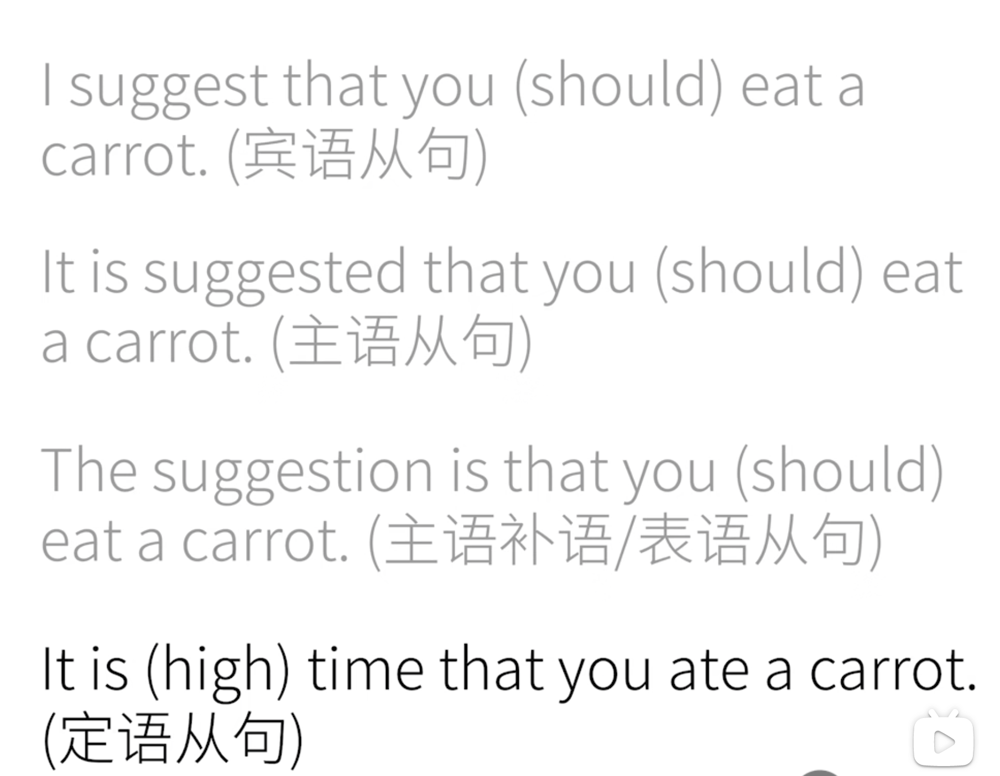

# 动词语气 (verb mood) 3 

ps: 这个mood和你的心情（mood）可是没有任何关系的。

## 陈述语气 （Indicative Mood）

陈述一个事实

## 祈使语气 (Imperative Mood)

命令 和 请求

+ 绝大大数情况下可以这样造句：
    + 使用第二人称 You 用一般现在时态，去掉“You” 并保持动词原形
    + ~~You~~ eat the carrot!  ->  Eat the carrot!
    + ~~You~~ don't eat it!  -> Don't eat it!
    + ~~You~~ are quiet!  ->  Be quiet!
    + ~~You~~ never give up!   ->  Never give up!

## 虚拟语气（Subjunctive Mood）（重点）(两大用法)

### 1. 表示“不可能的假设”

你会发现，英语中描述主观的、脑中的想象和与现实相悖的情况时，就会使用虚拟语气。

中文中我们说“虚拟语气”，如：“如果我现在看到那只兔子的话，我会咬他。”

动词形式上看其实根本没有变化，我们只好根据语境推测：我现在还没有看到兔子，这只是我自己想出来的。

如果在英文中你这样直接翻译上面那句话：“If I see the rabbit now, I will bite him.” **注意，这句话是错误的。它有了十分明确的时间线，now表示就是现在，描述了一个事实。而will bite我们在时态中讲过，这表示了一种肯定。而并不是我们想要的“我自己幻想的”效果**

那我们要怎么做？

+ 将**现在的动词时间段向过去推一个时间段！！！**。“If I saw the rabbit now, I would bite him.” 这里动词是过去式，但是并不是表示过去的事实，而是描述了一种现在的、没发生但希望发生的事情。

如果我们改一下刚刚的那句话“If I see the rabbit tomorrow, I will bite him.”  **这句话完成正确，他就是在陈述一种事实，动词see并没有使用虚拟语气，明天我确定会看到那兔子然后咬他。有的语法书会将其归类为条件语气，但他本身与陈述语气没有本质区别。**

那要是我不敢肯定明天的事呢？我只是想说大话呢？

+ If I should see the rabbit tomorrow, I would bite him."
+ 这就是将来时间下的虚拟语气，用来表示将来时间下可能性很小的动作、事情。可以理解为：万一我明天....

那过去时间下的呢？早知今日何必当初呢？

+ 当初确实没干，我要是前几天看见那只兔子就好了。
+ 这时候，过去式动词 前推 成过去完成时态。
+ If I have seen the rabbit a few days ago, I would have bitten him.

总结：

1. 与现在事实相反
    + **条件句：过去式** 
    + **主句： would + 动词原形**
    + 注意：如果动词是be，那么不管是什么人称，一律变位为**were**。
2. 与将来事实相反（可能性小）
    + **条件句：should + 动词原形**
    + **主句：would + 动词原形**
    + 为什么用should？should不是“应该”的意思吗？但是**这里的should 其实是 shall 的过去式（我们在verbs tense中讲过，将来时间主要使用will 和 shall进行表达），所以这里并没有“应该”的意思。而should 的另一个身份，做情态助动词时才会有“应该”的意思。**
    + 另外，条件句中的should  可以使用 were to进行替换
    + 主句中的would 可以用 might(may过去式)，could(can过去式)，should(will 过去式)
3. 与过去事实相反
    + **条件句：have + 动词过去分词 **
    + **主句：should have + 动词过去分词**

### 2. 表达愿望、请求、建议、命令等

说白了就是“希望某个动作发生”。大部分情况下都是结合了动词wish使用（wish和hope有所区别，wish 通常表示可能性很小，但是hope就比较中性）

**wish:**  

1. 对现在的希望
    + Wish + 动词过去式
    + I wish that I were a rabbit. （宾语从句，这里的that往往也可以省略）
2. 对将来的希望
    + wish + should( would could might) + 动词原形
    + I wish (that) I could eat the carrot. 
3. 对过去的希望
    + Wish + had / would have + 动词过去分词
    + I wish (that) I had eaten the carrot.

**would rather:** 

先自行判断一下接下来的话所对应的时间，以及胡萝卜到底已经吃了没有？

I would rather that you didn't eat the carrot.

I would rather that you badn't eaten the carrot.

答案：

第一句话乍一看是过去式，但是在我们前面说过的前推时间段，这其实是对现在的虚拟“我宁愿你不会吃这个胡萝卜，或者说接下来别吃”，还没吃呢。

第二句“我宁愿你没吃掉那个胡萝卜”，言下之意我是对过去的妄想，你已经吃掉了。

**demand, suggest, insist, order...**

这样的词后面一律接**should + 动词原形**

+ I demand (suggest, insist, order) that you should give me a carrot.
    我要求/建议/坚持/命令你给我一根胡萝卜.
+ 这里的should也可以省略。
+ 你用过去式，demanded suggested...后面也是一样

虚拟语气还可以变换句型使用，这里我们简单介绍，后续在从句中详细说明：

