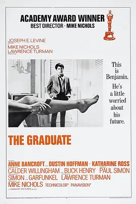
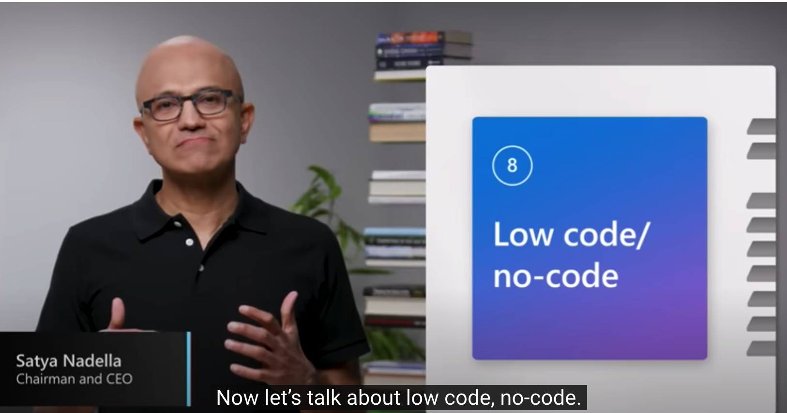
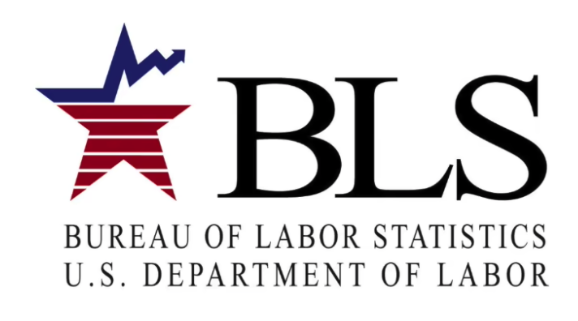

# Coding is still a good career bet

20230128 *Financial Times*

⭐️⭐️⭐️

## 原文：

### Coding is still a good career bet

*Tech job losses and AI advances do not mean computers can program themselves*

 

“Just one word . . . plastics” is the career advice offered by the family friend Mr McGuire to a bemused Benjamin Braddock, played by Dustin Hoffman, in the 1967 movie The Graduate. A modern-day Mr McGuire might well advocate coding as the route to decently paid job security. Or he might have done before the tech industry axed 200,000 jobs in the past 12 months — and the clamour around the artificial intelligence platform ChatGPT raised awareness that machines can write code, too. Computers, it seems, may soon be programming themselves. So is what we’ve been telling our kids about safe jobs all wrong?

Parental panic would be premature. Widespread lay-offs may indeed signal that the days of perpetual growth in Big Tech companies are ending and they are starting to behave more like banks — hiring in good times and firing in bad. Some are, for the first time, being pressed by activist investors to raise profitability. But after their extraordinary hiring sprees during lockdown, the job cuts represent only a modest retrenchment. Many of the axed roles are in sales and marketing, not programming. And if the arms race among tech companies to secure computer science graduates is abating, other previously outgunned sectors — from engineering to media and finance — will be happy to pick up the spare talent.

The need for software will only grow. The pandemic drove demand from consumers needing to work, shop, educate and entertain themselves at home — and from businesses struggling to control supply chains. Now organisations are looking to IT to blunt the impact of inflation. Robotics, automation, and the digitisation of even everyday products will require a lot more code. And a lot of legacy systems will need replacing.

Rather than being a big threat to coders, generative AI can help. Computers are unlikely to be writing their own programs any time soon, but Copilot, a kind of super-smart autocomplete function for coding from Microsoft’s GitHub division, is already raising productivity. Coders write a prompt on what they’re aiming to do and Copilot suggests lines of code. Andrej Karpathy, a former director of AI at Tesla, tweeted last month that Copilot was writing 80 per cent of his code, with 80 per cent accuracy. Programmers say the tool both speeds up their work and frees them to be more creative.

Advances are also opening coding to non-specialists. Low-code or no-code development platforms allow users to create application software by using a graphical interface. Microsoft’s CEO Satya Nadella suggests this could help close skills gaps: someone with expertise in, say, media or logistics, but no coding knowledge, can get involved in developing business apps. This shifts the balance a little towards business units and away from IT.

Those who understand coding from scratch will still be needed — not least to oversee the AI and correct any machine-generated mistakes. But as the grunt work is automated away, their skills will have to move up the value curve. The US Bureau of Labor Statistics projects US employment among “programmers”, narrowly defined, will fall 10 per cent over the next decade, but sees the number of software developers, including those responsible for planning, quality assurance, testing and integration, rising by a quarter.

If automation makes the best IT brains more productive, this is a good thing. Scaling the capabilities of talented people is likely to lead to more breakthroughs. Computers taking over more technical work as humans move up to a higher level of abstraction has been happening since the dawn of computing. For the graduates of today, that means coding is still a good place to start.

## 阅读：

### Coding is still ==a good career bet==

> + a good bet 有望成功的事
>     + Textiles are a good bet for a country bent on industrialisation.
>     + 纺织业 对于致力于工业化的国家来说是一个比较稳妥的产业
> + bet 
>     + *v.*打赌，赌博；<非正式>敢肯定
>     + *n.*下注；赌金；预计，猜想；<非正式>有可能成功的人选（或备选行动）

*Tech ==job losses== and AI advances do not mean computers can ==program== themselves*

> + job losses 裁员
> + program   v. 编程
>     + Programmer   n. 程序员
>     + programming   n. 编程
>     + 本文里code 和 program 都讲做v. 编程
> + 该句想表明：科技公司裁员和人工智能的发展并不意味着电脑可以自己编程了

“Just one word . . . plastics” is the career advice offered by the family friend Mr McGuire to ==a bemused Benjamin Braddock==, played by Dustin Hoffman, in the 1967 movie ==The Graduate==. 

> + The Graduate
>     + 根据文中是1967年的一部电影，Mr McGuire对另Benjamin Braddock说了一句话`“Just one word . . . plastics”`，这个Benjamin Braddock由Dustin Hoffman饰演（可能是主角，其实就是）
>     + 这是这部电影的名场面，想让主角做塑料行业
> + bemused   a. 困惑的，茫然的
>     + becalmed   a. (帆船)无法航行的
>     + bewildered   a. 困惑的
> + a bemused Benjamin Braddock
>     + 句中用了`a`，并不是说Benjamin Braddock有很多，而是说明了Benjamin Braddock当时是一个迷茫的状态

A ==modern-day== Mr McGuire might well advocate coding as the route to decently paid ==job security==. 

> + modern-day    a.当代的
> + job security    职业保障
> + 意思就是 当代版的Mr McGuire可能会推荐主角去敲代码了

Or he might have done before the tech industry ==axed== 200,000 jobs in the past 12 months — and the ==clamour== around the artificial intelligence platform ChatGPT raised awareness that machines can write code, too. 

> + axe   v. 裁员
>     + axe   n. 斧子
> + clamour   n. 喧闹声，吵闹，沸沸扬扬
> + ChatGPT 是2022年11美国开发出的一个AI狠角，我写这篇blog是23年的2月，此时国内热度一直不降已经1个月了
> + Or he might have done ^^before the tech industry axed 200,000 jobs in the past 12 months — and the clamour around the artificial intelligence platform ChatGPT raised awareness ^^that machines can write code, too. 
>     + before the tech industry axed 200,000 jobs in the past 12 months — and the clamour around the artificial intelligence platform ChatGPT raised awareness 时间状语从句
>     + he might have done  主句，使用了现在进行时态
>     + that machines can write code    awareness的同位语从句
>
> [ChatGPT](https://openai.com/blog/chatgpt/)

Computers, it seems, may soon be programming themselves. So is what we’ve been telling our kids about safe jobs all wrong? 

> 没啥好说的

**至此第1段结束，段落大意：**

以电影名场面开场，引出计算机作为新兴火热行业，最近却时运不齐，命途多舛（裁员和人工智能高速发展）。究竟是我们所想的这样吗？

---

Parental panic would be ==premature==. Widespread ==lay-offs== may indeed signal that the days of ==perpetual== growth in ==Big Tech== companies are ending and they are starting to behave more like banks — hiring in good times and firing in bad. 

> + Proemature   a. 早熟的，过早的，草率的
> + lay-off   n. 解雇
>     + 当你看见一个`v.`+ `n.`组成一个`n.`，而且中间还有一个连词符号，那么大概率是来自一个动词短语
>     + lay sb. Off 解雇
> + perpetual   a. 不间断的，持续的
> + Big Tech  科技巨头，科技公司
> + —hiring in good times and firing in bad 解释了前面那句话“科技公司越来越像银行了”

Some are, for the first time, being pressed by ==activist== investors to raise profitability. But after their extraordinary hiring ==sprees== during ==lockdown==, the job cuts represent only a modest ==retrenchment==. Many of the axed roles are in sales and marketing, not programming. 

> + Activist investor  没找到专业术语，大概就是一类很强势的投资人
>     + activist   n. 激进分子
> + spees   n. 一段时间的无节制行为
>     + crime spree   疯狂犯罪
>     + shopping spree   疯狂购物
> + lockdown   n. 封锁
>     + 这里during lockdown 指疫情封锁期间
> + retrenchment   n.（资金、人员）紧缩
>     + retrench    v. 裁员，缩减开支
> + modest   a. 不太多的，谦虚的，适中的

And if the ==arms race== among tech companies to ==secure== computer science graduates is ==abating==, other previously ==outgunned== sectors — from engineering to media and finance — will be happy to pick up the ==spare== talent.

>+ arms race  n.军备竞赛
>+ secure   a. 安全的   v. 得到
>    + v. （尤指经过努力而）**获得**，得到；使安全，保护；缚牢，将（某物）固定；确保，保证；为（债务或贷款）作抵押，作保；（外科）压迫（血管）止血；停止工作；船抛锚 
>+ abate   v.减弱，衰退
>+ outgun   v. 胜过，压过
>+ spare   a. 多余的，闲置的
>    + spare crash n. 闲钱
>    + spare   n. 备胎

**至此第2段结束，段落大意：**

现在替计算机行业担心还是为时过早，1.现在裁员的是疫情封锁期间招人过剩；2.大部分科技公司裁员也针对的事销售和市场，不是编程人员；3.即使科技大厂减少找计算机专业的学生了，其他行业也十分愿意去接受这些spare talent.

---

The need for software will only grow. The pandemic drove ==demand== from consumers needing to work, shop, educate and entertain themselves at home — and from businesses ==struggling== to control supply chains. 

> + Demand   v.&n. 需求，强烈要求
> + struggling   adj. 艰难奋斗的，苦苦挣扎的
>     + struggle   v.  奋斗，努力；搏斗，扭打；争夺，争抢

Now organisations are looking to IT to ==blunt== the impact of ==inflation==. Robotics, ==automation==, and the ==digitisation== of even everyday products will require a lot more code. And a lot of ==legacy systems== will need replacing.

> + blunt   a. 钝的   v.使...削弱
> + inflation   n. 通货膨胀
> + automation   n. 自动化
> + Digitisation   n. 电子化
> + leagacy systems   n. 旧系统

**至此第3段结束，段落大意：**

计算机行业依然有优势的举例，软件行业只增不减：疫情下的各行各业对软件的需求

---

Rather than being a big threat to coders, ==generative== AI can help. 

> 这句话说谁对于码农是威胁呢？
>
> `Rather than`表示与其说，与其说是威胁，不如说是`help`。那在`help`这里就讲了前面想要说的主角——generative AI
>
> + generative 有生产力的  chatGPT——Chat ==Generative== Pre-trained Transformer

Computers are unlikely to be writing their own programs ==any time soon==, but Copilot, a kind of super-smart ==autocomplete== function for coding from Microsoft’s GitHub ==division==, is already raising productivity. 

> + any time soon  短期内
> + Autocomplete 自动填成
>     + autofill  自动填充（浏览器的自动联想）
> + division  n. 部门
>     + marketing division 营销部门

Coders write a ==prompt== on what they’re aiming to do and Copilot suggests lines of code. ==Andrej Karpathy==, a former director of AI at Tesla, ==tweeted== last month that Copilot was writing 80 per cent of his code, with 80 per cent accuracy. Programmers say the tool both speeds up their work and ==frees== them to be more creative.

> + prompt   n.提示符
> + Andrej Karpathy  特斯拉TESLA前任人工智能总监
> + Tweet  v. 发推文  n. 推文
>     + twitter
> + free   v. 释放，解放   抽象意义上的

**至此第4段结束，段落大意：**

从人工智能角度来看，AI也不是抢程序员饭碗的，而是一个很不错的帮手

---

Advances are also opening coding to non-specialists. Low-code or no-code development platforms allow users to create application software by using a ==graphical interface==. Microsoft’s CEO Satya Nadella suggests this could help close skills gaps: someone with ==expertise== in, ==say==, media or ==logistics==, but no coding knowledge, can get involved in developing business apps. This shifts the balance a little towards business ==units== and away from IT.

> + specialists   n. 专业人士
>     + Non-specialists   非专业人士
> + Low-code/no-code development platforms
>     + 低代码开发平台，无代码开发平台
>     + nolo drinks
>         + == no-alcohol/low-alcohol drink 无酒精饮料，低酒精饮料
>     + graphical interface   图形交互界面
> + Satya Nadella
> + 
> + expertise   n. 专业技能
>     + ~ in sth. / doing sth.
> + say   v. 比方说
>     + == let's say
>     + The form might include, say, a dozen questions.
> + logistics   n. 物流，后勤
> + shift  v. 变换，更替
>     + ~ towards/to sth. 向某事的方向倾斜
>     + ~ away from sth. 远离某事的方向
> + unit   n. 部门，子公司
>     + business unit  事业部

**至此第5段结束，段落大意：**

技术进步让不懂代码的人也能develop applications，不需要专业人士了。不过这似乎与主题：计算机行业没有衰退的  背道而驰了，看看下面。

---

Those who understand coding ==from scratch== will still be needed — ==not least== to ==oversee== the AI and correct any machine-generated mistakes. But as the ==grunt== work is ==automated== ==away==, their skills will have to move up the value curve. 

> + from scratch 从零开始
> + not least  尤其，特别
>     + especially
> + oversee   v. 监督
> + grunt   n. 工作乏味工资低的人
>     + grunt work 不同工作
> + automate   v. 使自动化
> + away   adv. 消失
>     + die away   声音逐渐消失
> + Value curve   价值曲线

The US ==Bureau of Labor Statistics== ==projects== US employment among “programmers”, ==narrowly== defined, will fall 10 per cent over the next decade, but sees the number of software developers, including those responsible for planning, ==quality assurance==, testing and integration, rising by a quarter. 

> + Bureau of Labor Statistics  劳工统计局
> + 
> + project   v. 预测
> + narrow  a. 狭义的  
>     + ≈ broad  概括的，不具体的
> + quality assurance  QA 质保

**至此第6段结束，段落大意：**

各行业还是需要懂代码的人，简单的枯燥的工作没有了，程序员需要向高技术方向攀爬。软件行业还是需要

---

If automation makes the best IT brains more productive, this is a good thing. ==Scaling== the capabilities of talented people is likely to lead to more breakthroughs. Computers taking over more technical work as humans move up to a higher level of abstraction has been happening since ==the dawn of== computing. For the graduates of today, that means coding is still a good place to start.

> + Scale  v.增大
>     + == scale up
> + the dawn of   ...的开端
>     + dawn 黎明

**至此第7段结束，段落大意：**

自动化，AI作为辅助能更好的让高精尖人才做出重大突破。计算机行业仍然是不错的选择。

本文主要从两个担忧论证计算机依然能行：

1、大裁员，不需要计算机人才了；

2、AI崛起

作者逐一进行了回答，用的例子也比较新鲜，但是每一个小论据铺垫太长导致逻辑上可能有些混乱。

---

