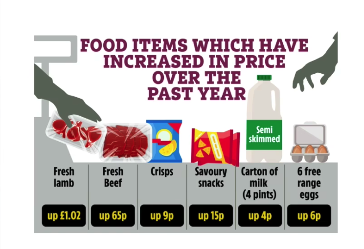
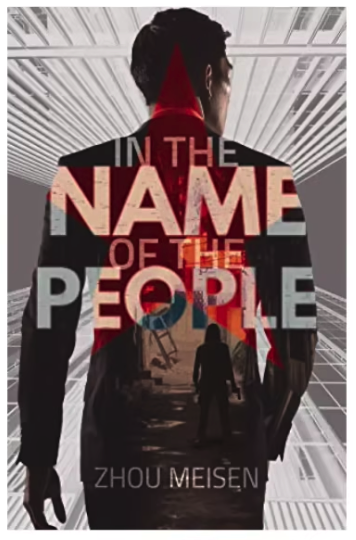
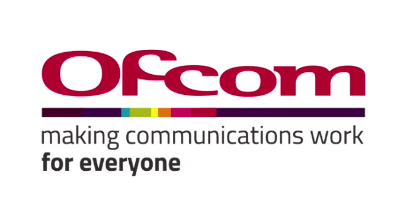

# Digital Exclusion

20220623  *The Guardian*

⭐️⭐️⭐️⭐️

## 原文

### The Guardian view on digital exclusion: online must not be the only option

**The interests of a significant minority are being neglected as everyday tasks are conducted via smartphones and tablets** 

On the eve of this week’s rail strikes, it was reported that industry bosses are planning to phase out paper train tickets and shut almost 1,000 station ticket offices in England. The government says nothing has been decided. But the transport secretary, Grant Shapps, has made no secret of his desire to see savings delivered in this way; some stations, Mr Shapps likes to point out, sell only a handful of tickets each week and the vast majority of transactions have moved online. 

Irrespective of the outcome of the current standoff with the RMT union, the direction of travel is clear. In the name of modernisation and cost-cutting, station ticket offices are likely to follow many high street bank branches and rural post offices into the vaults of sepia-tinted memory. For those of us who have grown used to the advantages of organising travel via a smartphone, there will be little to mourn. But for people without online access or skills – who tend to be older, poorer and more vulnerable – another small social barrier will have been erected.

From GP appointments to payment apps for parking, more and more key services are now delivered digitally. Local councils, cash-strapped and in search of efficiency savings, are moving inexorably online in the way they do business. BT plans to phase out traditional landlines by 2025. As this revolution takes place, unjustified assumptions are being made about the ability of some users to cope. In the case of health and social care, it will often be those most in need of assistance who are least able to navigate a digital route to accessing it. A recent Ofcom report estimated that around 6% of households – 1.5m homes – have no internet access. Millions more of us remain irregular and unconfident users of the internet. As digital technology becomes the gatekeeper to swathes of everyday life – a process accelerated by the pandemic – a significant minority risks exclusion and isolation. 

The inexorable shift online is inevitable, but its fallout needs to be managed with more care. Technology should not be allowed to drive people to the side of their own lives, as anecdotal evidence suggests is increasingly the case. Ros Altmann, the former pensions minister and Conservative peer, recently wrote of being contacted by an elderly woman who no longer drives to her local park, because she cannot download the car parking app required. As the sheer range and complexity of digital requirements expands, the desperate recruitment of middle-aged sons and daughters as unpaid consultants has become a phenomenon of our times. Meanwhile, the growing rarity of person-to-person interactions while making transactions – or just seeking advice and information – can exacerbate a sense of isolation among the lonely.

The debate over ticket offices offers an opportunity to reflect more broadly on the increasing role of technology in our social landscape. Clearly, much more needs to be invested in helping marginalised groups gain easy online access. But a diversity of provision also needs to be protected. Some people will never become comfortable using smartphones or tablets to get vital tasks done. Alternative and viable offline options must be maintained for important services. Contactable telephone numbers and staffed public access points should always be available. This will cost more. But that is the price of being fair to those who find themselves on the wrong side of the digital divide.

## 阅读

### ==The Guardian view on== digital ==exclusion==: online must not be the only option

> 标题
>
> + The Guardian view on  卫报的所有**社论**都是以这句话开头的
>     + **社论**（英语：Editorial，美国英语又称 leading article，英国英语又称leader）是由报纸、杂志或任何其他书面文档的高级编辑或出版者撰写的文章（通常不署名或以集体署名），用以表达其（通常是[编辑](https://zh.wikipedia.org/wiki/编辑)、编委会或出版者）对某一事件、文章的意见态度，当中或有个人观点、主观期望，或与读者观点有分歧及共鸣。澳大利亚和美国的主要报纸，如[《纽约时报》](https://zh.wikipedia.org/wiki/纽约时报)和[《波士顿环球报》](https://zh.wikipedia.org/wiki/波士頓環球報)，经常会在“意见”（英语：Opinion）标题下对社论进行分类。
> + exclusion  n. 排斥
>     + exclude   v. 将...排斥在外
>     + include    v. 把...包括进来
>     + ex- 词根表示了向外的含义，in- 词根表示了向内的含义

**The ==interests== of a ==significant minority== are being neglected as everyday tasks are conducted via smartphones and ==tablets== ** 

> 导语
>
> + interest  这里使用了复数形式，那么就是`n. 利益`的含义
>     + protect sb's ~ and rights  保护某人权益
> + significant minority  极少数群体
>     + significant   a. 相当数量的；意义重大的
>     + minority    n. 少数派，少数民族  a. 少数的
>         + minor    */*ˈmaɪnə(r)*/*  a. 较少的，轻微的
>         + **注意区分**：monitor   */*ˈmɒnɪtə(r)*/*   n. 监视器
> + tablet    n. 平板电脑

On the eve of this week’s ==rail strikes==, it was reported that industry bosses are planning to ==phase out== paper train tickets and shut almost 1,000 station ==ticket offices== in England. 

> + strike   n. 罢工
>     + rail/post/coal strike   铁路/邮政/煤矿工人罢工
>     + 一周，英国正在进行大规模罢工。原因就是CPI涨的特别快，许多铁路工人要求加薪
>     + CPI 居民消费价格指数（Consumer Price Index）
> + 
> + phase out   逐步废除
>     + phase in   逐步引入
>     + phase   n. 阶段  v. 分段进行
>         + **注意区分** phrase   n. 短语   v. 用...表达
> + ticket offices  售票处

The government says nothing has been decided. But the ==transport secretary==, Grant Shapps, has ==made no secret of== his desire to see ==savings delivered== in this way; some stations, Mr Shapps likes to point out, sell only a ==handful of== tickets each week and the vast majority of transactions have moved online. 

> + transport  secretary   交通大臣     交通部的老大
>     + ==  Secretary of State for Transport
>     + 英国还是更喜欢大臣，因为应该还是有王室的。美国就会用部长。
> + make no secret of sth.   对某事不加隐瞒
>     + Jack made no secret of his dislike for John.
> + savings delivered    就是   省钱
>     + saving  省钱
>     + delivered  实现
> + handful of  用来修饰可数名词，表达一种少的可怜的意思。

**至此第1段结束，段落大意：**

英国铁路准备逐步取消纸质收票；交通大臣认为此举可以大大省钱

---

==Irrespective of== the outcome of the current ==standoff== with the ==RMT union==, the direction of travel is clear. 

> + irrespective of   不考虑某事
>     + ==  regardless of sth.
> + standoff   n. 僵局
>     + == deadlock == stalemate 
>     + == impasse  /amˈpɑːs/ 这个词从法语来的，不读*/*ˈɪmpæs*/*
> + RMT union
>     + National Union of Rail, Maritime and Transport Workers   铁路，海事和运输工人联盟
>     + maritime  a. 海上的，海事的
> + 

==In the name of== modernisation and cost-cutting, station ticket offices are likely to follow many high street bank branches and rural post offices into the ==vaults== of ==sepia-tinted== memory. 

> + in the name of sth.  以某件事的名义
>     + in the name of people   人民的名义 （17年的一部反腐剧，印象很深）
>     + 
> + cost-cutting  减少消费
> + high street   a. 高街的，大众的
>     + 
>     + 美国这东西叫  main street
>     + high street fashion  大众款式
> + 与`high street bank` 相对应 `investment bank  投行`，投行一般是负责大公司之间的并购收购，上市等
> + vault   n. 金库；墓穴；库
> + sepia   n. 深褐色（复古风格）
>     + sepia  photograph 泛黄的照片
> + tint   v. 给...染色
>     + Rose-tinted glasses  玫瑰色眼镜（表示乐观看问题）
> + 本句意思是：在现代化和减少消费的名义下，车站售票处很可能和许多高街银行和乡村邮局一样，成为时代的眼泪（进入了一个泛黄了的回忆库）

For those of us who ==have grown used to== the advantages of organising travel via a smartphone, there will be little to ==mourn==. But for people without online access or skills – who tend to be older, poorer and more ==vulnerable== – another small social barrier will have been ==erected==.

> + have grown used to   表示已经习惯，已经适应
>     + used 这里是非谓语动词
>     + grow  意思很多，这里是`逐渐变得`的意思
> + mourn   v. 为...哀悼
> + For those of us who have grown used to the advantages of organising travel via a smartphone
>     + 这种句子可以这样看，先抓主谓 For those of us who have grown used to
>         + 对于那些已经适应（）的人
>     + 再找宾语，且宾语**倒着**看（倒着翻译才能符合汉语习惯）the advantages of organising travel via a smartphone
>         + 通过智能手机  via a smartphone
>         + 组织旅行  organising travel
>         + 的优势  the advantages of
>         + 于是合起来就是  通过智能手机组织旅行的优势
>     + 整句就是：对于那些已经适应 通过智能手机组织旅行优势 的人（大致意思出来后润色一下即可）
> + there will be little to mourn   **注意**这里是little
>     + little 表示意思是  少偏向没有，即几乎没有
>     + 意思就是 对于那些习惯的人来讲，几乎没有什么可以哀悼的。
> + vulnerable  这个单词很熟了，易受伤害的
>     + 但是它经常与名词组成复合词，很好用
>         + climate-vulnerable community 易受气候变化的群体
> + erect  v. 建立，搭建；使坚立      a. 挺起的，竖起的
> + But for people without online access or skills – who tend to be older, poorer and more vulnerable – another small social barrier will have been erected.
>     + 这句话有一个将来完成时，表达的意思是在过去这样的社会障碍会完成
>     + 但是本句的将来时间节点并没有出现，其实这种时间节点在英语中有时候是一种感觉，这里的将来时就是：那些售票处被拆除后。

**至此第2段结束，段落大意：**

数字化趋势大局已定，早就适应的人没有什么损失，但是对一些弱势群体将会是一种障碍。

---

From ==GP== ==appointments== to payment apps for parking, more and more key services are now ==delivered== digitally. 

> + GP  n. 全科医生
>     + == general practitioner
>     + practitioner   n.  医学界和法学界的从事人员
>     + 全科医生在英国很常见。当你有一些问题的时候，你可能会先去预约全科医生看一下，小问题就给你治好了，大问题他会告诉你如何转诊的某个医院某个科。
> + appointment   n. 约定；委派；任务
>     + appoint  v. 任命，指派；约定，安排（日期、时间）；装饰，布置（房间或空间）
> + deliver  这里又出现了，这个单词做`实现,交付完成`的翻译很常见，比`运送`还常见
>     + delivery   n. 传递，送达，交付

==Local councils==, ==cash-strapped== and ==in search of efficiency savings==, are moving ==inexorably== online in the way they do business. ==BT== plans to ==phase out== traditional ==landlines== by 2025. 

> + local council  地方议会，基本上就是地方政府
> + cash-strapped   a. 财政困难的（人和组织）
>     + strapped  a. 手头紧的，拮据的
>         + strap   v. （用带子）束紧，捆绑    n. 带字，皮鞭
> + in search of  寻找寻求
> + efficiency savings  提升效率
> + inexorably   ad. 不可阻挡地
>     + inexorable   */*ɪnˈeksərəb(ə)l*/*    a. 不可阻挡的
> + BT   British Telecom 英国电信团
> + phase out   又来了，是什么意思?
> + landline   n. 有线电话

As this revolution takes place, ==unjustified== ==assumptions== are being made about the ability of some users to cope. In the case of health and social care, it will often be those most in need of assistance who are least able to navigate a digital route to accessing it. 

> + unjustified   a. 不公正的，不合理的
> + assumption   n. 假设
>     + **注意区分**：consumption   n. 消费
> + As this revolution takes place, unjustified assumptions are being made about the ability of some users to cope.
>     + 这句话理解一下
>         + 在这场革命进行过程中 `As this revolution takes place`
>         + 主语  `unjustified assumption`  不合理的假设
>         + 谓语  被动语态进行时  `are being made`  
>         + `about`  关于什么呢？倒着看
>             + `some users to cope`中，`to cope` 不定式做宾补。这里的`some users`指哪些弱势群体，而`cope`我们知道，是`处理`的意思，这里就是指 处理新技术
>             + `the ablility of` 的能力
>     + 在这场（新技术）革命的进行过程中，一些使用者处理新技术的能力被不合理的假设（认定的有问题，言下之意就是高估大家了）
> + navigat   v. 导航，航行
> + In the case of health and social care, it will often be those most in need of assistance who are least able to navigate a digital route to accessing it.
>     + 这句话也很有意思
>         + 以医疗和社会福利工作为例，`in case of...`
>         + `those most in need of assistance`  最需要帮助的人， `who` 他们呢
>         + 他们就会怎样？`are least able to navigate a digital route to accessing it` 他们也是最不能找到一条电子路线去接触到什么东西
>         + `accessing it` 中的`it`代指的是前面`health and social care`
>     + 就是说那些最需要服务的人，往往可能根本没有电子渠道去接触到这些服务。

A recent ==Ofcom== report estimated that around 6% of ==households== – 1.5m homes – have no internet access. Millions more of us remain ==irregular== and unconfident users of the internet. As digital technology becomes the ==gatekeeper== to ==swathes== of everyday life – a process accelerated by the pandemic – a significant minority risks exclusion and isolation. 

> + Ofcom  英国通讯管理局   Office of Communications
> + 
>     + FCC 联邦通讯委员会（美国）
>         + 
>     + Of开头的有很多都是英国的某些政府机构，而且经常是监管某些具体的行业
>         + Ofsted  管教育
>             + Office for Standards in Education, Children's Services and Skills
>         + Ofgem  管能源市场
>             + Office of Gas and Electricity Markets
> + household   n. 家庭
> + irregular   a. 不定时的（这里可不是不规则的意思，就是那种不太常用的互联网的意思）
>     + Funeral diectors often work long, irregular hours.
>     + 殡仪业人员的工作者时间经常很长，而且不定时
> + gatekeeper   n. 看门人
> + swathe  n. 一长条，一大片
>     + swathes of everyday life  生活的一大部分

**至此第3段结束，段落大意：**

服务转到线上，但是很多人很难或者压根不可能接触到线上的服务。

---

The ==inexorable== shift online is inevitable, but its ==fallout== needs to be managed with more care. Technology should not be allowed to drive people to the ==side== of their own lives, as ==anecdotal== evidence suggests is increasingly the case. 

> + inevitable  a. 不可避免的
> + fallout    n. 后果，余波
> + side   n. 边缘
>     + kerbside   n. 路缘
> + anecdotal   a. 传闻的
>     + anecdote  n. 传闻，轶事
> + anecdotal evidence  传闻性的证据
>     + hard fact 确凿的事实

Ros Altmann, the former ==pensions== minister and Conservative ==peer==, recently wrote of being contacted by an elderly woman who no longer drives to her local park, because she cannot download the car parking app required. 

> + pensions   n. 养老金
>     + pension scheme    养老金计划
> + 这里的pension minister 是就业养老金部的官员
>     + Department for Work and Pensions
> + 英国部门里的官员，层级由上到下：
>     + Secretary of State  大臣
>     + Minister of State    国务大臣
>     + Parliamentary Undersecretary 政务次长
> + Conservative  这里大写了，指的是英国的保守党
> + peer   n. 贵族
> + write of sth  写到...（被一个老妇人联系）

As the ==sheer== range and complexity of digital requirements expands, the desperate recruitment of middle-aged sons and daughters as unpaid consultants has become a phenomenon of our times. Meanwhile, the growing ==rarity== of person-to-person interactions while making transactions – or just seeking advice and information – can ==exacerbate== a sense of isolation among the lonely.

> + sheer  a. 强调数目之大（本身无意义）; 陡峭的
> + rarity  n. 罕见
> + exacerbate   v. 加剧，恶化
> + a sense of sth.  XX感

**至此第4段结束，段落大意：**

老年人的电子产品使用能力不够，还需子女进行辅助。且越来越少的面对面交流会产生更多的孤独感。

----

The debate over ticket offices offers an opportunity to reflect more broadly on the increasing role of technology in our social ==landscape==. Clearly, much more needs to be invested in helping ==marginalised== groups gain easy online access. But a diversity of ==provision== also needs to be protected. Some people will never become comfortable using smartphones or tablets to get vital tasks done. Alternative and viable offline options must be maintained for important services. Contactable telephone numbers and ==staffed== public access points should always be available. This will cost more. But that is the price of being fair to those who find themselves on the wrong side of the digital divide.

> + landscape  n. 情况，形式；景色
> + marginalised   a. 被边缘化的
>     + marginalise  v. 使...边缘化
>     + the marginalised  边缘化群体
> + provision   n. 供给
>     + 这里是说多元化的供给还是需要被保护，就是说线上线下多样的供给应该保留
> + staff  v. 为...配备职员
> + digital divide n. 数字鸿沟