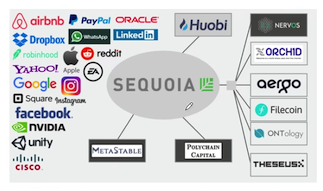

# Frogs and princes

20201114 *The Economist*

本篇金融方向术语偏多

⭐️⭐️⭐️⭐️

## 原文

More and more capital is chasing fewer and fewer ideas

Who are the heirs of Robert Fleming, the 19th-century Scot who saw that America was the coming place to put risk capital? The venture capitalists of Silicon Valley have the best claim. The businesses that loom largest in publice quity markets—Amazon, Apple, Facebook, Google, Tesla and the rest—were nurtured by VCs. Venture-backed companies account for around a fifth of the market capitalisation of public companies in America and almost half their research spending. The funds that unearth such gems stand to make pots of money. VCs have on average (an important qualifier) beaten the public market net of fees over the long run.

Most firms that receive VC funding fail. But the winner-takes-all nature of technology markets means those that succeed often do so extravagantly. The VC industry is at the frontier of capital allocation. The typical investor has tokiss a lot of frogs to find a prince (or even a decent-looking frog). The average VC firm screens 200 targets, but makes only four investments, according to a study in the Journal of Financial Economics. Part of the added value, say its authors, is to improve the governance of startups and keep a watchful eye on management.

No wonder pension schemes, sovereign-wealth funds and mutual funds are competing to write big cheques for Silicon Valley’s next generation of stars. But unlike the railways, brewers, distillers and mines of the Fleming era, today’s new firms have no great need of capital. A young technology firm can rent computing power from the cloud, download basic software from the internet and use a range of cheap, outsourced services to help it grow. Startups are staying private for longer. When they list, it is because the founders need to cash out or (as with the latest rash of tech IPOs) when the money on offer in the public markets is simply too good to turn down. It is not to raise capital for the business.

Very few new firms turn out to be world-beaters. Good ideas are scarce. But VC firms that have succeeded in the past may have an edge in finding them. Astudy by Morten Sorensen finds that companies funded by more experienced VCs are more likely to succeed. And sourcing the best entrepreneurial talentis more important to success than the development of that talent.

In this sense the best venture-capital firms resemble elite universities. Because the brightest turn up at their door, they are able to charge the highest fees. And those fees are mostly for the accreditation and the social networks that the institution can offer.

## 阅读

> tips:
>
> + 风险投资（Venture Capital）简称风投，也叫创业投资。主要是指向初创企业提供资金支持并取得该公司股份的一种融资方式，风投机构同时也会对公司的运营提供专业建议。苹果、谷歌、Facebook、腾讯、阿里、美团等互联网巨头的发展壮大都离不开早期慧眼识珠的风险投资。
>
> + SEQUOIA Capital
>
>     
>
> + 美国一家著名的风投机构，上面的品牌都眼熟的不行

### Frogs and princes

> The Frog Prince 青蛙王子，一个寓言故事。大概是讲一个公主把一个青蛙亲成王子。
>
> 为什么起这样的标题，看文章就知道了。

More and more ==capital== is chasing fewer and fewer ideas

> 导语
>
> + capital   n. 资本，资金，资本家

Who are the ==heirs== of Robert Fleming, the 19th-century ==Scot== who saw that America was the coming place to put risk capital? The ==venture capitalists== of Silicon Valley have the best claim. 

> 正文开始
>
> + heir   */*eə(r)*/*  n. 继承者
> + risk capital == venture capital
> + Scot   苏格兰人
>     + Robert Fleming  著名金融家，[Robert Fleming & Co.](https://en.wikipedia.org/wiki/Robert_Fleming_%26_Co.)商业银行创始人
> + Venture capialist   风险投资人
> + venture   n. 风险项目，冒险事业
>     + Joint venture  各自公司
> + Silicon Valley  硅谷
> + claim   v. 宣称，这里是 n. 所有权

The businesses that ==loom largest== in ==publice quity markets==—Amazon, Apple, Facebook, Google, Tesla and the rest—were ==nurtured== by VCs. 

> + + They have first claim on the assets of the trust.  他们对这笔信托财产有第一所属权 
> + Loom large  非常重要，无法回避（固定搭配）（往往是不好的事情）
>     + Fear of failure loomed large in his mind.  失败的恐惧沉重地压在他的心头。
>     + loom   *v.*（尤指阴森森地）隐约出现，赫然耸现；逼近，临近
> + publice quity markets   公开股票市场
>     + equity   n. 股票，普通股
> + nurture   v. 培养，扶持

==Venture-backed== companies account for around a fifth of the ==market capitalisation== of ==public companies== in America and almost half their ==research spending==. The funds that ==unearth== such ==gems== ==stand to== make pots of money. VCs have on average (an important ==qualifier==) beaten the public market ==net of== fees over the long run.

> + venture-backed   风投支持的
>     + backed   a. 有财力支持的
> + market capitalisation / market cap   市值
> + public company  公众公司
>     + 可以股份公开转让的公司
>     + 包括 listed company `(上市公司)`，这些公司可以在 stock exchange `(证券交易所)` 公开将自己的股票买卖
>         + Over-the-counter(OTC) `上柜交易` 是另一种交易方式。
> + research spending   n. 研发开销
> + unearth   v. 发掘
> + gem   n. 宝石
> + stand to do sth.  很可能做某事
> + qualifier   n. 修饰词
>     + 这里应该是想说，注意是：平均（on average）。
>     + 或者翻译为：这是一个很重要的限制条件
> + net   a. 净的
>     + net of sth. 扣除
>         + return net of tax  税后利润
>         + net of fees  除去费用
> + over the long run  长期来看

**至此第1段结束，段落大意：**

风投机构培育了大量巨头企业，是美国众多公司的资金来演，而且风投公司也能从这些投资中得到回报。

---

Most firms that receive VC funding fail. But the ==winner-takes-all== nature of technology markets means those that succeed often do so ==extravagantly==. The VC industry is ==at the frontier of== ==capital allocation==. 

> + winner-takes-all  赢家通吃
> + extravagantly    a. 奢侈的，铺账的
> + 第一句的意思就是 赢家通吃的科技市场风格也意味着想成功付出的也是十分夸张的。
> + at the frontier of   在...前沿（这个前沿往往是未知的边界，常用作学科新领域发现）
>     + 比较：in the front line of sth.  在第一线
>         + They stayed in the front line of the fight against covid-19.    他们留在了抗疫最前线
> + capital allocattion   资本配置

The typical investor has to kiss a lot of frogs to find a prince (or even a decent-looking frog). 

> 文章的标题开始引入
>
> 这句话就很搞笑
>
> 投资者不得不亲很多只青蛙，才能找到一个王子（甚至是找到一只长得还行的青蛙）
>
> + decent    a. 得体的，像样的

The average VC firm ==screens== 200 targets, but makes only four investments, according to a study in the Journal of Financial Economics. Part of the ==added value==, say its authors, is to improve the ==governance== of startups and ==keep a watchful eye on== management.

>+ Screen  v. 审查，筛查  n. 筛查
>    + n.  health screen 体检
>+ screening  n. 审查
>    + screening for lung cancer 肺癌筛查
>    + 你知道吗？肺癌是中国第一癌症杀手，第二位结肠癌
>+ added value 附加价值
>+ governance   n. 管理
>+ keep a watchful eye on  小心留意

**至此第2段结束，段落大意：**

风投公司成功率不算太高，风投风险巨大；风投机构需要筛查多个目标才能找到应该decent投资对象；风投机构对start-ups的管理提供支持。

---

No wonder ==pension schemes==, ==sovereign-wealth funds== and ==mutual funds== are competing to write big ==cheques== for Silicon Valley’s next generation of stars. 

> + Pension scheme   养老金计划
>     + pension    n. 养老金，退休金
> + Sovereign-wealth funds   主权财富基金
>     + sovereign   a.国家）有主权的，完全独立的；掌握全部权力的，有至高无上的权力的；首要的；非常好的，非常有效的；  
>     + n. 君主，元首；金镑
> + mutual fund   证券投资基金
> + cheque    n. 支票
> + 这句话的翻译是：==也难怪==养老基金计划，主权财富基金和证券投资基金==争相去==给==硅谷的明日之星====开大支票==。

But unlike the railways, ==brewers==, ==distillers== and mines of the Fleming era, today’s new firms have no great need of capital. A young technology firm can rent computing power from the cloud, download basic software from the internet and use a range of cheap, ==outsourced== services to help it grow. Startups are staying ==private== for longer. When they ==list==, it is because the founders need to ==cash out== or (as with the latest ==rash of== tech ==IPOs==) when the money ==on offer== in the public markets is simply too good to ==turn down==. It is not to raise capital for the business.

> + brewer  n. 啤酒公司
>     + brew   v. 酿制啤酒  n. 啤酒
> + distiller   n. （采用蒸馏法的）酿酒厂
>     + distill   v. 蒸馏
> + outsourced   a. 外包的
> + private   a. 私营的
> + list    v. （原指）被列入行情牌，即上市⭐️⭐️
> + cash out  把（投资）兑现
> + rash of...  大量...（不愉快的，突发的事）
> + on offer   提供的，可使用的
> + turn down   拒绝
> + IPO abbr. 首次公开募股（Initial Public Offerings）；初次公开发行（Initial Public Offering）

**至此第3段结束，段落大意：**

很多基金都投资硅谷新星；现在的初创公司对资金的需求不像原来那样大，它们更倾向于不上市；即使上市也是为了套现，或者是因为市场条件太好而谋利，而不是为了企业融资需求。

> 初创公司上市套现是指公司股东将其所持有的股份以较高价格卖出，从而获得现金收益的行为。在初创公司上市前，创始人、风险投资基金等股东通常持有大部分股份，上市后他们可以将股份出售获得现金，这就是所谓的套现。
>
> 初创公司上市套现是一个常见的现象。对于初创公司的创始人、投资者等，他们可能已经投入了大量资金和精力，但是公司尚未盈利或者盈利较少，上市套现成为了他们退出的主要方式。对于创始人而言，上市套现也是一种实现个人财富价值的方式。
>
> 然而，需要注意的是，初创公司上市套现也可能会带来一些负面影响。一方面，如果创始人和风险投资者一次性抛售大量股票，可能会引发市场恐慌，导致股票价格暴跌；另一方面，过于追求套现可能会导致公司缺乏长期发展战略，忽略了公司的长远利益，从而对公司的未来发展产生不利影响。
>
> From chatGPT  初创公司上市是为了套现是什么意思？

---

Very few new firms turn out to be ==world-beaters==. Good ideas are ==scarce==. But VC firms that have succeeded in the past may have an edge in finding them. Astudy by Morten Sorensen finds that companies funded by more experienced VCs are more likely to succeed. And sourcing the best entrepreneurial talentis more important to success than the development of that talent.

> + world-beaters 举世无双的人/事（打败了世界）
>     + world-beating   a. 举世无双的
> + scarce   a. 稀少的
> + edge   n. （微弱）优势，边界
>     + competitive edge   竞争力
> + source    v. 从...获得
>     + source sth. from ... 
> + entreperneurial   a. 创业的
> + entrepreneur   n. 企业家

**至此第4段结束，段落大意：**

只有很少初创企业能成长为举世无双的巨头，但成功的风投公司总有办法找到并培育它们，而且找准人才比培养人才更重要。

---

==In this sense== the best venture-capital firms ==resemble== ==elite universities==. Because the brightest ==turn up== at their door, they are able to charge the highest fees. And those fees are mostly for the ==accreditation== and the social networks that the institution can offer.

> + in this sence   从这个角度来说
>     + == from this perspective
>     + sense   有 意义 的意思
>         + make sence 有道理
> + resemble 看起来像
> + She closely resembles her mum.  她和她妈妈长得很像
> + elite university   精英大学
>     + the lvy league  常春藤
>     + The Russell Group  罗素大学集团
> + turn up   出现
> + brightest  这里不是最亮的，是说那些最聪明的人
>     + 这句话的意思是，那些最聪明的人会自己送上门
> + accreditation   n. 证明合格
>     + accredit  v. 认可，认为；归于
>     + Michael Phelps ==was accredited with== being one of the world's fastest swimmer.  菲尔普斯被认为是世界上最快的游泳运动员之一
>     + 表示归于
>         + accredit sth. to sb.
>         + accredit sb. with sth.
>         + The invention of airplane is accredited to the Wright Brothers.
>         + The Wright Brothers were accredited with the invention of airplane. 菜特兄弟被认为发明了飞机。

**至此第5段结束，段落大意：**

厉害的风投机构和精英大学很像：好苗子都主动送上门，而且可以对自己提供的资质认证和社交网络收取高额费用。

---

