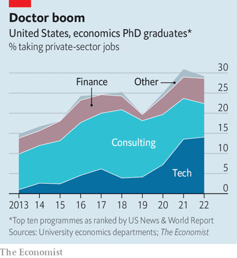
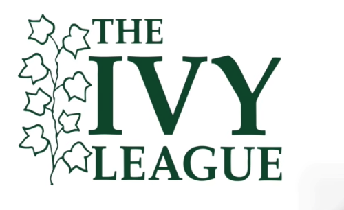
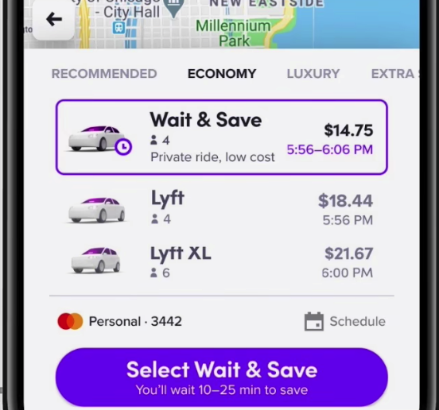

# Why economists are flocking to Silicon Valley

20220910 *The Economist*

⭐️⭐️

## 原文：

**Mr Smith goes to Silicon Valley**

### Why economists are flocking to Silicon Valley

**And why big tech wants them**

For more than a decade Facebook, now known as Meta, has awarded fellowships to promising graduate students working on cutting-edge research. The prize, which this year comes with up to two years’ worth of university tuition and a $42,000 stipend, has gone to computer scientists, engineers, physicists and statisticians. Now it has gone to an economist. “I was not expecting it,” says Jaume Vives i Bastida, the lucky recipient working on a PhD at the Massachusetts Institute of Technology (MIT).

Silicon Valley is increasingly turning to economics for insights into how to solve business problems—from pricing and product development to strategy. Job-placement data from ten leading graduate programmes in economics shows that tech firms hired one in seven newly minted PhDs in 2022, up from less than one in 20 in 2018 (see chart). Amazon is the keenest recruiter. The e-emporium now has some 400 full-time economists on staff, several times as many as a typical research university. Uber is another big employer—last year the ride-hailing firm hired a fifth of Harvard University’s graduating PhD class.

For the dismal scientists pay is a factor, says John List, a professor at the University of Chicago who has worked at Uber and Lyft. But tech companies also offer many of the benefits of a university career without the “publish or perish” culture. In the past, heading to the private sector often meant forgoing research completely. Now, explains Mr Vives, “Research can still be a big component of your job.” Access to the companies’ ample data is another selling point, says Steve Tadelis of the University of California, Berkeley, who spent two years at eBay, an online marketplace.

For big tech, meanwhile, economists offer skills that computer scientists and engineers often lack. They tend to have a good grasp of statistics, as well as a knack for understanding how incentives affect human behaviour. Most important, economists are adept at designing experiments to identify causal relationships between variables. Machine-learning engineers usually think in terms of prediction problems, notes one Ivy League grad who recently started a job in tech. Economists can nail down the causal parameters, he says.

An e-commerce firm may want to estimate the effect of next-day shipping on sales. A ride-hailing firm may wish to know which sets of incentives lure drivers back to the city centre after they are hailed by customers attending a big concert or sporting event. In two periods between 2015 and 2017 Mr List and colleagues at Lyft, Arizona State University and Boston University manipulated the prices and wait times for Lyft rides across 13 American cities to estimate the value of time. The study, which found that Lyft users value their time at about $19 per hour, yielded a paper. It also led to a new feature on the Lyft app called “Wait & Save”, which lets riders opt for a longer wait time in exchange for a lower fare.

For all its recent recruitment success, Silicon Valley may have a harder time attracting the finest economists. In contrast to fields like artificial intelligence, “our best minds still stay in the academy,” observes Mr List. Maybe not for long. “I would like to be a professor, I would like to do research for a living,” says Mr Vives. “I can also do that at a tech company.”

## 阅读：

**==Mr Smith== goes to ==Silicon Valley== **

> 红标部分，玩梗区
>
> + Mr Smith
>     + 代指亚当·斯密或者经济学
>     + Adam Smith 亚当·斯密
>     + 现代经济学之父
>     + The Wealth of Nations《国富论》
> + Silicon Valley
>     + 硅谷
>     + Silicon Delta 硅三加州

### Why economists are ==flocking to== Silicon Valley

> 标题  为什么搞经济的人蜂拥到硅谷？
>
> + flock   n. 鸟群，羊群
>     + herd   n. 兽群
> + flock   v. 聚集，蜂拥
>     + ~ to/into   ... 蜂拥到某地

*And why ==big tech== wants them*

>  导语 而且为什么科技巨头要经济人才
>
> + Big Tech   n. 科技巨头

For more than a decade Facebook, now known as Meta, has awarded ==fellowships== to ==promising== ==graduate students== ^^working on cutting-edge research^^. 

> + Fellowship   n. 奖学金
>     + == scholarship
> + promising   a. showing signs of being good or successful.
> + graduate students   n. 研究生
>     + == postgraduate
> + cutting-edge   a. 前沿的
>     + == leading-edge

The prize, which this year comes with up to two years’ worth of university ==tuition== and a $42,000 ==stipend==, has gone to computer scientists, engineers, physicists and statisticians.

> + tuition   n. 学费
>     + == tuition fee
> + stipend   n. 生活津贴
> + statistician   n. 统计学家
>     + statistic   n. 统计学
> + 非限定性定语从句：（The prize）近几年包含价值2年的学费和$42,000的津贴

Now it has gone to an economist. “I was not expecting it,” says Jaume Vives i Bastida, the lucky ==recipient== working on a PhD at the Massachusetts Institute of Technology (MIT).

>+ recipient   n. 得主，接受者
>
>+ working on a PhD  攻读博士学位
>    + work on sth 致力于
>+ I was not expecting it  没指望

**至此第1段结束，段落大意：**

Meta的奖项再过去的得主基本是研究工科理科的学生，但今年得主是一个经济学博士。

---

Silicon Valley is increasingly turning to economics for insights into how to solve business problems—from ==pricing== and product development to strategy. 

> + price   v. 定价
>     + pricing
>
> 硅谷逐渐转向经济学来寻求见解，什么样的见解呢，在怎样解决商业难题上，难题是指从产品定价和产品开发到营销策略

==Job-placement== data from ten leading graduate ==programmes== in economics shows that tech firms hired one in seven newly ==minted== ==PhDs== in 2022, up from less than one in 20 in 2018 (see chart). 

> + Job-placement   n.就业安排
>     + placement   n. 安置，特指就业方面的
>     + job-placement service   就业安排服务
> + programme   n. 课程，常喜欢指研究生的课程
>     + taught programme  授课型课程
>     + research programme 研究性课程
> + mint  
>     + v. 铸造硬币 
>     + n. 薄荷糖，铸币厂，巨款
>     + a. 崭新的
>     + freshly minted interpreter  崭新出炉的（才结束训练的）口译员
> + PhD
>     + Doctor of Philosophy 博士学位
>     + doctoral programme 正在攻读博士

Amazon is the keenest ==recruiter==. The ==e-emporium== now has some 400 full-time economists ==on staff==, several times as many as a typical research university. Uber is another big employer—last year the ==ride-hailing== firm hired a fifth of Harvard University’s graduating PhD class.

> + recruiter   v. 招募
>     + recruiter   n. 招募单位
> + emporium   n. 大商店
>     + e- 电子相关
> + be on (the) staff  在员工中
> + class   n. 同届毕业生
>     + the class of'22  2022届毕业生

**至此第2段结束，段落大意：**

摆事实，列数据，讲道理。举了Amazon和Uber两大招人公司的招人方向来说明硅谷青睐经济学人才

---

For the ==dismal scientists== pay is a factor, says John List, a professor at the University of Chicago who has worked at Uber and ==Lyft==. 

> + dismal science  沉闷科学
>     + 玩梗，economics绰号
>     + dismal   a. 凄凉的，阴沉的
> + pay  工资
>     + paycheck  工资支票
>     + Payday  发薪日
> + Lyft  来福车   一家ride-hailing公司

But tech companies also offer many of the benefits of a university career without the ==“publish or perish”== culture. 

> + Perish   v. 死亡
>     + publish or perish  要么发表要么死亡（表示一些大学里的硬性规定：每年必须发表多少片论文）
>     + make or break  不成功便成仁

In the past, heading to the ==private sector== often meant ==forgoing== research completely. Now, explains Mr Vives, “Research can still be a big component of your job.” Access to the companies’ ==ample== data is another selling point, says Steve Tadelis of the University of California, Berkeley, who spent two years at eBay, an online marketplace.

> + private sector   n. 私营部门
>     + public sector   n. 公营部门
> + Forgo   v. 放弃
> + ample   a. 足够的
> + selling point   n. 卖点
>     + USP == unique selling point  独家卖点

**至此第3段结束，段落大意：**

经济学人才被吸引的3个方面：薪水，依然有学校那样的研究环境，大量的数据。

---

For big tech, meanwhile, economists offer skills that computer scientists and engineers often lack. They tend to have a good grasp of statistics, as well as a ==knack== for understanding how ==incentives== affect human behaviour. 

> + knack   n. 技能，能力
> + incentive   n. 动力，激励

Most important, economists are ==adept== at designing experiments to identify ==causal== relationships between ==variables==. Machine-learning engineers usually think in terms of prediction problems, notes one ==Ivy League== grad who recently started a job in tech. Economists can ==nail down== the causal parameters, he says.

>+ Adept   a. 适应的
>    + be adept at doing sth. 擅长做某事
>+ causal   `/ˈkɔːz(ə)l/`  adj. 因果关系的
>    + 区分  casual   `/ˈkæʒuəl/` a. 偶然的，随意的
>+ variable   n. 变量
>+ Lvy league  常春藤联盟
>+ grad  毕业生
>+ nail down  对...做出定论

**至此第4段结束，段落大意：**

第3段说了经济学人才去的原因，4段则是介绍硅谷招经济学人才的原因。

经济学人才有着其他科技方面的人才所不具有的能力（擅长统计学，知晓激励机制如何影响人的行为以及发现变量间的因果关系），这也是硅谷青睐经济学人才的原因。

---

An e-commerce firm may want to estimate the *effect* of next-day ==shipping== *on* sales. A ride-hailing firm may wish to know which sets of incentives ==lure== drivers back to the city centre after they are hailed by customers ^^attending a big concert or sporting event^^. 

> + `effect`一般后面会接上`on`。effect A on B，表示A对B的影响。
> + ship   n. 船
>     + next-day shipping  次日达     ==    next-day delivery
>     + same-day shipping  当日达
> + lure   v.&n. 诱惑
>     + lure sb into/to 
> + attending a big concert or sporting event  做customer的后置定语

In two periods between 2015 and 2017 Mr List and colleagues at Lyft, ==Arizona State University== and ==Boston University== ==manipulated== the prices and wait times for Lyft ==rides== across 13 American cities to estimate the value of time. The study, which found that Lyft users ==value== their time at about $19 per hour, ==yielded== a paper. It also led to a new ==feature== on the Lyft app called “Wait & Save”, which lets riders opt for a longer wait time in exchange for a lower fare.

> + Arizona State University   亚利桑那州立大学
> + Boston University  波士顿大学
> + Manipulate   v. 操纵
> + ride   n. 乘车的短途旅程
> + value   v. 给...定价
> + yield   v. 产生（收益 效益）
>     + yield fruitful results 产生有效的结果
>     + field   n. 田野；行业；领域
> + feature   n. 特色   v. 以...为特色，起重要作用
>     +  但是它多跟电子产品使用，表达含义为`功能`。
>     + Apple's 2022 "Pro" iPhones feature a notchless display with Dynamic Island.
>     + 苹果2022年发布的iPhone Pro系列屏幕没有刘海，还配有灵动岛
> + Wait & Save

**至此第5段结束，段落大意：**

举例说明了经济学在Lyft打车软件的应用场景，表名经济学人才可以为科技公司解决问题

---

==For all== its recent recruitment success, Silicon Valley may have a harder time attracting the ==finest== economists. In contrast to fields like artificial intelligence, “our best ==minds== still stay in the academy,” ==observes== Mr List. Maybe not for long. “I would like to be a professor, I would like to do research for a living,” says Mr Vives. “I can also do that at a tech company.”

> + for all  尽管
>     + == despite/in spite of  这些后面都是跟名词的
> + finest   高质量的，高水准的
> + mind   n. 有才智的人
>     + Great minds think a like. 英雄所见略同
> + observe   v. 【正式】评论；观察
> + “our best minds still stay in the academy,”  最顶尖的人才还在院校里

**至此第6段结束，段落大意：**

展望未来，尽管目前最顶级的经济学人才还在院校中，但是科技公司抛出的橄榄枝也会挖走他们的。

---