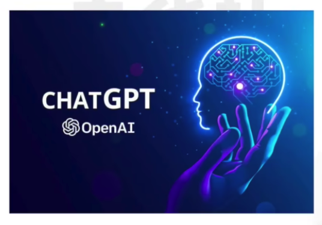
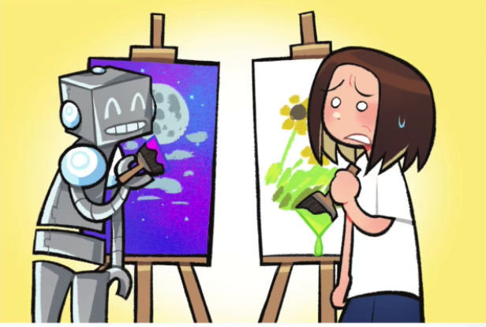

# chatGPT

20230204 *Financial Times*

⭐️⭐️⭐️

## 原文

“The age of AI is upon us,” Microsoft’s chief executive Satya Nadella declared last week.

The giant software company is certainly backing its grand talk with hard cash and computing power. Last month, Microsoft announced it was investing a further $10bn in OpenAI, the San Francisco-based research company that has electrified the digital world with the launch of its ChatGPT language-generation model.

Within a week of opening up ChatGPT to the public, 1mn users were experimenting with the super-sophisticated chatbot to write reams of highly plausible text at astonishing speed.

Such “large language models”, as they are called, are not new, but never before have they been made so widely accessible. Even the British finance minister Jeremy Hunt (or his speechwriter) employed ChatGPT to compose the introduction to his recent speech on innovation

Despite the broader tech market downturn, venture capital firms have been frenziedly pouring billions of dollars into start-ups to exploit the commercial opportunities of these “generative” AI models.

Trained on huge amounts of content drawn from the internet, these models can also be used to generate computer code, images, audio and video. The next big thing in AI this year may well be the emergence of multi-modal models that mix several of these elements. “The quality and capabilities of generative models for imagery, video, and audio has shown truly stunning and extraordinary advances in 2022,” wrote Jeff Dean, one of Google’s most senior AI researchers.

Tech evangelists argue that the widespread adoption of generative AI opens up a new era in technology, just as the emergence of personal computers, smartphones and social media gave birth to seemingly limitless business opportunities in earlier times. Generative AI may yet transform the creative industries, video games production and enterprise software, for example. One of the open questions surrounding its use is whether it will strengthen the power of the tech incumbents, including Microsoft and Google, or stimulate fresh competition from insurgent start-ups, such as Cohere, Stability AI and You.com.

But the widespread adoption of generative AI is also triggering concerns about the theft of copyright, the spread of disinformation and deepfakes and the debasement of knowledge on the world wide web. Generative AI systems are trained to produce the most statistically probable answer, not the most accurate, and can “hallucinate” facts. ChatGPT has been described as “the greatest bullshitter ever” by Arvind Narayanan, a computer science professor at Princeton University.

The digital gold rush around generative AI may also be distracting us from more profound and productive uses of other machine learning models, according to one tech executive. While everyone is fixated on the industry’s “shiny new toy”, researchers have been using machine learning systems to diagnose cancers, model protein structures, optimise electricity grids and design components for heart valves, aero engines or wind turbines.

The age of AI may well be upon us, but not quite in the way we — and our digital assistants — are currently all chatting about.

## 阅读

“The age of AI is ==upon== us,” Microsoft’s ==chief executive== Satya Nadella declared last week.

> + Upon    prep. 即将来临
>     + Winter is almost upon us.
> + chief executive == CEO 首席执行官
> + Satya Nadella   这个人我们在 *Coding is still a good career bet*提到过

The giant software company is certainly ==backing== its ==grand talk== with ==hard cash== and ==computing power==. 

> + back   v, 帮助，支持
> + grand talk   （宏伟的演讲）豪言壮语
> + hard crash   现金（硬币纸币）
> + Computing power   算力

Last month, Microsoft announced it was investing a ==further $10bn== in OpenAI, the San Francisco==-based== research company that has ==electrified== the digital world with the ==launch== of its ==ChatGPT== language-generation model.

> + bn billion   十亿
>     + Further $10bn  再投资10亿元
> + -base   a.总部位于...的
>     + a London-based law firm
> + electrified   v. 使通电，使兴奋
> + launch    n. 上市
> + ChatGPT
>     + Chat Generative Pre-trained Transformer
>     + 

**至此第1 2段结束，段落大意：**

概述了openAI的诞生和微软的行动，对科技界轰动很大

---

Within a week of opening up ChatGPT to the public, 1mn users were experimenting with the super-==sophisticated== chatbot to write ==reams== of highly ==plausible== text at astonishing speed.

> + Sophisticated   a. 先进的，复杂的
> + reams   n. 大量的文字【非正式】
> + plausible   a. 看起来合理的

**至此第3段结束，段落大意：**

当openAI开放向大众时，大量用户用他来做文本生成

---

Such “large language models”, ==as they are called==, are not new, but ==never before have they been made so widely accessible==. Even the British finance minister Jeremy Hunt (or his speechwriter) employed ChatGPT to ==compose== the introduction to his recent speech on innovation

> + large language models  LLM  大型语言模型
> + as they are called   插入语，可以不管，也可以译作 所谓的
> + never before have they been made so widely accessible中的`never`提前了，表示强调
>     + They have never before been made so widely accessible.
> + Finance minister 财政大臣（小写指总称）
>     + Chancellor of the Exchequer   财政大臣
>     + the Exchequer   英国财政部
> + compose   v. 撰写（诗歌讲稿）作曲
>     + compose   v. 作曲
>     + composer   n. 作曲家
>     + composition    n. 作品

**至此第4段结束，段落大意：**

大型语言模型不是新鲜事物，但是从未如此被广泛使用

---

==Despite== the broader tech market ==downturn==, ==venture capital== firms have been ==frenziedly== pouring billions of dollars into ==start-ups== to ==exploit== the commercial opportunities of these ==“generative” AI models==.

> + Despite  再次提醒，despite后面跟名词
> + downturn   n. 衰退（商业经济）
> + venture capital   (VC) 风险投资，后面会找一篇做reading
> + Frenziedly   adv. 疯狂地，狂乱地
>     + frenzied   a. 疯狂的
> + start-ups   初创公司
> + exploit   v. 充分利用
>     + 贬义：压榨
> + “generative” AI models  生成式AI模型，这个`generative AI`我们在上一篇讲过。
> + 

**至此第5段结束，段落大意：**

资本市场如何反应。

---

Trained on huge amounts of content ==drawn== ==from== the internet, these models can also be used to generate computer code, images, audio and video. The next big thing in AI this year ==may well== be the ==emergence== of ==multi-modal models== that mix several of these elements. “The quality and capabilities of generative models for imagery, video, and audio has shown truly stunning and extraordinary advances in 2022,” wrote Jeff Dean, one of Google’s most senior AI researchers.

> + draw A from B  从B获得A    文中是被动形式
> + May well   常用搭配：很可能
>     + can/could/may/might well 很可能
> + emergence    n. 出现
> + mutli-modal model  多模态模型
>     + modal   */*ˈməʊdl*/*   a. 模态的
>     + model   */*ˈmɒd(ə)l*/*

**至此第6段结束，段落大意：**

生成式AI模型能做什么；预测下一件AI界的大事might well 多模态模型。2022年generative model 也确实取得了惊人的成绩。

---

==Tech evangelists== argue that the widespread ==adoption== of generative AI opens up a new era in technology, ==just as== the emergence of personal computers, smartphones and social media ==gave birth to== ==seemingly limitless business opportunities== in earlier times. 

>+ Tech evangelists  这里是一个专业术语，可以简单的理解为技术理念的推广者。
>    + Evangelists   n. （宗教）巡回布道者，传播者
>    + A **technology evangelist** is a person who builds a [critical mass](https://en.wikipedia.org/wiki/Critical_mass_(sociodynamics)) of support for a given technology, and then establishes it as a [technical standard](https://en.wikipedia.org/wiki/Technical_standard) in a market that is subject to [network effects](https://en.wikipedia.org/wiki/Network_effects).
>    + The term "software evangelist" was coined by Mike Murray of [Apple Computer](https://en.wikipedia.org/wiki/Apple_Computer)'s [Macintosh computer](https://en.wikipedia.org/wiki/Macintosh_computer) division. It was part of Apple's drive to compete with [IBM](https://en.wikipedia.org/wiki/IBM) and it specifically described the initiative to win over third-party developers rhetorically to persuade them to develop software and applications for the [Macintosh](https://en.wikipedia.org/wiki/Macintosh) platform.
>+ adoption   n. 采用（想法，计划）
>    + Adopter   n. 新技术的应用者，养父母
>+ just as sth.   正如...
>+ give birth to ...   使产生，催生了
>+ Seemingly limitless business opportunities  看似无限的商机

Generative AI may ==yet== transform the creative industries, video games production and enterprise software, for example. One of the ==open questions== surrounding its use is whether it will strengthen the power of the tech ==incumbents==, including Microsoft and Google, or stimulate fresh competition from insurgent ==start-ups==, such as Cohere, Stability AI and You.com.

> + Yet 这里不是 `还没有`这层意思
>     + yet   adv. 终归，迟早
>     + I know she's alive and I'll find her yet. 我知道她还活着，我迟早会找到她。
> + open questions   未下定论的问题，悬而未决的问题。
> + Incumbents   n. 在职者，现任。这里那些指位于前列的big tech
>     + In general, incumbents have a 94 percent chance of being reelected.  通常现任官员有94%的概率会再次当选
> + stimulate   v. 促进，刺激
> + insurgent   a. 起义的
> + 本句话非常精彩，意思为：生成式AI带来一个未定论的问题是，它是会让当前在位的科技巨头巩固自己的地位呢，还是会刺激起义的初创公司来撬动它们的地位。

**至此第7段结束，段落大意：**

技术传播者宣称生成式AI的广泛使用可以会带来跨时代的革新，但这会巩固现有巨头的地位还是给新兴企业更多机会还不得而知。

---

But the widespread adoption of generative AI is also ==triggering concerns== about ==the theft of copyright==, the spread of ==disinformation== and deepfakes and the ==debasement== of knowledge on the world wide web. 

> + trigger   v. 引发
>     + trigger concern   引发一些担心
> + the theft of copyright   版权盗窃（模仿画风，笔风）
> + disinformation    n. 虚假消息，常指特意发布出欺骗群众的消息
> + Deepfake  深度伪造（AI换脸）
>     + 合成词  ==  deep learning + fake
> + debasement   n. 降低，贬值

Generative AI systems are trained to produce the most ==statistically probable== answer, not the most accurate, and can “==hallucinate==” facts. ChatGPT has been described as “the greatest ==bullshitter== ever” by Arvind Narayanan, a computer science professor at ==Princeton University==.

> + statistically   a. 从统计学上来说
> + probable   a. 可能发生的
> + hallucinate   vi. 产生幻觉  常见的不及物意思
>     + hallucinate   vt. 用幻觉影响  这里是及物动词
>     + hallucination    n. 幻觉
> + Princeton University  普林斯顿大学
> + 
> + Bullshit 胡说八道
>     + bullshiter 胡说八道的人

**至此第8段结束，段落大意：**

生成式AI的引发的一系列担忧，内容的准确性还有待商榷。

---

The digital gold rush around generative AI may also be distracting us from ==more profound and productive== uses of other machine learning models, according to one tech executive. 

> + Gold rush  淘金热
>     + 是指人们涌向新发现的财经区的热潮
>     + 
> + more profound and productive   更有深度，更加有成果的。

While everyone ==is fixated on== the industry’s “shiny new toy”, researchers have been using machine learning systems to diagnose cancers, model protein structures, ==optimise== ==electricity grids== and design components for ==heart valves==, ==aero engines== or ==wind turbines==.

> + Be fixated on sth.  专注于
> + shiny new toy  闪闪发光的新玩具，这里指的是`generative AI`
> + model protein structures
>     + model   v. 建模
> + Optimise   v. 优化
> + Electricity grid  电网
> + Heart valves  心脏瓣膜
> + aero engines  航空发动机
> + wind turbine  锋利涡轮发动机

**至此第9段结束，段落大意：**

过度的关注`generative AI`可能不会利于其他AI的应用发展，实际上其他当面AI领域已经给各行各业带来了切实有效的帮助

---

The age of AI may well be upon us, but not quite in the way we — and our digital assistants — are currently all chatting about.

> + Upon  有 即将来临  之意
>
> + ^^but not^^ quite ^^in the way^^  但不是以（）的方式
> + 什么样的方式呢
>     + ==we== — and our digital assistants — ==are currently all chatting about.==
>     + 我们现在一直在聊的那种方式
> + — and our digital assistants — 插入语补充主语，我们以及我们的电子助手（AI）
> + == The age of AI may well be upon us, but not quite in the way (that) weand our digital assistants arecurrently all chatting about.

**至此第10段结束，段落大意：**

哪怕AI时代真的来临，也不会是我们想的这样