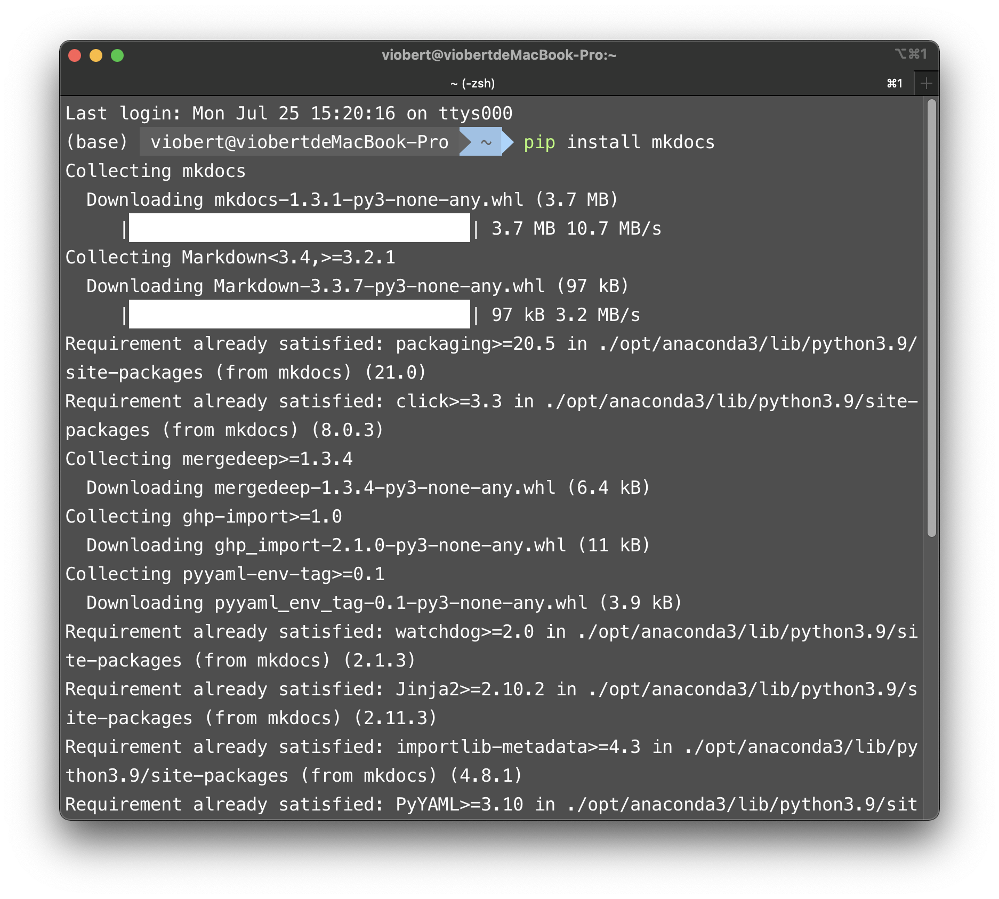
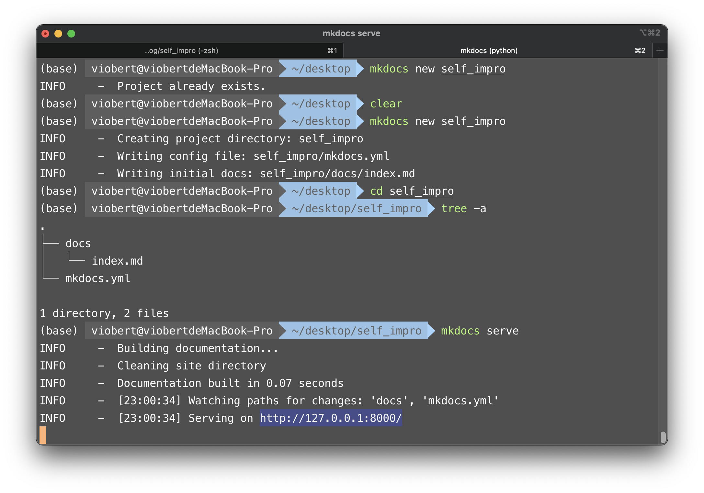
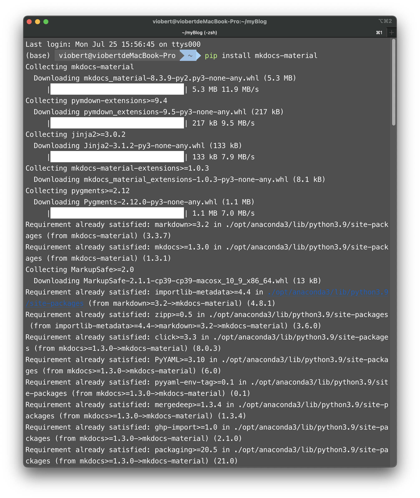

# Getting Started


## Github Pages

你想拥有一个自己的个人博客、网站吗，那么gh pages是一个不二选择。你不必拥有自己的服务器、自己申请域名什么什么的，因为GitHub都帮你把麻烦事解决了！

## Introduction

使用GitHub pages制作自己的**静态**网站有许许多多的途径。[GitHub Pages](https://pages.github.com/)为你提供一个舞台，舞台上的你可以尽情表演自己的才能，像[jekyll](https://jekyllrb.com/)、[hexo](https://hexo.io/zh-cn/)、[mkdocs](https://www.mkdocs.org/)......都可以帮你快速高效的搭建一个静态网站。这里博主选择的是mkdocs（其他的我也没试过哈哈，先看到mkdocs的教程就用了）。直接写markdow就行了，都不用写HTML/CSS/JAVASCRIPT真的很舒服！！（你不会markdown啊，很简单的，学一下吧）

我个人的电脑环境是 macOS Monterey 12.2.1。不同的环境也可以稍作借鉴啦，不同的地方碰到疑惑需要自己google去找解决的方案，这才是一种学习的过程！

## Install git

什么，你还没学会git？其实也不要紧，你可以去上一篇博客[learn git](https://viobert.github.io/self_impro/GIT/learnGit/git/)看看吧。不用学会很多，你也可以先读下面，不会再查。

## Install mkdocs

[mkdocs installation--A detailed guide ](https://www.mkdocs.org/user-guide/installation/)

> MkDocs requires a recent version of [Python](https://www.python.org/) and the Python package manager, [pip](https://pip.readthedocs.io/en/stable/installing/), to be installed on your system.
>
> You can check if you already have these installed from the command line:

```
$ python --version
Python 3.8.2
$ pip --version
pip 20.0.2 from /usr/local/lib/python3.8/site-packages/pip (python 3.8)
```

mkdocs需要Python和pip，所以你需要先安装Python。你可以在命令行中输入上面的代码检验一下你是否已经安装过了。Python、pip的安装这里就先不记录了。

那么到这里我可以认为你已经拥有了上述条件，那么很简单，命令行中输入

```
$ pip install mkdocs
```

> You should now have the `mkdocs` command installed on your system. Run `mkdocs --version` to check that everything worked okay.

安装完成后可以命令行输入如下，进行检查。

```
$ mkdocs --version
mkdocs, version 1.2.0 from /usr/local/lib/python3.8/site-packages/mkdocs (Python 3.8)
```



## Creating a new mkdocs project

终端中输入

```
$ mkdocs new (name)   # 创建
$ mkdocs serve        # 运行
```



图中最下方选中的地址复制到浏览器框中就可以看到一个简易的博客了。


## Install mkdocs-material

但是你的个人网站是这样的画风，想必你可能有些不满意。GitHub有一个很好的mkdocs主题[mkdocs-material](https://github.com/squidfunk/mkdocs-material)

应用起来也是失分简单

Material for MkDocs can be installed with ==pip==:

```
pip install mkdocs-material
```

Add the following lines to ==mkdocs.yml==:

```
theme:
  name: material
```

For detailed installation instructions, configuration options, and a demo, visit [squidfunk.github.io/mkdocs-material](https://squidfunk.github.io/mkdocs-material/)




## Git and Github

怎么与GitHub关联起来呢。[GitHub Pages](https://pages.github.com/)

在GitHub上创建个人网站，分两种类型：

1. Users sites

    [create a new public repository](https://github.com/new) named *username*.github.io, where *username* is your username (or organization name) on GitHub.

   注意这里的名字一定要是你的用户名，而且这种的仓库你只能创建一个。如果后续你又故技重施，那么你的网页会出现404报错。如果你还拿捏不准要不要使用users sites，可以先用下面的进行test。

2. Project sites

   这个就相对容易了，名字起你的仓库名就可以了。然后你的网址就是https://(username).github.io/(repository name)。比如我的是这样的: https://viobert.github.io/self_impro/。这个绑定的是你的个人仓库，仓库可以有多个，所以这个不限制数量的。

### git init

在你创建的mkdocs目录文件下

```
$ git init
$ git add.
$ git commit -m "initiation"
```

### git push

```
$ git remote add origin git@github.com:viobert/self_impro.git # your repo
$ git branch -M main
$ git push -u origin main
```


> 问题：
>
> * Error: ! [rejected] master -> master (fetch first)
>
> * 该问题出现的原因可能是远端仓库和本地仓库不一致了。极有可能是你在GitHub上创建新仓库中add readme.md了，但是很明显咱们的mkdocs文件目录下还没有这个。
>
> * ```
>   $ git pull --rebase origin main # 本地与远端合并
>   $ git push -u origin main       # push
>   ```

> 问题：
>
> * error: cannot pull with rebase: Your index contains uncommitted changes.
>   error: please commit or stash them.
>
> * 该问题可能是使用mkdocs serve部署页面后没有停止，命令行control + c 终止重来就行。或者：
>
> * 1、先执行   可用来暂存当前正在进行的工作
>   `git stash`
>
>   2、再执行
>   `git pull –rebase`
>
>   3、最后再执行  从Git栈中读取最近一次保存的内容
>   `git stash pop`

>问题：
>
>* GitHub的ssh认证
>
>* https://docs.github.com/cn/authentication/connecting-to-github-with-ssh/about-ssh
>
>  内容很多，但是按照official docs一步步来一定没问题，对应的服务（比如macOS将passphrase加到keychain）都有介绍。
>
>  passphrase可不是password啊！！
>
>* 这里记录一个点
>
>  If you work with `HTTPs` urls, it'll always ask for your username / password.
>
>  If you're correctly using `SSH` when cloning / setting remotes. Then make sure you have a ssh-agent to remember your password. That way, you'll only enter your passphrase once by terminal session.
>
>  If it is still too annoying, then simply set a ssh-key without passphrase.

然后在你的文件夹仓库下创建(your folder)/.github/workflow/(name).yml 相当于一个脚本，每次你push到GitHub它就会自动执行。这里具体的工作流程我还无法解释，抄作业。

```
.
├── .github
│   ├── .DS_Store
│   └── workflows
│       └── PublishMySite.yml
├── docs
│   └── index.md
└── mkdocs.yml
```

> 问题：
>
> * .DS_Store文件是什么啊？它好烦，我不想见到它。
>
>   
>
> * DS_Store，英文全称是 Desktop Services Store（桌面服务存储），开头的 DS 是 Desktop Services（桌面服务） 的缩写。它是一种由macOS系统自动创建的隐藏文件，存在于每一个用「访达」打开过的文件夹下面。
>
> * 你可能在给别人传输压缩包时候，会被问到：“哎，你这个文件夹中的这个文件是干嘛的啊?”，而你可能根本不知道你什么时候把它“放进去”了，一脸困惑。
>
> * 虽然不能在「访达」中直接看到它，但是通过「终端」App，可以输入`ls -la`命令列出。同时，通过`file`命令，可以显示出其文件类型，即”Desktop Services Store“。
>
>   DS_Store 文件的主要作用，是存储当前文件夹在桌面显示相关方面的一些自定义属性，包括文件图标的位置、文件夹上次打开时窗口的大小、展现形式和位置等。这有助于保留为特定文件夹配置的设置，例如，将桌面文件夹设置为查看按名称排序的图标，同时将下载文件夹配置为将文件显示为列表并按日期排序，最近修改的先显示。
>
>   后来，苹果又往里面加入了一些和文件注释相关的自定义信息。（这部分注释信息在最新的macOS中，同时被存储在文件自身的扩展文件属性中，这里仅作为了备份）
>
>   DS_Store 文件被苹果作为底层数据隐藏在系统中，不期望用户接触到。它存储的元数据仅仅被「访达」用于文件夹的自定义显示。它不会占用太多的存储空间，所以不用过于担心。
>
>   
>
> * Git仓库管理永久忽略 DS_Store 文件
>
>   1. 将 . DS_Store 加入全局的 .gitignore 文件（**你可能经常在别人的仓库里看见.gitignore文件，感兴趣自己去Google一下吧**），执行命令：
>
>   ```text
>   echo .DS_Store >> ~/.gitignore_global
>   ```
>
>   2. 将这个全局的 .gitignore 文件加入Git的全局config文件中，执行命令：
>
>   ```text
>   git config --global core.excludesfile ~/.gitignore_global
>   ```
>
>   
>
> * 如果你已经把它放进一个仓库里了，那么也不必担心
>
>   ```
>   $ find . -name .DS_Store -print0 | xargs -0 git rm -f --ignore-unmatch
>   $ git commit -m '.DS_Store delete!'
>   $ git push origin main
>   ```
>
>   这样就删掉了。
>
>   
>
> * 压缩包里我也不想看见它！
>
>   这也不是难事，但是根据你使用的压缩软件可能有所不同，这里就不多介绍了，Google！

### GitHub pages

去仓库里设置

Settings > Code and automation > Pages > Build and deployment 

> **Branch**
>
> Your GitHub Pages site is currently being built from the `gh-pages` branch. [Learn more](https://docs.github.com/articles/configuring-a-publishing-source-for-github-pages/).
>
> 选择分支 gh-pages  选择文件夹 /root

上面有有写你的repo被部署在哪里了


好了，那么到此为止，我相信你已经完成了基本工作，喝口水休息一下吧。


## Reference

[我不是小杰](https://www.bilibili.com/video/BV1hL4y1w72r?share_source=copy_web&vd_source=19ee44b0ddf39531fae061fcb1320f71) 超级赞！！


