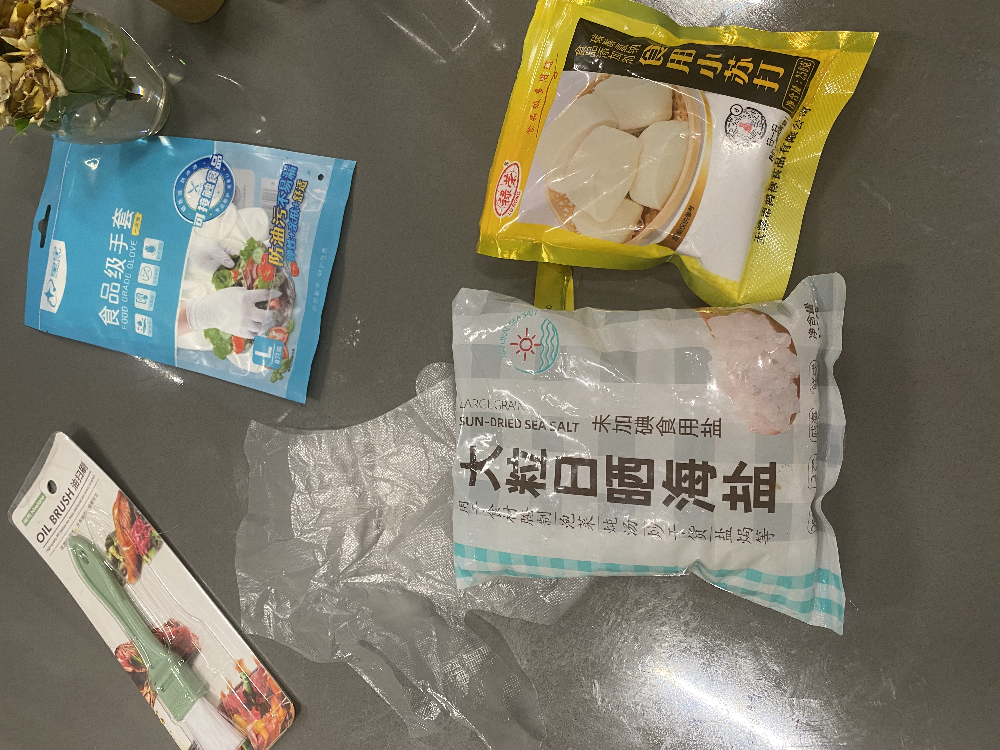
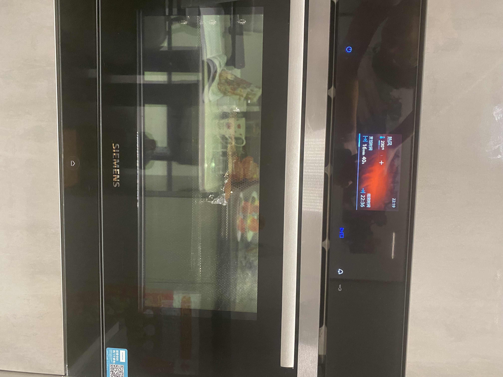
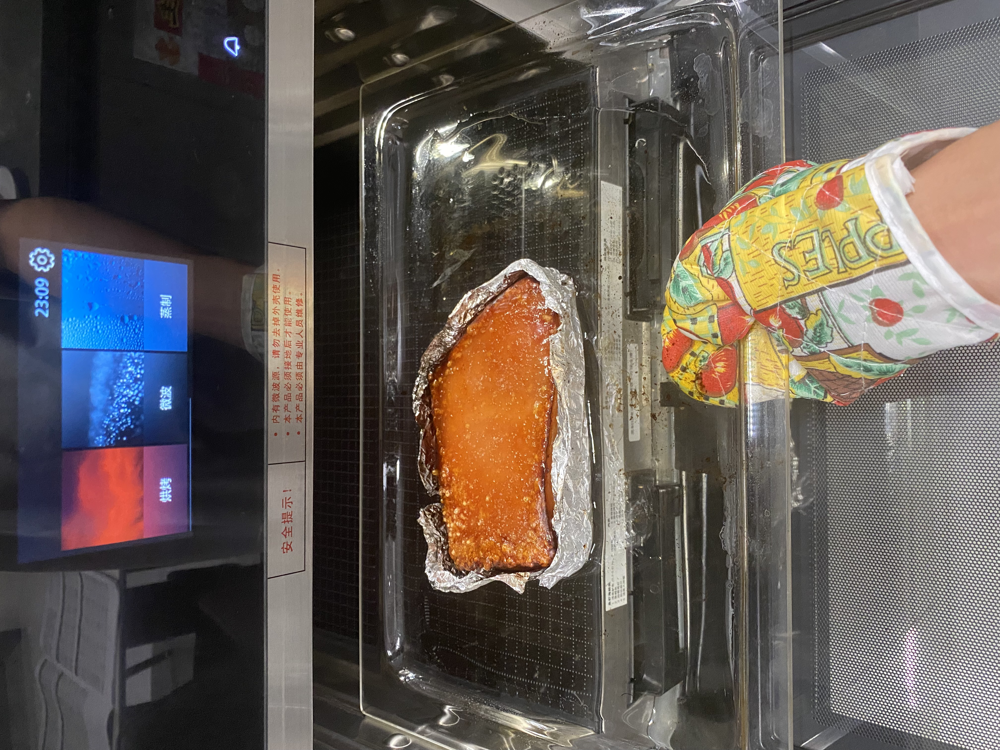

# 脆皮五花肉

心血来潮，看B站美食up看得多了，真觉得自己行了。上手！

## 用料

自制调味汁：盐、糖、五香粉、韩式辣椒酱、孜然、辣椒粉、生抽、耗油（配比最下方的参考视频有，根据个人口味稍作调整吧）

手忙脚乱的准备材料

五花肉、葱、姜、花椒、料酒、粗盐、小苏打、白醋、烤箱、锡纸、小刷子、手套、叉子 or 牙签 or 专业工具（用来扎皮）

## 制作过程

去毛五花肉，洗干净去掉血水，下锅，加葱段、姜片、花椒和料酒去腥，锅里泡澡10min。

出锅下刀切片（瘦肉入刀切到肥肉出，每一刀间隔男生的两个手指宽吧），猪皮扎针，翻身将皮泡在白醋里10min。趁机配酱料，泡完小刷子刷上酱料，保上锡纸。放冰箱恒温冷藏一晚上（我这里等不及了，就放了2h，实在太馋了）

五花肉出冰箱，小刷子刷一层白醋，加一点小苏打在表面，撒上粗盐颗粒，进烤箱（230℃ 20min）。然后出来将粗盐去掉，表皮再刷白醋，进去（230℃ 35min，这里我烤的时间长，因为期间观察爆痘现象不明显。建议这一遍时候守在炉子前见机行事）

耐心等待ing...

出炉，感觉还不错（已经晚上11点了，夜深人静版脆皮五花肉）

## 评价&教训

吃了一口，真的耳机党福利啊。不过复刻出来的确实和视频里看得到差远了。。。。

自己调的料太咸了，我现在真的吃盐能力大大下降。。下次注意少放盐。

表皮脆了一半，很奇怪。原因应该是插针的时候偷懒了一半，导致其中一半孔有点稀疏，还是要密一点。

五花肉买的时候别贪小便宜，肥瘦匀称才好，这东西真的很油啊，一整个长条也不是不能做的。

## 参考教程

* [二喵的饭](https://www.bilibili.com/video/BV1xE411i72y?share_source=copy_web&vd_source=19ee44b0ddf39531fae061fcb1320f71)

* [日食记](https://www.bilibili.com/video/BV1ky4y1j7rx?share_source=copy_web&vd_source=19ee44b0ddf39531fae061fcb1320f71)
