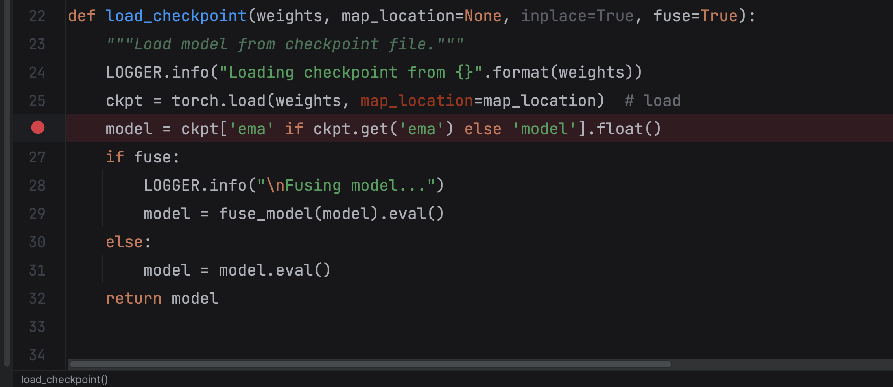

# Explorers program

**Explorers program**意译作“找杰哥前的100件小事”（希望不止100吧）。本节目特别感谢：Vakaranai

## Process finished with exit code 139 (interrupted by signal 11: SIGSEGV)  (pytorch)

Q: 做YOLO推理预测的时候，出现了 segmentation fault  问题

A: 命令行运行的，直接给segmentation fault。当时以为参数什么的给错了。debug带参调试，发现参数也没问题，搭上了好几个小时。

当时已经猜了一下可能是库的问题。最后搜了搜139，正好有些answer说是库的问题。我直接把环境删了重新装了。一定要保证环境干净啊！

举个例子：

> ERROR: pip's dependency resolver does not currently take into account all the packages that are installed. This behaviour is the source of the following dependency conflicts. 
>
> tensorflow 2.12.0 requires numpy<1.24,>=1.22, but You have numpy 1.24.2 which is incompatible.numba 0.56.4 requires numpy<1.24,>=1.18, but you have numpy 1.24.2 which is incompatible.

## button的槽函数多次响应（pyqt5）

Q: 当时给界面的按钮设计槽函数，起名`on_buttonSaveTo_clicked()`。然后运行界面点击1次按钮，槽函数会响应3次。

A: 槽函数起名不要使用`on_*_clicked`的格式，即可解决问题。当时困惑了好久好久

