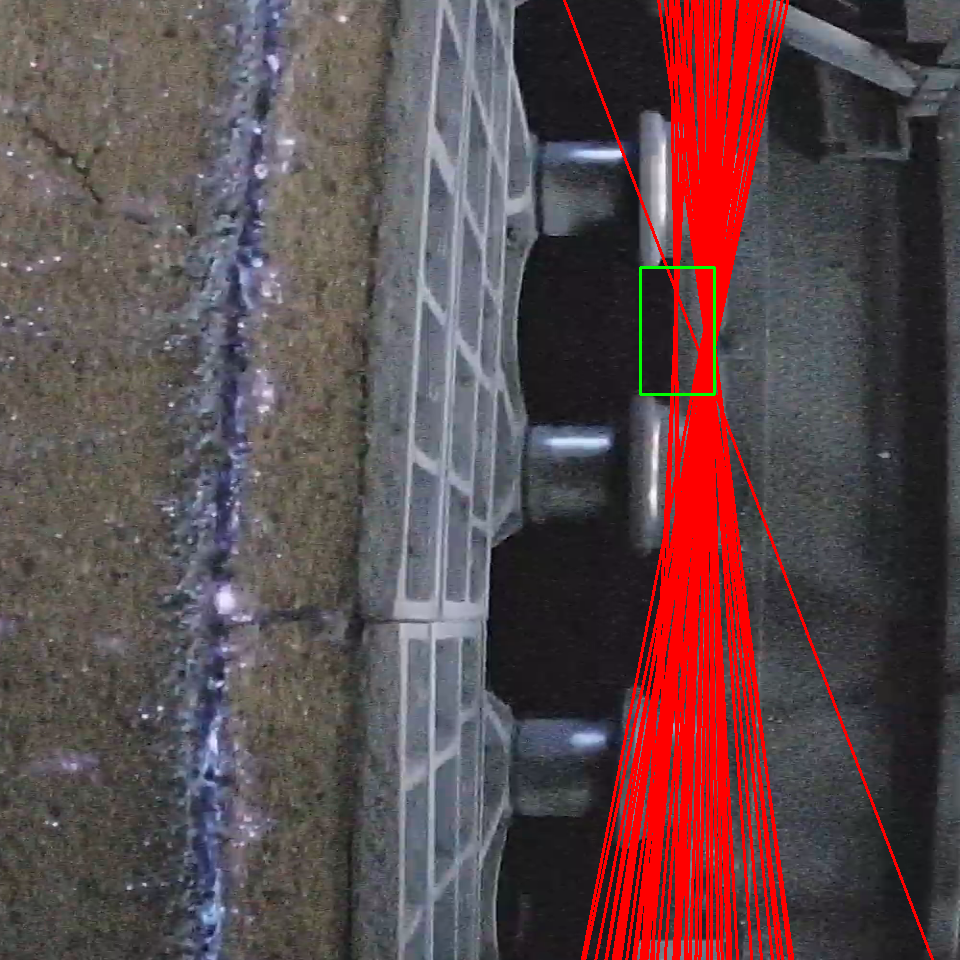

# YOLO

## abstract


## YOLO v6 3.0

```
├── configs        #配置文件目录，用于指定网络结构，优化器，数据增强等超参
│   ├── experiment #存放非发版模型的实验配置
│   ├── repopt     #存放repopt训练相关的配置
│   ├── base       #存放基础版模型的配置(PTQ量化友好)
│   ├── *.py       #常规模型的配置（RepVGG进阶版）
├── data           #数据集路径配置文件
├── tools          #启动训练、评估、推理、量化等任务
│   ├── train.py   #训练启动脚本
│   ├── eval.py    #评估启动脚本
│   └── infer.py   #推理启动脚本
│   ├── qat        #qat量化相关脚本
│   ├── partial_quantization   #ptq量化相关脚本
|── yolov6         #检测算法核心部分，包含运行组件、网络定义、数据处理、标签分配及损失计算等核心模块
|    ├── assigners #标签分配算法，包括ATSS和TAL分配算法及相关工具脚本
|    ├── core      #模型训练、评估和推理等组件的核心运行逻辑
|    ├── data      #数据预处理，包括数据加载，各种数据增强变换和数据格式转换等脚本
|    ├── layers    #定义卷积，RepVGG block，SPPF 等基础算子和模块
|    ├── models    #网络结构定义（包括 Backbone, Neck, Head）以及loss计算等脚本
|    ├── solver    #优化器构建组件
|    └── utils     #模型保存加载、指标计算，NMS后处理等工具脚本
├── deploy         #模型部署目录
│   ├── ONNX       #导出 ONNX 模型
│   ├── OpenVINO   #导出 OpenVINO 模型
│   └── TensorRT   #转换 TRT 模型以及验证可视化
├── docs           #相关教程文档
│   ├── Test_speed.md           #复现测速指标的相关命令教程
│   ├── Train_coco_data.md      #复现 COCO 精度指标的命令
│   ├── Train_custom_data.md    #训练自定义数据集的教程指引
│   ├── Tutorial of Quantization.md #量化相关的教程和指引
│   └── tutorial_voc.ipynb      #训练 VOC 数据集的教程指引
```


