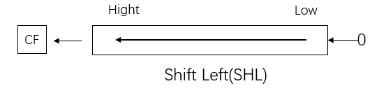
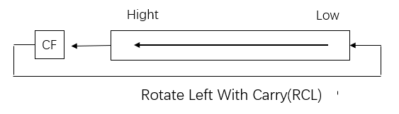
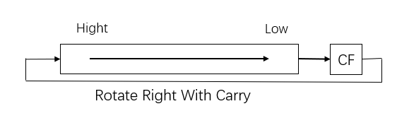

# 汇编语言


## 第一章 计算机系统概述


### 1 计算机系统的分类

#### 1.1 计算机的基本组成

冯诺依曼体系：计算机由5部分组成：运算器、控制器、存储器、输入设备、输出设备。

##### 1.2 三大主流芯片架构

1. X86
    + **X86采用CISC架构。**与采用RISC不同的是，在CISC处理器中，程序的各条指令是按顺序串行执行的，每条指令中的各个操作也是按顺序串行执行的。顺序执行的优点是控制简单，但计算机各部分的利用率不高，执行速度慢。
2. ARM
    + **ARM是高级精简指令集的简称（Advanced RISC Machine）**，它是一个32位的精简指令集架构，但也配备16位指令集(Thumb)，能很好的兼容8位/16位器件。ARM架构下大量使用寄存器，指令执行速度更快，大多数数据操作都在寄存器中完成。寻址方式也更灵活简单，执行效率高，其指令长度固定。ARM具有Load_store结构，即计算在寄存器中完成，而寄存器与内存之间的通信使用单独的指令。整体上采用流水线处理方式。
3. MIPS
    + **MIPS架构，是一种采取精简指令集（RISC）的处理器架构**，它的基本特点是：包含大量的寄存器、指令数和字符以及可视的管道延时时隙。这些特性使MIPS架构能够提供最高的每平方毫米性能和当今SoC设计中最低的能耗。

### 2 复杂指令集和精简指令集

####  2.1 CISC:复杂指令集(Complex Instruction Set Computer)，其特点如下：

+ 具有大量的指令和寻址方式，指令长度可变
+ 8/2原则：80%的程序只使用20%的指今
+ 大多数程序只使用少量的指令就能够运行。

#### 2.2 RISC:精简指令集(Reduced Instruction Set Computer0，其特点如下：

+ 只包含最有用的指令，指令长度固定
+ 确保数据通道快速执行每一条指令
+ 使CPU硬件结构设计变得更为简单

#### 2.3 CISC的背景和特点

+ 背景：存储资源紧缺，强调编译优化。
+ 增强指令功能，设置一些功能复杂的指令，把一些原来由软件实现的、常用的功能改
  用硬件的（微程序）指令系统来实现。
+ 为节省存储空间。强调高代码密度。指令格式不固定，指令可长可短，操作数可多
  可少。
+ 寻址方式复杂多样。操作数可来自寄存器，也可来自存储器。
+ 采用微程序控制。执行每条指令均需完成一个微指令序列。
+ CPI>5，指令越复杂，CPI越大。

#### 2.4 RISC的基本设计思想

+ 减小CPI:CPUtime = Instr Count * CPI * Clock cycle.

+ 精简指令集:保留最基本的，去掉复杂、使用频度不高的指令。

+ 采用Load/Store结构，有助于减少指令格式，统一存诸器访问方式。==采用硬接线控制代替微程序控制== 。

+ 采用RISC指令集可以减少指令平均执行周期数（RISC 大多数指令在一个时钟周期内完成）

  > 

#### 2.5 RISC 与 CISC的对比

>  

### 3 X86系统介绍

#### ※ 3.1 冯诺依曼结构模型和工作原理

>  

#### ※ 3.2 存储器

存储器是冯诺依曼计算机体系下的五大结构之一。

存储器可以这样分类：

+ CPU**内部**的存储器——**寄存器**

+ CPU**外部**的存储器：

    + **主存**

        + 内存又称主存，是CPU能直接寻址访问的存储空间。在计算机工作的时候，所有的数据都要先经过内存，然后才能交由处理器去处理，内存也被称为，CPU与外存通信的桥梁。它的特点是读写速度快。

            内存一般是由半导体器件组成，可分为**RAM（随机存储器）、ROM（只读存储器）、Cache（高速缓存）**。

    + **辅存/外存**

        + 外存外存又称为辅存，是指除计算机内存及CPU缓存以外的存储器，此类存储器断电后仍能保存数据。常见的外存有硬盘、光盘、U盘等。我们现在笔记本所使用的SSD固态硬盘，机械硬盘等等就是外部存储器。CPU如果想访问外存中的数据，必须先把外存的数据保存到内存中，CPU再去读取内存中的数据。

##### 3.2.1 存储器概述

存储器的计量单位：

1. bit
2. Byte

ps: 1Byte = 8bit；1KB=1024Byte，1MB=1024KB，1GB=1024MB，1TB=1024GB

##### 3.2.2 存储器概述

存储器的基本存储单位是一个二进制位（bit），每8位组成一个字节，每相邻的2个字节可组成一个字。
**存储器以字节为单位存储信息。（1地址就是1字节）**为区别不同的字节存储单元，每个单元都被指定一个唯一的编号，称为该单元的物理地址（简称PA）。地址编号从0开始，按顺序加1，一般用十六进制数表示。
**因此PC机的内存是按字节编址的，即以字节单元为单位对内存进行编址。**

字节：最基本的存储单位叫做字节(Byte)，简写B。

字：两个连续字节的存储空间叫做字(Word)，简写W。

双字：两个连续的字(四个连续的字节)的存储空间叫做双字(Double Word)，简写DW。

 ##### 3.2.3 寄存器 占10分的图

>  


##### 3.2.4 存储单元分段

那么问题来了：8086/8088CPU访问1MB空间的内存必须有20位地址，而其内部与地址有关的寄存器均为16位的，只能处理16位地址，对内存的直接寻址范围最大只能达64KB。8086/8088CPU应如何提供20位地址，以寻址1MB内存？
**解决方法： 存储器地址分段**

1. 逻辑地址和物理地址

    1. 逻辑地址：selector : offset
    2. 物理地址：内存唯一地址

2. 逻辑（虚拟）地址经过分段转化为线性地址，线性地址经过分页转为物理地址。**如果启用了分页机制，那么线性地址可以再经过变换以产生一个物理地址。如果没有启用分页机制，那么线性地址直接就是物理地址。**

    > 作者：Hao Lee
    > 链接：https://www.zhihu.com/question/29918252/answer/163114415
    >
    > 
    >
    > **以下讲解都是在 Intel 32 位下，并且以代码段为例 (之所以不讲 64 位是因为在 64-bit long mode 下分段直接被禁用了，内存完全平坦，没什么可以讲的...)**
    >
    > 在 Intel 平台下，**逻辑地址(logical address)**是 **selector:offset** 这种形式，selector 是 CS 寄存器的值，**offset 是 EIP 寄存器的值**。如果用 selector 去 GDT( 全局描述符表 ) 里拿到 segment base address(段基址) 然后加上 offset(段内偏移)，这就得到了 linear address。我们把这个过程称作**段式内存管理**。
    >
    > 如果再把 linear address 切成四段，用前三段分别作为索引去PGD、PMD、Page Table里查表，最终就会得到一个页表项(Page Table Entry)，那里面的值就是一页物理内存的起始地址，把它加上 linear address 切分之后第四段的内容(又叫页内偏移)就得到了最终的 **physical address**。我们把这个过程称作**页式内存管理**。
    >
    > 问题来了，为什么没提到 virtual address，这是个什么东西？其实在 Intel IA-32 手册里并没有提到这个术语，但是在内核的确是用到了这个概念，比如__va和__pa这两个宏定义。经过我的考证，virtual address就是linear address的别名，俩词汇是一个意思，内核代码和我们编程中喜欢用virtual address这个术语，而Intel手册里只用linear address这个术语。
    >
    > 这几个概念本身在不同手册的叫法不同，再加上国内很多人东抄西抄，瞎翻译写博客把问题复杂化了。

3. **具体运算**：段地址×16（左移四位，也就是2的四次方，相当于乘16）+偏移地址=物理地址（可以理解为段地址末尾补一个零）

4. 如何分段：把1MB内存划分成若干个存储区域，每个区域称为一个逻辑段(每个段都在一个连续的存储区域内，容量最大64KB）。8086规定每个段的段起始地址必须能被16整除，其特征是：20位段起始地址的最低4位为0（用16进制表示为××××0H）。暂时忽略段起始地址的低4位，其高16位（称段基址）可**存放在16位的寄存器**中。段基址可确定某个段在内存中的起始位置，而段中某个单元在该段中的位置则可由该单元在段内相对于段起始地址的偏移量（称偏移地址，也 为16位）来决定。也就是说，内存中某单元的位置可用16位的段基址和16位的偏移地址确定。

##### 3.2.5 段的分配

内存一般可分成4个段，分别称为代码段、数据段、堆栈段和附加数据

1. 代码段：存放指令。
2. 堆栈段：程序的堆栈区（子程序调用、系统功能调用、中断处理等操作使用，是按“先进后出”原则访问的特殊存储区域）或作为临时数据存储区。
3. 数据段：存放程序所使用的数据。
4. 附加数据段：辅助的数据区（串操作指令使用）。

**4个逻辑段的段基址分别放在相应的代码段寄存器CS、数据段寄存器DS、堆栈段寄存器SS和附加段寄存器ES中，由这4个段寄存器来指明每个段在内存中的起始地址。**


## 第二章 x86汇编基础

### 1 汇编语言源程序

#### 1.1 语句格式

汇编的语句可以分为**指令语句**和**伪指令语句**

伪指令与指令的**本质区别**：汇编的过程中，伪指令并不形成任何代码，**不直接命令CPU去执行什么操作。伪指令是给汇编程序的命令，在汇编过程中由汇编程序进行处理。**如定义段等。

1. 指令语句

    + 每一条指令语句在汇编时都要产生一个可供CPU执行的机器目标代码，它又叫可执行语句。
    + 指令语句的一般格式为：==标号== **:** ==指令助记符== **,** ==操作数==     **;** ==注释==

    1. 标号字段
        + **标号是可选字段**，它后面必须有“：”。
        + 标号是一条指令的符号地址，代表了该指令的第一个字节存放地址。标号一般放在一个程序段或子程序的入口处，控制程序的执行转到该程序位置。在转移指令或子程序调用指令中，可直接引用这个标号。
        + 例 ==ADDR1==：MOV AL，100 
    2. 指令助记符字段
        + 该字段是一条指令的必选项，它表示这条语句要求 CPU完成什么具体操作，如MOV、ADD、SHL等。 有些指令还可以在指令助记符的前面加上前缀，实现一定的附加操作。如串操作指令前所加的重复前缀REP等。 
    3. 操作数字段
        + 一条指令可以有一个操作数、两个操作数或者无操作数。如ADD、MOV指令需要两个操作数，INC、NOT 指令只需一个操作数，而CLC指令不需要操作数。
    4. 注释字段
        + “;” 后表示注释，注释字段不会产生机器目标代码。

2. 伪指令语句

    + 伪指令用来对汇编程序进行控制，对程序中的数据进行存储空间分配、实现条件汇编、列表等处理，其格式和汇编指令一样，但**伪指令本身并不产生对应的机器目标代码**。它仅仅是告诉汇编程序对其后面的指令语句和伪指令语句的操作数应该如何处理。
    + 伪指令没有对应的机器代码，它不像指令那样由CPU来执行，它是由MASM汇编程序对 ==源程序汇编期间== 进行处理的。
    + 一条伪指令语句可以包含四个字段。如：==符号名== ==伪指令符== **,** ==操作数== **;** ==注释==
    + MASM设置了几十种伪指令，以下是常用的几种伪指令：
    
    1. 数据定义伪指令
    
        + 数据定义伪指令也称为变量定义伪指令，或存储单元分配伪指令。它用来定义变量、确定变量的类型、给变量赋初值、为变量分配存储空间等。
    
        + [变量名] 伪操作助记符 [操作数1] [，操作数2]…
    
        + ```assembly
            STR DB 'STRING'
            
            NUM DW 0AAH，23H
            
            LAB0 DQ 01A4578H
            ```
    
        + 数据定义伪指令中的操作数也可以是问号"?"，它表示预留相应数量的存储单元，但不存入数据。如果操作数很多而且相同，可以使用重复数据操作符DUP定义变量。
    
    2. 符号定义伪指令
    
        + 符号定义伪指令也称为赋值伪指令。
    
        + 简单来说就是将程序可能会多次出现的数值、表达式用一个符号替代。有两种，第一种是“EQU”，第二种是“=”
    
        + ```assembly
            CONS EQU 10 ;常数赋给符号CONS
            ALPHA EQU 32 ;常数赋给符号ALPHA
            
            NUM=8
            NUM=NUM+6
            ```
    
    3. 汇编结束伪指令
    
        + END 表达式
        + 表达式为可执行程序运行的起始位置,一般是一个标号。汇编程序在汇编时遇到END， 便知源程序已经结束。
    
    4. 过程定义伪指令
    
        + 程序设计中，可将具有一定功能的程序段看成为一个过程(相当于一个子程序)，它可以被别的程序调用。一个过程由伪指令PROC和ENDP来定义，其格式为：
    
        + > 过程名 PROC [类型]
            >
            > ​        过程体
            >
            > ​        RET
            >
            > 过程名 ENDP
    
            ```asm
            SUB PROC FAR
            ……
            RET
            SUB ENDP
            ```
    
    5. 宏指令
    
        + 在汇编语言书写的源程序中，有的程序段要多次使用，为了简化书写，该程序段可以用一条特殊的指令来代替，这个特殊的指令就是宏指令。宏指令定义格式：
    
        + > 宏指令名 MACRO <形参列表>
            >
            > ​       汇编程序段(宏体)
            >
            > ENDM
    
        + ```asm
            ; 宏，宏命令 macro instruction
            SHIFT MACRO
            	MOV CL, 4
            	SAL AL, CL
            ENDM
            ```
    
    6. 段定义伪指令，地址定义伪指令...
    


关于下面的节，其实这部分书上讲的十分糟糕，逻辑体系最起码我是没看明白。乍一看好似是要讲一下三个段：**数据段DS，代码段CS，栈段SS**，但是其中的小节又穿插了一堆乱七八糟的东西。建议别用这本书。不过本着适应的原则，下面还是进行梳理。

其实，**内存并没有分段，段的划分来自于CPU**。由于8086CPU用 “基础地址（段地址×16）+偏移地址=物理地址” 的方式给出内存单元的物理地址，使得我们可以用**分段的方式来管理内存**。


### 2 数据段定义及规范

#### 2.1 段定义伪指令和段分配伪指令

##### 2.1.1 段定义伪指令

伪指令SEGMENT和ENDS用于定义一个逻辑段。使用时必须配对，分别表示定义的开始与结束，如：

```
段名 SEGMENT [定位类型] [组合类型] [‘类别名’] 

…... 

段名 ENDS
```

1. 段名
    + 自选，开头结尾要一致。
2. 定位类型
    + **Para:**段起始地址必须从**小段边界**开始，即起始地址的最低16进制数位必须为0，这样段内起始偏移地址可以是0（**默认值**）。
    + **Byte:**段起始地址是任意，这样段内起始偏移地址**可能不为****0**。
    + **Word:**段起始地址必须是**字边界**，即起始地址必须为偶数。
    + **Dword:**段起始地址必须是**双字边界**，即起始地址16进制数最底位必须是4的倍数。
    + **Page:**段起始地址必须是**页边界**，即起始地址16进制数最底2位必须是0。
3. 组合类型
4. 类别名

##### 2.1.2 段分配伪指令（段寻址伪指令）

段寻址伪指令ASSUME的作用是告诉汇编程序，在处理源程序时，定义的段与哪个寄存器关联。ASSUME并不设置各个段寄存器的具体内容，段寄存器的值是在程序运行时设定的。

一般格式 ：ASSUME 段寄存器名：段名，段寄存器名：段名，......

```asm
DATA1 SEGMENT
	VAR1 DB 12H 
DATA1 ENDS 

DATA2 SEGMENT 
	VAR2 DB 34H 
DATA2 ENDS 

CODE SEGMENT 
	ASSUME CS:CODE, DS:DATA1, ES:DATA2 ;该指令汇编时，VAR1使用的是DS VAR2使用的是ES,即指令编码中有段前缀ES 。
	START: 
		.......... 
		INC VAR1 
		INC VAR2 ......
CODE ENDS
	END START
```


下面说说数据段里面常用的东西：

#### 2.2 数据段

##### 2.2.1 数据定义伪指令

```asm
;变量:即内存中的存储单元或数据区。变量名是存储单元(数据区)的符号地址或名字。变量也有三个属性:
	;	段地址——变量所在段的段地址。
	;	偏移量——变量单元地址与段首地址之间的位移量。
	;	类型——有BYTE、WORD和DWORD三种。

; 1 数据表达式
DATA1 DB 32，30H  ;DATA1的内容为32（20H），DATA1+1单元内容为30H。

; 2 DB DW DD
DATA_B   DB   10, 5, 10H  ;此处DB表示defined byte，为字节
DATA_W   DW   100H, -4    ;此处DW表示defined word，为字
DATA_D   DD   OFFFBH      ;此处DD表示defined double word，为双字

; 3 ?表达式
DA_BYTE DB ?, ?, ?     ;不带引号的问号“？”表示可以预置任意内容。

```

###### 2.2.1.1 字符串表达式

1. 对DB伪指令，字符串为用引号括起来的不超过255个字符。给每一个字符分配一个字节单元。

    + `STRING1 DB ‘ABCDEF’` 一个字符串，6个字符6个字节。表达式内存中如下

    + | 内存内容 （注意观察顺序） |                         对应字符解释                         |
        | :-----------------------: | :----------------------------------------------------------: |
        |            41H            | 'A'  （ASCII codes for 'A' ; 'A' decimal code: 65 ; 'A' hex code: 41 ） |
        |            42H            |                             'B'                              |
        |            43H            |                             'C'                              |
        |            44H            |                             'D'                              |
        |            45H            |                             'E'                              |
        |            46H            |                             'F'                              |
        |                           |                                                              |

2. 对于DW伪指令可以给两个字符组成的字符串分配两个字节存储单元。

    + 注意：两个字符的存放顺序是前一个字符放在高地址，后一字符放低地址单元。

    + `STRING2 DW ‘AB’, ‘CD’, ’EF’`  3个字符串分配6个字节

    + | 内存内容（注意观察顺序，自上向下表示地址自低到高） | 对应字符解释 |
        | :------------------------------------------------: | :----------: |
        |                        42H                         |     'B'      |
        |                        41H                         |     'A'      |
        |                        44H                         |     'D'      |
        |                        43H                         |     'C'      |
        |                        46H                         |     'F'      |
        |                        45H                         |     'E'      |
        |                                                    |              |

3. 对于DD伪指令，只能给两个字符组成的字符串分配4个字节单元。

    + 两个字符存放在较低地址的两个字节单元中。存放顺序与DW伪指令相同，而较高地址的两个字节单元存放0。

    + `STRING3 DD ‘AB’, ‘CD’`  两个字符串分配8个字节。

    + | 内存内容（注意观察顺序，自上向下表示地址自低到高） | 对应字符解释 |
        | :------------------------------------------------: | :----------: |
        |                        42H                         |     'B'      |
        |                        41H                         |     'A'      |
        |                         0                          |              |
        |                         0                          |              |
        |                        44H                         |     'D'      |
        |                        43H                         |     'C'      |
        |                         0                          |              |
        |                         0                          |              |

###### 2.2.1.2 重复操作符DUP

```asm
;格式：
;变量名 + DB/DW/DD + 重复次数 + DUP(值或表达式)

如：
DATA_A DB 3 DUP(0)  ;分配3个字节单元，它们的值都是0，相当于DB 0,0,0。
DATA_B DB 20H DUP(‘AB’) ;分配20H*2=40H个 字节，其内容为重复字符串‘AB’

```

##### 2.2.2 定位伪指令（对准伪操作）ORG

首先介绍一下——**地址计数器$：**保存当前正在汇编的指令的地址。

汇编开始时或每一段编译开始时地址记数器 \$ 初始化为0，以后每汇编一条指令， \$ 增加该汇编指令所需要字节数；$伪操作用于参数字段表示地址计数器的当前值，其值随位置不同而各异 。

```asm
ARRAY  DW  1, 2, $+4, 3   ; $用于指令中则代表该指令的首地址；
JNE  $+6                  ; 条件满足时转向的地址是JNE的首址+6；
JMP  $+2                  ; JMP只占2B，所以无条件转向下一条指令
```

ORG的作用就是设置当前地址计数器$的值。

```asm
DATA  SEGMENT  
ORG 10            ; 设置$为10，此段目标代码从偏移地址10开始
BUF DB 'ABCD’     ; BUF的偏移地址为10
ORG $+5          ;  $增加5，即在ABCD之后空出5个字节
NUM   DW 50      ;  NUM的偏移地址为19
DATA  ENDS
```


### 3 代码段定义及规范

#### 3.1 一些运算符

##### 3.1.1 算数运算符

+、—、＊、 / 、MOD、SHL、SHR、[ ] 

1. 运算符“+”和“-”也可作单目运算符，表示数的正负。

2. 使用“+”、“-”、“＊”、和“/”运算符时，参加运算的数和运算结果都是整数。

3. “/”运算为取商的整数部分，而“MOD”运算取除法运算的余数。

4. “SHR ”和“SHL ”为逻辑移位运算符。“SHR”为右移，左边移出来的空位用0补入。 “SHL”为左移，右边移出来的空位用0补入。 
5. .下标运算符“[ ]”具有相加的作用。一般使用格式：`表达式1 [表达式2]` 。作用：将表达式1与表达式2的值相加后形成一个存储器操作数的地址。 

```asm
MOV AX，DA_WORD[20H] 
MOV AX，DA_WORD+20H 
```

##### 3.1.2 逻辑运算符

NOT、AND、OR和XOR

##### 3.1.3 关系运算符

EQ（等于）、NE（不等于）、LT（小于）、LE（小于等于）、GT（大于）、GE（大于等于）

##### 3.1.4 数值返回运算符

1. SEG        取变量或标号所在段的段基值.

2. OFFSET  该运算符的作用是取变量或标号在段内的偏移量。

3. TYPE      取变量或标号的类型属性，并用数字形式表示。对变量来说就是取它的字节长度。

4. LENGTHEN

    + 该运算符用于取变量的长度。

    + 如果变量是用重复数据操作符DUP说明的,则LENGTH运 算取外层DUP给定的值。 

    + 如果没有用DUP说明，则LENGTH运算返回值总是1。

    + ```asm
        K1 DB 10H DUP (0)
        K2 DB 10H, 20H, 30H, 40H
        K3 DW 20H DUP (0，1, 2 DUP (0)
        K4 DB 'ABCDEFGH'
        
        
        MOV AL, LENGTH K1 ;(AL)=10H
        MOV BL, LENGTH K2 ;(BL)=1
        MOV CX, LENGTH K3 ;(CX)-20H
        MOV DX, LENGTH K4 ;(DX)=1
        ```

5. SIZE       该运算符只能作用于变量，SIZE取值等于LENGTH和 TYPE两个运算符返回值的乘积。

##### 3.1.5 属性修改运算符

1. PTR

    + 格式：`类型 + PTR + 地址表达 `
    + 作用：**将地址表达式所指定的标号、变量或用其它形式表示的存储器地址的类型属性修改为指定“类型”**。类型可以是BYTE、WORD、DWORD、NEAR和FAR。 这种修改是临时的，**只在含有该运算符的语句内有效.**

2. HIGH//LOW

    + 格式：`HIGH + 表达式`，`LOW + 表达式`
    + 作用：这两个运算符用来将表达式的值分离出高字节和低字节。如果表达式为一个**常量**，则将其分离成高8位和低8位； 如果表达式是一个**地址**（段基值或偏移量）时，则分离出它的高字节和低字节。
    + 注意：HIGH/LOW运算符不能用来分离一个**变量**、**寄存器**或**存储器单元**的高字节与低字节。

3. THIS

    + 在程序中，如果需要以另一种数据类型来访问某一存储单元时，可用强制属性操作符PTR来实现。但如果在程序中要经常以某种其它的数据类型来访问该存储单元的话，那么，就必须在每次访问时都要加上强制属性操作符PTR。这样做虽然可行，但在编写程序时就显得比较麻烦。

        为了克服上述不便，汇编语言提供了另一种操作符THIS，它为同一存储单元取另一别名，该别名可具有其自身的数据属性，但其段地址和偏移量是不变的。

        ```asm
        wbuffer equ this word
        buffer db 20 dup(?)
        ```

        如上面的代码，声明了20个长度为1字节的空间，命名为buffer，如果以buffer为名字来访问这部分空间，这部分空间就是以字节为单位来进行访问的，而以wbuffer来访问就是以字为单位。调用的时候。

        ```asm
        mov ax, wbuffer
        mov ax, word ptr buffer
        ```

        这两句话是一个意思。

#### 3.2 运算符的优先级

自高到底：

1. LENGTH, SIZE, ( )
2. PTR, OFFSET, SEG, TYPE, THIS
3. HIGH, LOW
4. *, /, MOD, SHR, SHL
5. \+, -
6. EQ, NE, LT, LE, GT, GE
7. NOT
8. AND
9. OR, XOR


### 4 简化段定义

简化段

简化段只有三类声明段的语句

```text
.code [段名]
.data
.stack [大小]
```

可以没有繁琐的end，和繁琐的参数选择。

每一个段开始自动结束上一个段。

>  ps：
>
> **程序开始执行的位置**：使用一个标号（例如： START）作为汇编结束END伪指令的参数。
>
> **应用程序执行终止**：语句“EXIT 0”终止程序执行，返回操作系统，并提供一个返回代码（0）。注意执行终止≠汇编结束。
>
> **源程序汇编结束**：使用END伪指令语句。

简化法方式：

1. 堆栈段
    + `.stack [大小]`
        + 声明的段名是"stack"，大小是储存的字节数，默认为1024字节，也就是1kb。
2. 数据段
    + `.data`
        + 创建一个数据段，声明的段名是 "\_data"。而.data?声明的段名为"\_bss"不同于前者，该命令意味着只有在运行的时候才会生成数据段，这样子可以减少编译出来的exe大小。
    + `.const`
        + 建立一个只读的数据段，段名为const。
3. 代码段
    + `.code [段名]`
        + 如果不给段名，将会在tiny、small、compact、flat模式下为"\_text"
        + 在其他模式下默认为"模块名_text"


## 第三章 80x86指令系统和寻址方式

### 1 80X86数据寻址方式

#### 1.1 立即数寻址

操作数紧跟操作码，属于机器代码一部分。

| 操作码 | 立即数 |
| :----: | :----: |

直接从指令代码中得到，如：`MOV EAX, 33221100H`

+ 机器代码：B8 00 11 22 33
+ 操作码：B8
+ 立即数： 33221100

#### 1.2 寄存器寻址

操作数存放在处理器的内部寄存器，用寄存器的名来表示它的内容。去寄存器里面找到操作数，如下指令`MOV EBX, EAX`

| 操作码 | 寄存器地址 |
| :----: | :--------: |

+ 32位通用寄存器：EAX EBX ECX...
+ 16位通用寄存器：AX BX CX DX...
+ 8位通用寄存器：AH AL BH BL ...
+ 16位段寄存器：DS CS SS ES ...

#### 1.3 存储器寻址

| 操作码 | 寻址方式 | 形式地址 |
| :----: | :------: | :------: |

寻址方式 + 形式地址 == 有效地址。寻址方式指定规则，结合形式地址计算得出有效地址。Effective Address。

##### 1.3.1 直接寻址

有效地址部分只有位移量，直接包含在指令代码中。段基地址+偏移即可找到所需操作数。

用变量名或加中括号表示偏移地址。

例如：`MOV ECX, [95480H]`

##### 1.3.2 寄存器间接寻址

操作数有效地址EA直接从基址寄存器(BX或BP)或变址寄存器(SI或DI)中获得。 

这些寄存器相当于一个地址指针。

例如：`MOV ECX, [EDI]`

##### 1.3.3 寄存器相对寻址

例如：`MOV ECX, [EDI + 12h]`

##### 1.3.4 基址变址寻址

基址加变址寻址。操作数在存储器中，其有效地址是一个基址寄存器和一个变址寄存器的内容之和，这种寻址方式称为基址加变址寻址。

例如：`MOV EAX, [EBX+ESI]` ;源操作数有效地址是EBX值加上ESI值

##### 1.3.5 相对基址变址寻址

相对基址加变址寻址方式中，操作数在存储器中，操作数的有效地址由于基址寄存器之一的内容与变址寄存器之一的内容及指令中给定的位移量（IDATA）相加得到。

例如： `MOV EAX,[EBX+EDX+1234H] `

### 2 数据传送类指令

#### 2.1 MOV指令

从源位置送到目的位置

#### 2.2 XCHG指令

XCHG指令的功能是将源操作数和目的操作数内容交换，是两个寄存器，寄存器和内存变量之间内容的交换指令，两个操作数的数据类型要相同，可以是一个字节，也可以是一个字，也可以是双字.

```assembly
; XCHG reg,reg/mem  例：
XCHG BL,BH，XCHG SI,[EDI]

; XCHG reg/mem,reg  例：
XCHG SI,DI，XCHG SI,[EDI] 
```

XCHG指令不允许的情况有以下四种：

1. 不能同时都为内存操作数；
2. 任何一个操作数都不能为段寄存器；
3. 任何一个操作数不能为立即数；
4. 两个操作数的长度不能不相等。

#### 2.3 PUSH指令&POP指令

**堆的生长方向向上，内存地址由低到高；栈的生长方向向下，内存地址由高到低。**

PUSH指令和POP指令对栈内空间及相应寄存器影响。

PUSH：以字为数据，ESP-2；双字ESP-4.

#### 2.4 LEA指令※

> lea是“load effective address”的缩写，简单的说，lea指令可以用来将一个内存地址直接赋给目的操作数，例如：
>
> `lea eax, [ebx+8]`就是将`ebx+8`这个值直接赋给`eax`，而不是把`ebx+8`处的内存地址里的数据赋给`eax`。
>
> 而mov指令则恰恰相反，例如：
>
> `mov eax,[ebx+8]`则是把内存地址为`ebx+8`处的数据赋给`eax`。
>
> 有个问题，那为什么`lea eax, [ebx+8]`本质上就是取值，为啥不能用`mov eax, ebx+8`。原因很简单，mov指令不允许这样的语法格式。

N.B. `mov`是取值，`lea`是取地址；`mov`和`lea`对变量操作不受[ ]影响；`mov`对寄存器操作[ ]表示取地址，`lea`对寄存器操作[ ]表示取值( ebx的值+8 )。

### 3 算术运算类指令

#### 3.1 标志位

状态标志位是处理器最基本的标志

+ 作为加减运算和逻辑运算的辅助结果
+ 构成各种条件，实现程序分支

8086标志位：

OF DF IF TF SF ZF AF PF CF  在标志寄存器中的位置如下：


##### 3.1.1 进位标志位 CF  (Carry Flag)

**当加减运算结果的最高有效位有进位（加法）或借位（减法）时，进位标志置1，即CF=1；否则CF=0**

CF针对无符号整数，判断加减结果是否超出表达范围

##### 3.1.2 溢出标志位 OF  (Overflow Flag)

**有符号数加减结果有溢出，则OF=1；否则OF=0**

OF针对有符号整数，判断加减结果是否超出表达范围

##### 3.1.3 零标志位 ZF  (Zero Flag)

**运算结果是0，则ZF=1；否则ZF=0**

##### 3.1.4 符号标志位 SF  (Sign Flag)

**运算结果最高位为1（负），则SF=1；否则为0**

##### 3.1.5 奇偶标志位 PF  (Parity  Flag)

**运算结果1的个数为偶数，PF=1；否则为0**

#### 3.2 加法运算指令

1. ADD

    + 按定义影响标志位

2. INC  自增1

    + **不影响CF**，其他的按照定义影响。

    + > INC DEC为什么不影响CF呢？明明可能产生进位。
        >
        > 答：没找到满意的答案，只能说就是这么设计的（有说法表示INC 和 DEC往往在地址上使用）

#### 3.3 减法运算指令

1. SUB
    + 按定义影响标志位
2. SBB 带借位减法指令
    + 操作数OPRD1减去OPRD2再减去CF的值，结果保存在OPRD1中。
    + 按定义影响标志位
3. DEC 自减1
    + **不影响CF**，其他的按照定义影响。
4. NEG 求补指令
    + 相当于SUB 0, 源操作数
    + 按定义影响标志位

#### 3.4 乘法运算指令

1. MUL  无符号乘法

    + `MUL OPRD` 其中`OPRD`提供乘法运算的一个操作数，他只能是寄存器操作数或者存储器操作数。另一操作数隐含使用`AL`后者`AX`寄存器

    + MUL只影响CF和OF标志，其它标志位的值不确定。 若结果的AH（字节运算）或DX（字运算）为全0，CF=0、 OF=0，否则 CF=1、OF=1。

2. IMUL  带符号乘法指令

    + 对标志位的影响：若乘积的高半部AH（字节乘法）或DX（字乘法）是低半部的符号扩展(不是有效数值）则CF=0、 OF=0。否则CF=1、 OF=1。

符号标志位、零标志位、奇偶标志位**无定义**。

#### 3.5 除法运算指令

1. DIV
2. IDIV

执行DIV或IDIV后，所有算术运算状态标志位的值都不确定。

### 4 位操作类指令

#### 4.1 逻辑运算指令

1. AND  与
2. OR   或
3. NOT  非
4. XOR  异或
5. TEST
    + Test命令将两个操作数进行逻辑与运算，并根据运算结果设置相关的标志位。但是，Test命令的两个操作数**不会**被改变。运算结果在设置过相关标记位后会被丢弃。**这点与AND不同**

逻辑运算指令，除NOT指令不影响标志外，其他逻辑指令使得：

+ OF = CF = 0
+ 根据结果定义ZF SF PF

#### 4.2 移位指令

1. 算术左移指令SAL
    + 功能：左移一次，最低位补0，最高位送入CF标志位，如图：
    + 
2. 算术右移指令SAR
    + 功能：右移一次，**最高位保持不变，**最低位送入CF标志位，如图：
    + 
3. 逻辑左移指令SHL
    + 功能：同SAL, 如图：
    + 
4. 逻辑右移指令SHR
    + 功能：右移一次，**最高位补0。**最低位送入CF标志位。如图：
    + 
5. 循环左移指令ROL
    + 功能：左移一次，左移前的最高位送入最低位以及CF。如图：
    + 
6. 循环右移指令ROR
    + 功能：右移一次，右移前的最低位送入最高位以及CF。如图：
    + 
7. 带进位的循环左移指令RCL
    + 功能：左移一次，左移前的最高位送入CF，CF的内容送入最低位。如图：
    + 
8. 带进位的循环右移指令RCR
    + 功能：右移一次，右移前的最低位送入CF，CF的内容送入最高位.如图：
    + 


### 5 转移类指令


## 第四章 80x86汇编语言程序设计


## 第五章 MIPS汇编基础


## 第六章 MIPS汇编顺序程序设计


