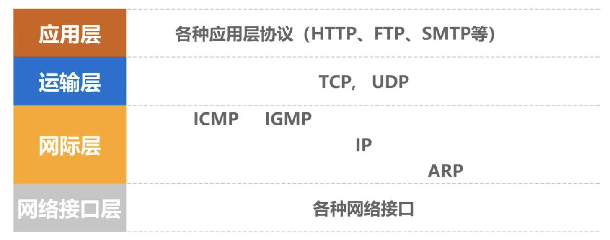
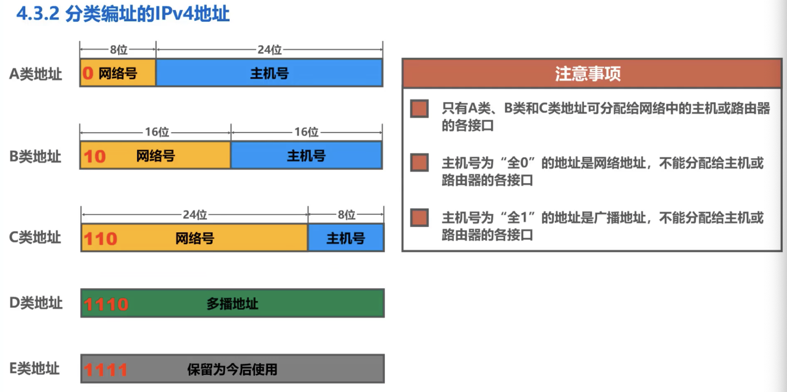
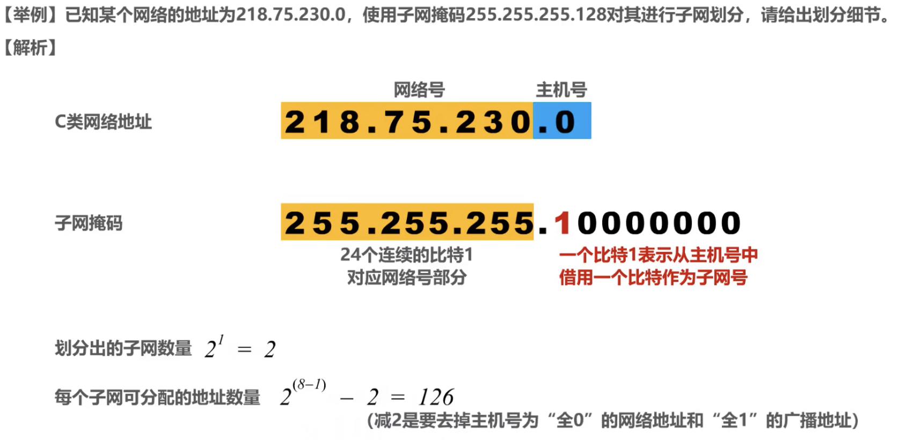
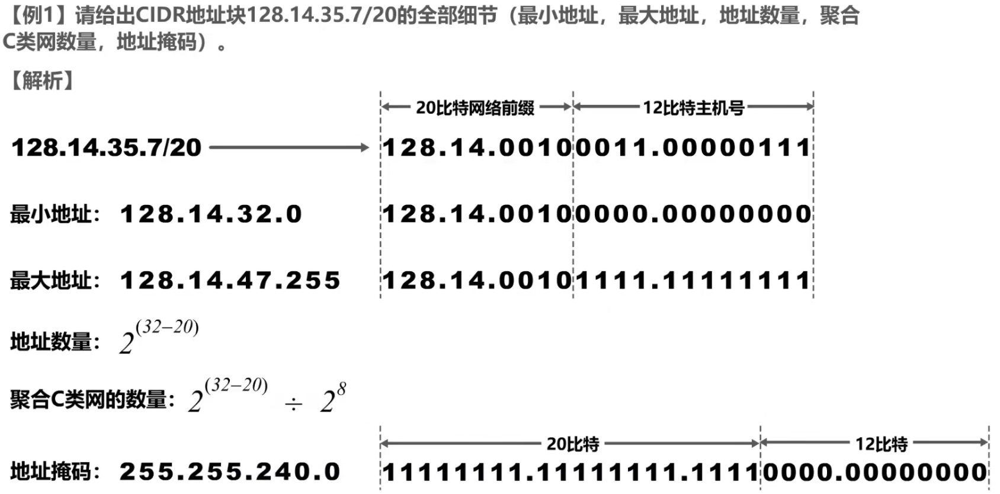

# 计算机网络

## 1  

## 2 

## 3 

## 4 网络层

### 4.1 网络层概述

+ 网络层的主要任务是：实现网络间的互联，进而实现数据包在各网络之间的传输

+ 实现网络层任务，要解决一下问题：

  > 网络层向运输层提供怎样的服务（可靠传输还是不可靠传输）
  >
  > 寻址问题
  >
  > 路由选择问题（传输的路线是？）

+ Internet是全世界用户数量最多的互联网，他使用**TCP/IP协议栈**

+ 由于TCP/IP协议栈的网络层使用**网际协议IP**，它是整个协议栈的核心协议，因此TCP/IP协议栈中的网络层常称为**网际层**

### 4.2 网络层提供的两种服务

1. ###### 面向连接的虚电路服务

   + 可靠通信由网络保障

   + 通信之前建立网络层的链接--虚电路VC（Virtual Circle）

   + 构成虚电路的每一条链路都有一个虚电路编号，每个分组首部只需要携带一条虚电路编号

   + 通信结束后，释放虚电路

2. ###### 无连接的数据报服务

   + Internet采用
   + 可靠通信由用户主机来保证
   + 不需要建立网络层连接
   + 每个分组可以走不同的路径
   + 每个分组的受不必须携带目的主机的完整地址
   + 这种方式下，分组可能出现误码、丢失、重复、失序
   + 由于网络本身不提供端到端的可靠传输服务，这使得网络中的路由器可以做的比较检点价格低廉
   + 因特网采用了这种设计思想，也就是将复杂的网络处理功能置于因特网的边缘（用户主机和其内部的运输层），而将相对简单的尽最大努力的分组交付功能置于因特网核心。

### 4.3 IPv4地址概述

#### 4.3.1 IPv4地址概述

+ IPv4地址就是给因特网上的每一台主机or路由器的每一个接口分配一个在全世界范围内是唯一的32bit的标识符

+ 现在已经分配完毕，我国在2014-2015年逐步停止分配IPV4，同时开展商用部署IPV6

+ IPv4地址的编址方法经历了三个阶段： 分类编址 -> 划分子网 -> 无分类编址

+ IPv4表示方法

  > 32bit IPv4不方便阅读，采用点分十进制表示方法以便使用，每8位一组

#### 4.3.2 分类编址的IPv4地址

+ 

+ A类广播地址

  >网络号占8位，最高位固定为0。00000000最小网络号为0，保留不指派；11111111最大网络号为127，作为本地环回测试地址，不指派（最小环回测试地址127.0.0.1-最大环回测试地址127.255.255.254）。
  >
  >第一个可指派的网络号为1，网络地址为1.0.0.0。
  >
  >最后一个可指派的网络号为126，网络地址为126.0.0.0。
  >
  >可指派的网络数量是 $2^8$ - 2 = 126（去除最小网络号0和最大网络号127）
  >
  >每个网络中可分配的IP地址数量为$2^{24}$ - 2 = 16777214（去除主机号全0的网络地址和全1的广播地址）

+ B类广播地址

  >网络号占16位，前两位固定为10。
  >
  >第一个可指派的网络号为128.0，地址为128.0.0.0
  >
  >最后一个可指派的网络号为191.255（1011111111111111），网络地址为191.255.0.0
  >
  >可指派的网络数量是$2^{16-2}$ = 16384（前两位固定）
  >
  >每个网络中可分配的IP地址数量是$2^{16}$ - 2 = 65534（全0全1）

+ C类广播地址

  >网络号占24位，前三位固定110
  >
  >最小可指派网络号192.0.0
  >
  >最大可指派网络号223.255.255
  >
  >可指派的网络数量为2097152
  >
  >每个网络中可分配的IP地址数量为254

+ 地址0.0.0.0是一个特殊的1Pv4地址，**只能作为源地址使用**，表示“在本网络上的本主机〞封装有DHCP Discovery报文的1P分组的源地址使用0.0.0.0;
+ 以127开头且后面三个字节非”全0” 或”全1” 的 P地址是一类特殊的 Pv4地址，**既可以作为源地址使用，也可以作为目的地址使用**，用于本地软件环回测试，例如常用的环回测试地址127.0.0.1;
+ 地址255.255.255.255是一个特殊的IPv4地址，**只能作为目的地址使用**，表示“只在本网络上进行广播（各路由器均不转发）

 #### 4.3.3 划分子网的IPv4地址

+ 32bit的子网掩码可以表明分类IP地址的主机号部分被借用了几个比特作为子网号
  + 子网掩码使用连续的比特1来对应网络号和子网号
  + 子网掩码使用连续的比特0来对应主机号
  + 将划分子网的IPv4地址与其相应的子网掩码进行逻辑与运算就可得到IPv4地址所在子网的网络地址（全1与运算可以将IPv4中的网络号和子网号留下，全0与运算就可以将主机号清零）

+ 默认子网掩码：未划分子网的情况下使用的子网掩码。（网络号全1，主机号全0即可）

#### 4.3.4 无分类编址的IPv4地址

+ IPv4面临耗尽威胁，提出了此分类法。1993年IETF发不了**无分类域间路由选择CIDR**，它消除了传统ABC类的地址和划分子网的概念。
+ CIDR使用**斜线记发**，在斜线后面写上网络前缀所占的bit数量。CIDR实际上是**将网络前缀都相同的连续的IP地址都组成一个CIDR地址块**。

+ 路由聚合
  + R1路由器中的多个IP地址，将其路由信息通告给另一个路由器R2时，为了减少多个IP地址占用R2的路由表，他可以将**多个目的网络地址根据共同的前缀记录下来成聚合地址块(超网)**，如有R1中5个IP有22位相同，则22位保留，剩下10位全部取0，聚合地址块可能为172.1.4.0/22
  + **网络前缀越长，地址块越小，路由越具体**；
  + 若路由器查表转发分组时发现有多条路由可选，则选择网络前缀最长的那条，这称为**最长前缀匹配**，
    因为这样的路由更具体。

#### 4.3.5 IPv4地址的应用规划

1. 定长的子网掩码FLSM
2. 变长的子网掩码VLSM

### 4.4 IP数据报的发送和转发过程

### 4.5 静态路由配置及可能产生的环路问题

### 4.6 路由选择

#### 4.6.1 路由选择协议概述

#### 4.6.2 路由信息协议RIP的基本工作原理

#### 4.6.3 开放最短路优先OSPF的基本工作原理

#### 4.6.4 边界网关协议BGP的基本工作原理

### 4.7 IPv4数据报的首部格式

### 4.8 网际控制报文协议ICMP

### 4.9 虚拟专用网VPN与网络地址转换NAT

## 5 运输层

### 5.1 运输层概述

### 5.2 运输层端口号、复用和分用的概念

### 5.3 UDP和TCP的区别

1. UDP(User Datagram Protocol)

2. TCP(Transmission Control Protocol)

## 6 应用层

### 6.1 应用层概述
