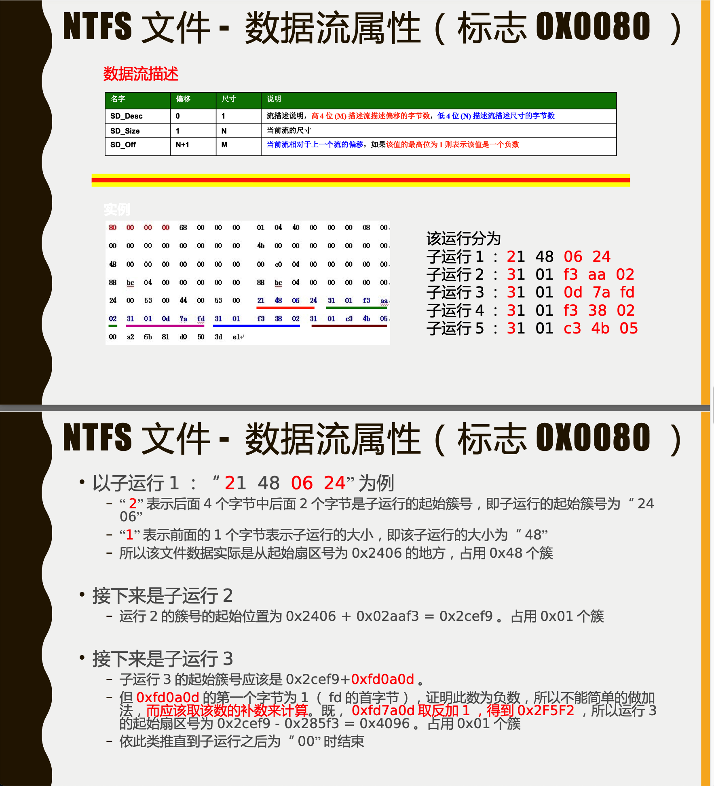

# 计算机病毒分析与对抗

号称软件安全，**凡记录皆为重点，只少不多**

## 1 计算机病毒概述

> 什么是病毒，病毒 / 病毒的对抗技术 的发展史分类啥的

### 1.1 生物病毒

🈚️

### 1.2 计算机病毒

**计算机病毒**是在计算机程序中插入的破坏计算机功能或者毁灭数据的一组**计算机指令**或者**程序代码**。


病毒的生命周期四阶段：

1. 潜伏
2. 传染（复制）
3. 触发（中）
4. 发作

#### 1.2.1 计算机病毒的起源

重要事件

+ 冯诺依曼勾勒计算机病毒蓝图
+ 计算机病毒登上历史舞台：贝尔实验室三位年轻的程序员发明了磁芯大战，行内约定不对外公开。
+ 1983年Ken Thompson`科恩·汤姆逊`公开说明计算机病毒存在。其导师`伦艾德勒曼`Len Adleman定义计算机病毒概念
+ 作家杜特尼在家卖磁芯大战源码
+ 小莫里斯开发蠕虫
+ 中国台湾陈盈豪  CIH  ==目前第一个破坏硬件的病毒==
+ 美丽莎  世界上最大一次病毒泛滥  ==宏病毒==

#### 1.2.2 计算机病毒的产生

🈚️

#### 1.2.3 计算机病毒的定义

我国《计算机病毒防治管理办法》：计算机病毒，是指编制或者在计算机程序中插入的破坏计算机功能或者毁坏数据，影响计算机使用，并能自我复制的一组计算机指令或者程序代码。

#### 1.2.4 计算机病毒的起源

7个特性

1. ==传播性（最大特点）==
2. 非授权性
3. 隐蔽性
4. 潜伏性（不会马上发作）
5. 破坏性
6. 不可预见性
7. 可触发性

#### 1.2.5 6  7 计算机病毒的分类，发展，自我保护技术

🈚️

### 1.3 计算机病毒的对抗

🈚️

## 2 预备知识

> 预备知识是必要的。譬如，病毒的内存分配，原理；文件病毒基本格式；要会汇编

### 2.1 计算机病毒的结构

#### 2.1.1 一个简单的病毒结构

🈚️

#### 2.1.2 计算疾病毒的逻辑结构

计算机病毒的逻辑结构和包含的3个模块，见书中21页           触发，传播，表现

#### 2.1.3 计算机病毒的磁盘存储结构

> 不同类型病毒，在磁盘上存储结构不同。所以需要了解磁盘的基本结构
>
> 经过格式化的磁盘主要包括
>
> + 主引导记录区
> + 引导记录区          （上面这俩用来存储操作系统启动时所用信息）
> + 文件分配表FAT    （反应磁盘使用情况）
> + 目录区  （存放磁盘上现有的文件目录和存放时间等）
> + 数据区  （存储文件数据）
>
> 
>
> 两种类型的文件的存储结构
>
> 1. 引导性病毒的磁盘存储结构
>     + 主要感染引导扇区
>     + 病毒存储在扇区中：第一部分第二部分可能会被分离——第一部分要知道第二部分的簇号存在哪；第二部分占用的簇没有对应文件名可能会被覆写——要在FAT中把这个簇标位坏簇。
> 2. 文件型病毒的磁盘存储结构
>     + 感染可执行性文件，存在文件的首部  尾部  中部  或者空闲部分

### 2.2 计算机磁盘管理

#### 2.2.1 硬盘结构简介

🈚️

#### 2.2.2 主引导扇区结构简介  Boot Sector

主引导扇区就是硬盘的第一个扇区（0面0磁道1扇区）


三部分组成：==这个东西要会画== p24

+ 主引导记录  `Main Boot Record   MBR`
+ 硬盘分区表   `Disk Partition Table   DPT`
+ 引导扇区记录  `Boot Record ID`


0 - 0x1FFH      共512

+ 主引导记录 
    + 占446个字节，**0** - 0x1BD**H**
    + 负责：从活动分区中装载并运行系统引导程序
+ 硬盘分区表  
    + 占64字节，0x1BEH - 0X1FDH
    + 分为4个分区项，每项16字节。
    + 最多分4个部分，记录每个主分区的信息，也就是说最多四个主分区。
+ 引导扇区记录  
    + 占用2个字节，0x1FEH - **0x1FFH**
    + 若为合法引导分区，则分别为 55  AA   也就是0xAA55     `1010101001010101`   `Little-Endian`存储


分区表结构，分为4个分区，每一项16个，也就是上面说的一共 `4 * 16 == 64`  p25

+ byte     分区状态     **0x80 表示激活**   偏移01BE
+ ...
+ Dword   相对扇区数    偏移01c6
+ Dword   分区总共扇区数    偏移01c6

上面说了，主分区表只有4个，那么分区最多4个。故出现了扩展分区，它们链式存储，后一个扩展分区的数据项记录在前一个扩展记录分区的分区表。


补充：GPT分区（UEFI下支持的分区表，UEFI是新型BIOS，而legacy是旧式的，legacy用MBR分区）

+ **UEFI 模式下安装的系统，只能用 UEFI 模式引导**; 同理，在 Legacy 模 式下安装的系统，也只能在 legacy 模式下进系统
+ **UEFI 只支持 64 位系统且磁盘分区必须为 GPT 模式**
+ 传统 BIOS 使用 INT13 中断读取磁盘，每次只==能读 64KB== ，非常低效。而 UEFI 每次可以读 1MB ，载入更快。
+ **MBR 识别最大2.2TB 的分区             GPT 可以识别最大256TB分区**

#### 2.2.3 文件系统

> 文件系统是操作系统用于明确磁盘或分区上的文件的方法和数据结构；即在磁盘上组织文件的方法。一块分区必须要有文件系统才可以使用。
>
> 举个通俗的比喻，一块硬盘就像一个块空地，文件就像不同的材料，我们首先得在空地上建起仓库（分区），并且指定好（格式化）仓库对材料的管理规范（文件系统），这样才能将材料运进仓库保管。
>
> 文件系统是对应硬盘的分区的，而不是整个硬盘，不管是硬盘只有一个分区，还是几个分区，不同的分区可以有着不同的文件系统！

==不同平台：==

Windows：Fat12，Fat16，Fat32，NTFS，NTFS5.0，WINFS

Linux：Exit2，Exit3，Minix，NTFS


讲两个主要的

1. Fat32
    + FAT32将逻辑盘的空间分三部分：引导区，文件分配表，数据区。（前两者也称系统区）
    + FAT16的根目录限制了一共只能有512个目录项。FAT32取消了，采用链式添加
    + 看看图
2. NTFS
    + 其中只有 $Boot (分区引导记录)文件的位置是固定存放在分区首部，其他的文件都可以随 意存在于分区中的任何一个位置。
    + NTFS组成
        + 引导扇区 
        + 主文件列表(`Master File Table  MFT`) 
        + 系统文件(`System files`)     16个系统文件，8个保留文件
        + 数据区


NTFS 数据流属性：




### 2.3 计算机内存管理

### 2.4 计算机引导过程

🈚️

### 2.5 PE文件 ⭐️

> PE文件就是可移植可执行文件 Portable Executable，是Win32可执行文件的标准格式
>
> （DOS系统下，是MZ文件格式）
>
> 研究PE文件，有助于了解病毒的传染原理和Windows结构。PE病毒就是寄生在PE文件上的

PE文件结构

+ DOS头
    + MZ文件头
        + **开始字节为  4D5A**
        + ==判断是否为PE文件==：判断该文件的前两个字节是否为：先看文件开头两个字节是不是**4D5A**。若是，在在DOS程序头中偏移3CH出四个字节找到字串的偏移位置，查看该偏移位置是不是**50\45\00\00**
    + DOS插桩程序
        + ==作用==： 在 DOS 环境下运行 32 位及以上程序时，给用户显示“本程序不能再 DOS 模式下运行”或 者“本程序要求在 win32 及以上操作系统下运行”等类似的提示信息，提示用户当前 DOS 系统不能运行 32 位及以上程序
+ PE头 （NT映像头）
    + 字串PE\0\0      
        +  该字串标志着NT映像头开始
        + 在DOS头中偏移**3CH**出的四个字节就是该字串的偏移位置
    + 映像文件头
        + 包含PE文件最基本信息
    + 可选映像头
        + 包含PE文件逻辑分布信息
        + **几个重要参数**
            + `AddressOfEntryPoint`：可选PE头中最重要的一个参数，也就是我们通常说的OEP，是当前程序的入口位置，该地址是一个相对虚拟地址，**指向了程序执行的第一条代码**，如果程序被加壳，那么这个地址就会被修改，通常在使用OD进行动态调试的时候，OD首次停留的位置就是AddressOfEntryPoint。
            + `ImageBase`：内存的镜像地址，也称基地址，是文件在内存中的首选装入地址，如果文件需要在内存中执行的话，会首先使用ImageBase中存放的地址，如果地址被占用，文件会被装入到其他地址中，因为直接装入这个地址不需要进行重定位，所以速度会很快，如果当前地址被占用就需要重定位后装入其他的地址，相对来说速度就会慢一些。
            + `SizeOfImage`：是程序在装入内存后的整个PE文件在内存中的映射尺寸，指的就是装入文件从ImageBase到最后一个块的大小，可以比实际的值大，但必须是SectionAlignment内存对齐的整数倍。
            + `SizeOfHeaders`：是DOS头，PE文件头和节表的总大小，该值必须是正确的，否则程序无法运行。
            + `NumberOfRvaAndSizes`：数据目录的项数。一般为16
+ 节表
+ 节


内存虚拟地址( VA ) = 镜像基址( ImageBase ) + 相对虚拟地址( RVA )

## 3 计算机病毒的基本机制

### 3.1 计算机病毒的三种机制

病毒程序主要有**4**个模块

1. 感染/传播模块
    + 有的病毒有感染标记，对已经感染的文件打上标记
2. 触发模块
    + 检查触发条件是否满足
3. 破坏模块
    + 实施病毒的破坏动作
4. 主控模块
    + 相当于总指挥
    + ==功能==：
        + 调用感染模块，进行感染
        + 调用触发模块，接受其返回值
        + 为真，执行破坏模块
        + 为假，执行后续程序
        + 检测运行环境
        + 常驻内存的病毒要做请求内存区，传送病毒代码...
        + 发生意外是，确保顺畅执行，不应死锁


对应了前三个模块，主要有**3**种机制（但是并不是所有病毒都有这三个模块）

1. 传播机制
2. 触发机制
3. 破坏机制


### 3.2 病毒的传播机制

#### 3.2.1 计算机病毒的传播途径

1. 不可移动的计算机硬件设备
2. 移动存储设备
3. 网络
4. 无线通信系统

#### 3.2.2 计算机病毒的传播过程

感染一般有3步：

1. 宿主工作时，截取控制权
2. 寻找感染突破口
3. 将病毒代码植入其他宿主

宿主一般有： 本地系统，应用程序（头部尾部中部感染），可移动存储设备，其他主机

### 3.3 病毒的触发机制

触发条件一般有：日期时间，键盘，鼠标，感染，启动，磁盘访问中断访问，CPU型号/主板型号

### 3.4 病毒的破坏机制

攻击内容一般包括：数据区，文件硬盘，内存，干扰系统运行，输出设备，键盘输入，窃取信息，下载恶意软件

## 4 DOS病毒分析

> DOS年间十分盛行的，现在DOS系统十分少了，DOS病毒也就没有舞台了。
>
> 但是还得研究。本章就是两个著名病毒进行分析：引导区病毒和文件型病毒

### 4.1 引导区病毒

> 其实病毒也是程序。硬盘重新分区或者格式化，病毒也就不存在了。但是，主引导区病毒可以永远保留下来。即使是Windows病毒，主引导区也称为了部分病毒`BootKit`实施'永驻'的位置之一。

#### 4.1.1 引导区病毒概述

**引导区病毒：专门感染磁盘引导扇区和硬盘主引导扇区的计算机病毒程序**


常见：大麻病毒，小球病毒，巴基斯坦智囊，磁盘杀手

#### 4.1.2 引导区病毒的原理

引导区病毒按照寄生对象不同，分两类：MBR，BR（即主引导区和引导区病毒）


通常情况下，这类病毒是把主引导分区的记录保存后，用自己的程序替换掉。执行完自己的处理后，将保存的原引导记录读入**0:7C00H**

#### 4.1.3 典型的DOS引导区病毒——大麻病毒分析

大麻病毒将原引导扇区转换到：

+ 对于软盘：1面0道3扇区
+ 对于硬盘：0面0道7扇区

清楚方式：调用`INT 13`，将扇区内容写入内存，再从内存中写入高端。       使用Fdisk/MBR指令


### 4.2 文件型病毒

所有通过操作系统的文件系统进行感染的病毒都叫做文件病毒。（引导型病毒在安装操作系统之前进入内存）

典型的DOS文件型病毒——黑色星期五


### 4.3 混合病毒

混合病毒是指：既可以对引导区进行感染，也可以对文件进行感染的病毒

>但这种病毒可不是两者的简单相加
>
>引导程序负责初始化系统环境、加载操作系统并将控制权转交给操作系统。在基于DOS的系统中，引导程序通常会加载DOS操作系统（如MS-DOS），然后将控制权转交给DOS。
>
>引导型病毒都是修改  `INT 13H`，而DOS功能调用`INT 21H`。一般都专门写一段查看21H中断指令是否改变的监视程序。发现DOS系统引导之后，再将涉及好的文件感染代码上场，进行感染。

## 5 Windows病毒分析

> DOS病毒逐渐成为过去式，随着用户使用量增加，病毒把目光转移到Windows和互联网。大部分都是汇编写的。

### 5.1 Win32 PE病毒

> 大多数病毒爱好者的严重，真正的病毒技术在Win32 PE病毒（下简称'PE病毒'）中才会得到真正的体现。

#### 5.1.1 Win32病毒的感染技术

1. 病毒感染重定位

    + ==为什么要采用重定位？==

        + 病毒要用到变（常量）。在病毒感染HOST程序后，由于它依附到HOST程序中的位置各不相同。因此病毒随着HOST载入程序后，病毒中的各个变量在内存中的位置会随着HOST程序的位置而发生变化。所以，病毒程序就要使用重定位技术

    + 重定位过程的三个步骤：

        + 用`CALL`指令跳转到下一条指令，使感染后下一条指令在内存中的事迹地址进栈
        + 用`POP`或者`MOV EXX`，指令取出栈顶内容，得到了感染后下一条指令在内存中的实际地址`Base`
        + `Vstart 为感染前call指令的下一条指令的地址`，`Var_Lable为感染前变量的地址`，则感染后的变量实际地址为$Base + (OffSet\ Var\_Lable - Offset\ V\_start)$

    + ==代码==

        + ```assembly
            VStart:
            	call delta                     ;这条语句执行之后，堆栈顶端为 delta 在内存中的真正地址
            delta:
            	pop ebp                         ;这条语句将 delta 在内存中的真正地址存放在 ebp 寄存器中
            	sub ebp, offset Var2 - Vstart   ;得到一个偏移差，变量加上该值进行重定位
            	lea eax, [offset Var2 + ebp]    ;此时 eax 中存放着 var 在内存中的真实地址
            ```

2. 获取API函数地址

    + > PE病毒和普通的Win32 PE程序一样需要调用API函数，但是普通的Win32 PE程序里面有一个引入函数结构，程序通过此节就可以找到代码段中用到的API函数在动态链接库汇总的真是地址。但是对于PE病毒来说，他只有一个代码节，不能像普通的PE程序一样直接调用API函数，所以得自己想办法。

    + 获取API函数地址。分两步：首先获得Kernel32的基地址；其次再从Kernel32中找到需要调用的API地址。

        + 1. 获取Kernel 32 地址

                + > `kernel32` 是一个重要的动态链接库（DLL）文件，它是微软 Windows 操作系统的一部分。它包含了许多核心系统功能的实现，提供了对操作系统底层功能的访问接口。

                1. 通过PEB获取

                    + ```assembly
                        find_kernel32:
                        	push esi
                        	xor eax, eax
                        	mov eax, fs:[eax + 0x30]
                        	test eax, eax
                        	js find_kernel32_9x
                        
                        find_kernel32_nt:
                        	mov eax, [eax+0x0c]
                        	mov esi, [eax+0x1c]
                        	lodsd
                        	mov eax, [eax+0x8]
                        	jmp find_kernel32_finished
                        	
                        find_kernel32_9x:
                        	mov eax, [eax+0x34]
                        	lea eax, [eax+0x7c]
                        	mov eax, [eax+0x3c]
                        	
                        find_keernel32_finished:
                        	pop esi
                        	ret
                        	
                        	
                        
                        
                        ; 2
                        aa db "kenel32.dll"
                        	mov ebx, offset aa
                        Find_kernel32:
                        	push esi
                        	xor eax,eax
                        	mov eax,fs:[eax,0x30] ; 找到 PEB
                        	mov eax,[eax+0x0c] ; 找到 LDR
                        	mov esi,[eax+0x1c] ; 找到前向初始化转载链指针
                        
                        find_continue:
                        	lodsd  ;esi所指向的内存数据拷贝至eax中 mov edx,[eax+0x14] 
                        	 mov edx, [eax + 0x14]  ;找到DLL的名字
                        	.....    ; 比较dll的名字是否是kernel32.dll，略
                        	je find_finished mov esi,[eax]   ;名字一样，表明找到了
                        	jmp find_continue	;下一个 DLL 的信息 继续比对
                        
                        find_finished:
                        	mov eax.[eax+8]    ; 获取 kernel32 的地址
                        	pop esi
                        ```

                2. 通过SEH获取

                    + > SEH（Structured Exception Handling）是一种用于处理异常的机制，用于在 Windows 操作系统中实现异常处理和异常传递。SEH 是一种结构化的异常处理机制，提供了在程序执行过程中捕获和处理异常的能力。

                    + ```asm
                        find_kerne132:
                        	push esi  ;Save esi
                        	push ecx ;Save ecx
                        	xor ecx,ecx ; Zero ecx
                        	mov esi,fs:[ecx] ; Snag our SEH entry
                        	not ecx ;Set ecx to Oxffffffff
                        	
                        find_kernel32_seh_loop:
                        	lodsd ; Load the memory in esi into eax
                        	mov esi,eax ;Use this eax as our next pointer for esi
                        	cmp [eax],ecx ; Is the next-handler set to Oxffrmf?
                        	jne find_kernel32_seh_loop ; Nope,keep going. Otherwise,fall through
                        	
                        find_kernel32_seh_loop_done:
                        	mov eax,[eax+0x04] ;Snag the function handler address in eax
                        find_kerne132_base:
                        
                        find_kernel32_base_loop:
                        	dec eax ; Subtract to our next page
                        	xor ax,ax ; Zero the lower half
                        	cmp word ptr[eax],0x5a4d ; Is this the top of kernel32?
                        	jne find_kernel32_base_loop ;No pe? Try again
                        	
                        find_kernel32_basease_finfinished:
                        	pop ecx ;Restore ecx
                        	pop esi ;Restore esi
                        	ret ;Return
                        ```

                3. TOPSTACK

                    + 只适应于 Windows NT 操作系统。不多说了

            2. 从Kernel 32中得到API函数地址

                + 如果直接知道所需API地址，通过Kernel32.dll的引出表信息
                + 或者通过`GetProcAddress`或者`LoadLibrary`两个API函数的地址得到需要的API地址。

    + That’s all.

3. 添加新节感染

4. 病毒返回宿主程序

#### 5.1.2 捆绑式感染方式简介

#### 5.1.3 网络传播方式的PE病毒

#### 5.1.4 可移动存储设备传播的PE病毒 

#### 5.1.5 Win32 病毒实例——熊猫烧香

🈚️

### 5.2 宏病毒

> 宏病毒编写门槛低，所以数量巨多
>
>
> 宏病毒（Macro Virus）是一种恶意软件，利用应用程序中的宏功能来传播和执行恶意代码。宏病毒最常见的形式是针对办公软件（如Microsoft Office）中的宏功能，特别是针对文档处理软件（如Microsoft Word、Excel）。
>
> 宏是一种宿主程序内部的自动化脚本或代码，允许用户创建自定义命令、自动化任务或自动执行一系列操作。宏病毒利用宏功能的特性，将恶意代码嵌入到文档中的宏代码中，当用户打开带有宏病毒的文档时，宏代码会自动执行，从而导致系统感染或数据泄露等问题。
>
> 宏病毒可以通过多种方式传播，包括通过电子邮件附件、共享文档、移动存储设备等方式。一旦宏病毒感染了一个系统，它可以利用宏功能在系统内部和其他文档中自动复制和传播，从而扩大感染范围。
>
> 宏病毒的危害取决于其具体的恶意代码和行为，可能包括以下方面：
>
> 1. 数据破坏：宏病毒可以修改、删除或破坏文档、文件或整个系统中的数据。
> 2. 传播恶意软件：宏病毒可以下载和安装其他恶意软件，如间谍软件、勒索软件等。
> 3. 窃取个人信息：宏病毒可以收集用户的敏感信息，如用户名、密码、银行账户等。
> 4. 网络攻击：宏病毒可以利用感染的计算机作为僵尸网络的一部分，进行分布式拒绝服务攻击（DDoS）或其他网络攻击行为。

针对：word，excel等办公软件

典型：**美丽莎病毒**

+ 结构：先是一些自我保护。然后通过寻找地址本上的前50个email，给这些email发带本病毒的文档。最后对本地文档进行感染。
+ 破坏体现：邮件风暴，网络阻塞。

### 5.3 脚本病毒

通过自我复制，附在文件的尾部或者中间部分，在文件加上调用病毒的代码；或者直接生成文件的副本，将自己代码放到文件副本上。

典型：**爱虫**，**新欢乐时光**

### 5.4 恶意网页

指HTML文件中用于非法修改用户机器配置的HTML文件。

网页恶意代码分为3种介绍

#### 5.4.1 修改注册表

自动修改网页浏览者电脑的注册表，从而达到修改IE首页地址，锁定部分功能等目的。

#### 5.4.2 操纵用户系统文件

对用户电脑文件进行读，写，执行指令。

#### 5.4.3 网页挂马

**网页挂马是指**：攻击者通过在正常的页面中插入一段代码，浏览者在打开该页面的时候，这段代码会被执行，然后下载并运行某木那的服务器端程序，进而控制浏览者的主机。

## 6 病毒技巧

### 6.1 病毒的隐藏技术

#### 6.1.1 引导型病毒的隐藏技术

两种基本方法

1. 改变基本输入输出系统BIOS，中断13H的入口地址，使其指向病毒代码。（调用13H时，病毒把正常中断代码返回）。
2. 改变DOS的，中断21H的地址。

#### 6.1.2 嵌入文件型病毒的隐藏技术

宏病毒隐藏一般是禁用宏。

有的恶意文件会插入在不同格式中的文件。

#### 6.1.3 Windows 病毒的隐藏技术

windows病毒常见的：

1. 在文件空隙中插入病毒
2. Win98 下隐藏进程
3. Win2000 创建服务进程：服务进程无法被用户关闭。
4. 创建远程线程：将病毒以线程的方式插入到进程。

#### 6.1.4 RootKit 隐藏技术

Rootkit：主要功能为隐藏其他软件存在痕迹的程序。

SSDT HOOK...

### 6.2 花指令

> 为了防止别简单的反汇编出来，在代码里面加入一些没用的代码混淆视听。

NOTE：不准有jump指令（call 可以回来但是jump不行）。花指令不准改变实际内存中的内容。

### 6.3 计算机病毒的简单加密

> 将病毒的某些主体代码采用固定的密钥进行加密。这样反汇编出来就是经过加密处理的

一个被加密的病毒代码一般有下面几部分：

+ 解密代码
+ 加密的主体代码
+ 跳转到解密后的代码执行

## 7 漏洞与网络蠕虫


## 8 特洛伊木马和Rootkit


