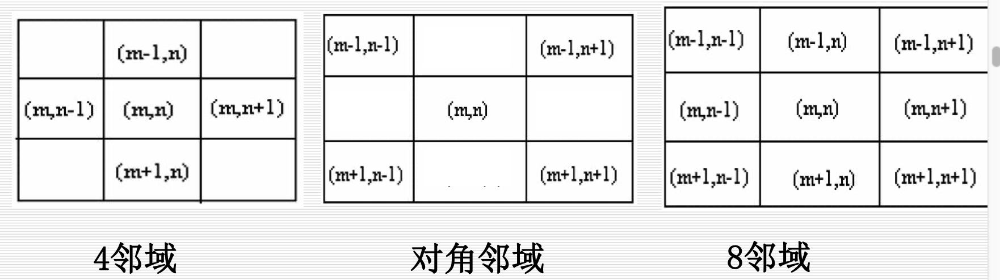
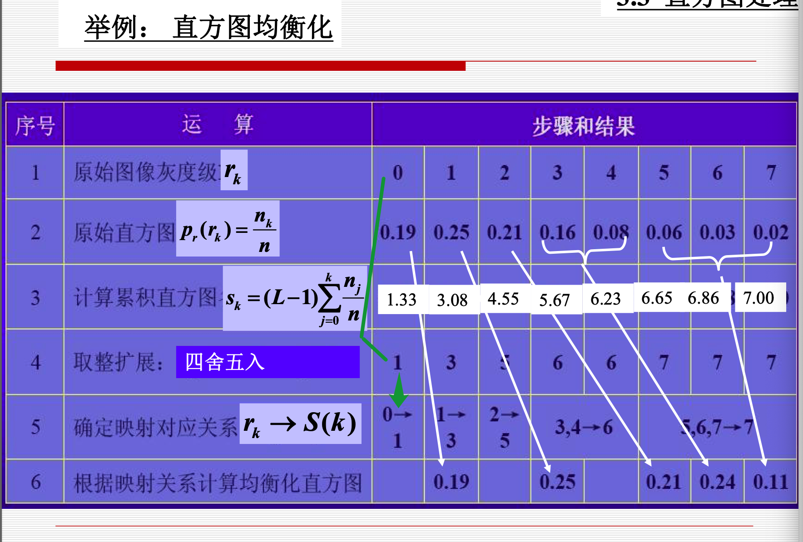
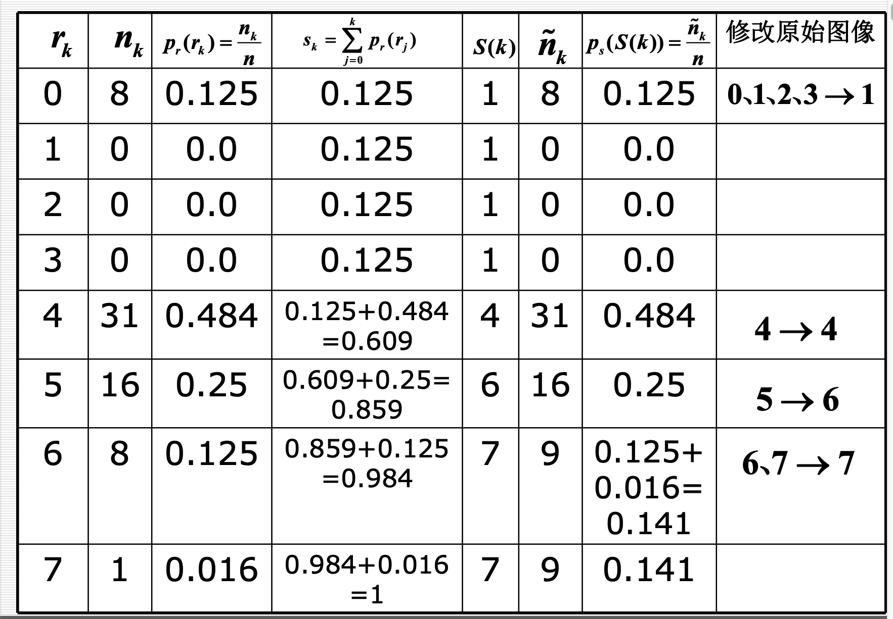
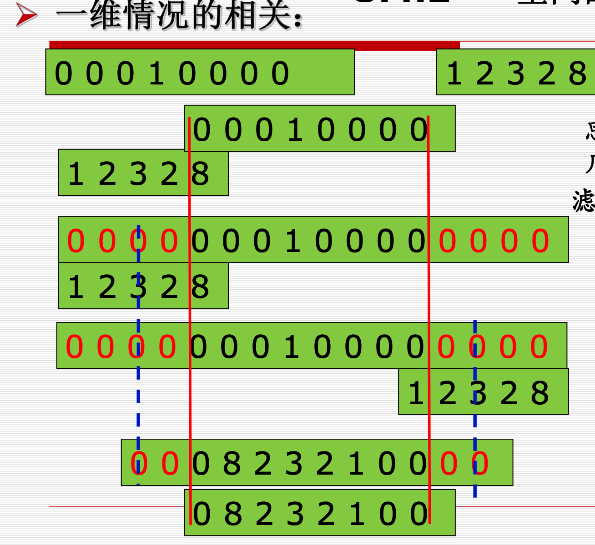
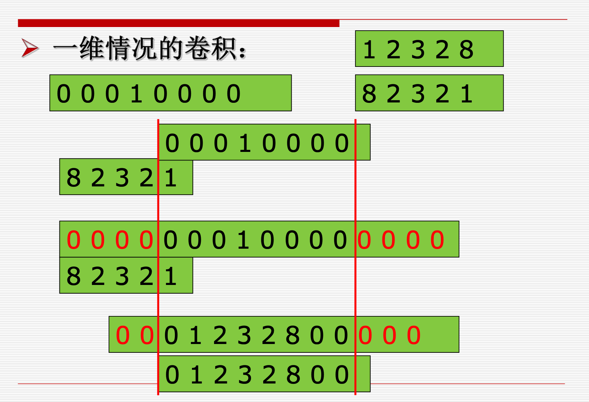
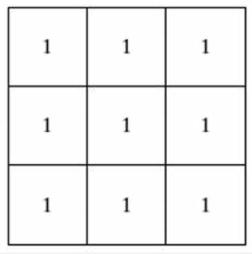
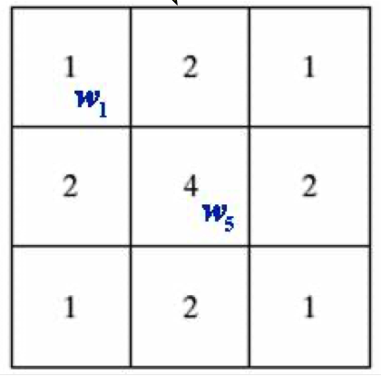

# 数字图像处理

## 第一章 绪论

### 1.1 DIP基本概念

#### 1.1.1 图像的概念

1. 模拟图像
    + 模拟图像可用连续函数来描述。$I = F(x, y)$
    + 其特点：光照位置(x, y)和光照强度I 均为**连续变化**的
2. 数字图像
    + 对模拟图像进行**取样**和**量化**，就可以得到**离散**形式的数字图像。
    + 光照位置(x, y)和光照强度I 均用离散的数字表示，基本元素称为**像素**。
    + 像素的属性：**空间位置**和**灰度**

#### 1.1.2 图像处理的概念

### 1.2 DIP起源

略

### 1.3 DIP内容

八个方面

1. 图像获取，表示和表现 **Image Acquisition, Representation and Presentation**
2. 图像增强 **Image Enhancement**
3. 图像复原 **Image Restoration**
4. 图像重建 **Image Reconstruction**
5. 图像压缩编码 **Image Encoding**
6. 图像分割 **Image Segmentation**
7. 目标识别 **Pattern Recognition**
8. 图像理解**Image Understanding**

### 1.4 DIP实例

略

### 1.5 DIP系统的组成

1. 图像采集模块
2. 图像显示模块
3. 图像存储模块
4. 图像通信模块
5. 主机
6. 图像处理软件

## 第二章 数字图像基础

### 2.1 视觉感知要素

### 2.2 光和电磁波谱

### 2.3 图像感知和获取

### 2.4 图像取样和量化

数字图像生成需要

1. 传感器输出
2. 数字化
    1. **取样**
    2. **量化**

获取图像的目标是从感知的数据中产生数字图像， 但是传感器的输出是连续的电压波形，因此需要把连续的感知数据转换为数字形式。

这一过程就需要取样和量化。

数字化坐标值称为取样，数字化幅度值称为量化。

#### 2.4.1 数字图像的表示

取样得到的数字图像有M行N列，则数字图像可以表示为M*N的矩阵。矩阵中每一个元素成为图像元素或者**像素**。

L为图像的灰度级，灰度的取值范围为[0, L - 1]。

一般，M, N, L取值为$2^n$形式，图像的许多计算可以得到简化。其中$L=2^k$，该图像称为k位图像。

> 存储一幅512×512，有256个灰度级的图像需要多少比特?
>
> 答: 存储一幅大小为M×N，有2k个不同灰度级的图像所用的 Bit数为: $b=M×N×k$ 
>
> 因此，存储一幅`512×512` ，有`256`个灰度级`(k=8)`的图像 需要$512×512×8=2097152(Bit)$ 或$ 512×512=256K(Byte)$

#### 2.4.2 空间分辨率

空间分辨率(spatial resolution)：每英寸点数（dots per inch）dpi每英寸点数图像中可分辨的最小细节。

跟采样间隔有关系，采样间隔值越小，空间分辨率越高。

####  2.4.2 灰度分辨率

通常也把灰度级**L**称为灰度分辨率。

总结：

图像的分辨率表示的是能看到图像细节的多少，显然依赖于`M×N`和`L`

+ 保持`M×N`不变而减少`L`则会导致假轮廓
+ 保持`L`不变而减少`M×N`则会导致棋盘状效果

图像质量一般随着`M×N`和`L`的增加而增加，但存储量增大。

实验表明图像的细节越多，用保持`M×N`恒定而增加`L`的方法来提高图像的显示效果就越不明显.因此，对于有大量细节的图像只需要少数的灰度级。

### 2.5 像素间基本关系

#### 2.5.1 相邻

$N_4(P), N_D(P), N_8(P)$

注意：坐标原点在左上角，X轴正方向为竖直向下，Y轴正方向为水平向右。

#### 2.5.2 邻接

像素的**相邻**仅说明了两个像素在位置上的关系，若再加上取值相同或相近，则称两个像素**邻接**。

条件：

1. 位置相邻
2. 灰度值满足$p\in V, q \in V, 其中 V={v1, v2, ...}$称为灰度值相近(似)准则。

+ 四邻接: 若像素p和q的灰度值均属于V中的元素，且q在$N_4(P)$中，则p和q是4邻接的。
+ 八邻接：若像素p和q的灰度值均属于V中的元素，且q在$N_8(P)$ 集中,则p和q是8邻接的。
+ m邻接（混合邻接）：若像素p和q的灰度值均属于V中的元素， 
    + q在$N_4(P)$中 **或**
    +  q在$N_D(P)$中，且集合$N_4(p)∩N_4(q)$没有V值的像素，则具V值的像素p，q是m邻接的。

V值的像素},则具有V值的像素p和q是m邻接的。

#### 2.5.3 通路

m邻接帮助消除通路二义性，只准m邻接之间直达。

### 2.6 线性和非线性操作

## 第三章 空间域图像增强

### 3.1 背景知识

### 3.2 基本灰度变换

### 3.3 直方图处理

横坐标$r_k \in [0, L-1]$，纵坐标对应该灰度级的像素个数。

直方图均衡化公式一览图：

直方图均衡化详细过程举例：

### 3.4 空间滤波基础

1. 相关:滤波器模板移过图像并计算每个位置乘积之和。
2. 卷积:跟相关机理相似，但滤波器模板要先旋转180度，再进行移动求乘积之和。

注意：当处理的像素是边界像素时，一 般先进行像素填充，即在像素一侧补0.

#### 3.4.1 一维空间相关

#### 3.4.2 一维空间卷积

### 3.5 平滑空间滤波器

#### 3.5.1 平滑线性滤波器

均值滤波器

公式：

$g(x, y)=\frac{\sum_{s=-a}^{a} \sum_{t=-b}^{b} w(s, t) f(x+s, y+t)}{\sum_{s=-a}^{a} \sum_{t=-b}^{b} w(s, t)}$

下图对应：$\frac{1}{9}*\sum_{i=1}^{9}z_i $

#### 3.5.2 平滑空间滤波器

加权均值滤波

公式：

$g(x, y)=\frac{\sum_{s=-a}^{a} \sum_{t=-b}^{b} w(s, t) f(x+s, y+t)}{\sum_{s=-a}^{a} \sum_{t=-b}^{b} w(s, t)}$

下图对应 $\frac{1}{16}*\sum_{i=1}^{9}w_iz_i $

中值滤波器

取模版区域的中值作为中心的值。

### 3.6 锐化空间滤波器

与平滑相对应，锐化主要是突出细节。

锐化处理可以用空间微分来完成**.** 微分算子的响应强度与图 像在该点的突变程度有关，图像微分增强了边缘和其他突变 （如噪声）而消弱了灰度变化缓慢的区域。

### 3.7 混合空间增强法

## 第四章 频率域滤波

### 4.1 背景知识

### 4.2 时域频域

### 4.3 二维傅里叶变换的性质

1. 平移性
    + 在频域中F原点平移到(u0 ,v0)时，其对应的空间域 f(x,y)要乘上一个正的指数项。
    +  在空域中f图像原点平移到(x0,y0)时，其对应的F(u,v)要乘上一个负的指数项。
2. 旋转性
    + 原图像f旋转一定角度 等价于 傅里叶变换后图像F旋转相同角度
3. 周期性
4. 对称性
    + 属于共轭对称（当两个复数实部相等,虚部互为相 反数时,这两个复数叫做互为共轭复数）
5. 线性性质
    + $af(x, y)+bg(x, y) \iff aF(u,v)+bG(u,v)$
6. 尺度定理
    + 幅度尺度：$af (x, y) \iff aF(u,v)$
    + 空间尺度：$f(a x, b y) \Leftrightarrow \frac{1}{|a b|} F\left(\frac{u}{a}, \frac{v}{b}\right)$

图像和频谱图的关系

1. 图像的能量分布：如果频谱图中暗点多，那么实际图像是柔和的。因为各点与邻域灰度差异都不大，梯度相对较小。反之，如果亮点多，那么实际图像是尖锐的，边界分明且边界两边像素差异较大的。
2. 图像的频谱分布：频谱移频到显示屏中心后，图像的频谱分布是以中从谱图像中可看出：图像频谱的分布是以中心为圆心，对称分布的。

### 4.4 频率滤波器

#### 4.4.1 低通滤波器（平滑滤波器）

#### 4.4.2 高通滤波器（锐化滤波器）

## 第六章 彩色图像处理

## 第八章 图像压缩

## 第十章 图像分割

