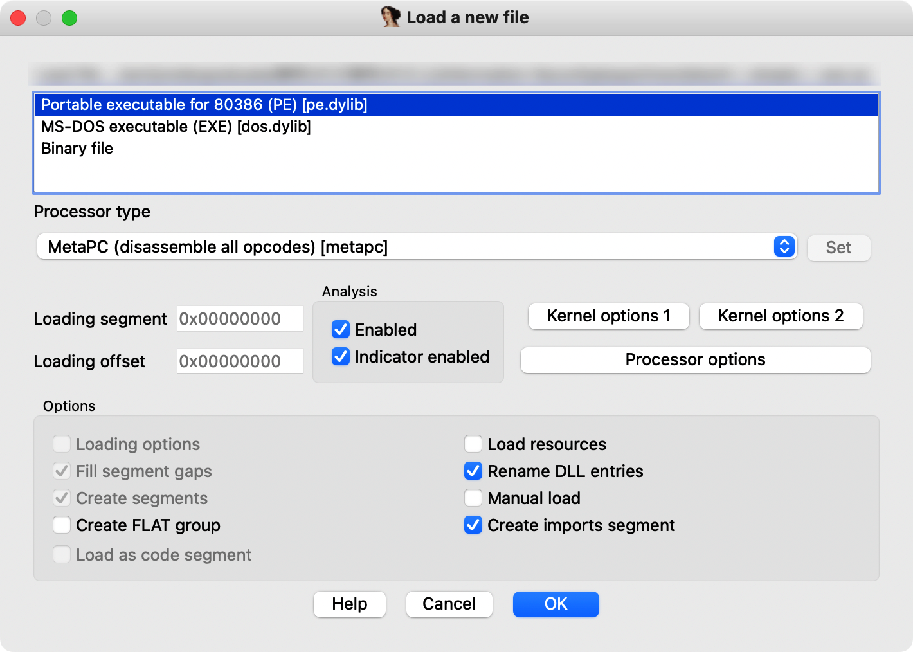

# C++反汇编

## 1 IDA工具使用

ida属于一个**静态分析**的反汇编工具，他不同与OD那样的**动态分析**（调试器加载程序，并以调试模式运行起来，分析者可以在程序的执行过程中观察程序的执行流程和计算结果）。而在实际分析过程中，你可能会遇到：设备环境不兼容、病毒程序、某软件的一模块无法单独运行...这时候你就需要静态分析的工具直接做反汇编（将二进制代码到汇编代码的翻译过程）。

### 1.1 基础使用方法

#### 1.1.1 加载分析文件

加载文件后，ida会询问你的分析方式：

1. Portable executable for 80386 (PE) [pe.dylib]

    + 分析一个PE格式文件

    + > **可移植性可执行文件**（[英语](https://zh.m.wikipedia.org/wiki/英语)：Portable Executable，缩写为PE）是一种用于[可执行文件](https://zh.m.wikipedia.org/wiki/可执行文件)、[目标文件](https://zh.m.wikipedia.org/wiki/目标文件)和[动态链接库](https://zh.m.wikipedia.org/wiki/动态链接库)的[文件格式](https://zh.m.wikipedia.org/wiki/文件格式)，主要使用在32位和64位的[Windows](https://zh.m.wikipedia.org/wiki/Microsoft_Windows)[操作系统](https://zh.m.wikipedia.org/wiki/操作系统)上。“可移植的”是指该文件格式的通用性，可用于许多种不同的操作系统和体系结构中。PE文件格式封装了Windows操作系统加载可执行程序代码时所必需的一些信息。这些信息包括[动态链接库](https://zh.m.wikipedia.org/wiki/库_(计算机)#动态链接)、[API](https://zh.m.wikipedia.org/wiki/Application_programming_interface)导入和导出表、资源管理数据和[线程局部存储](https://zh.m.wikipedia.org/w/index.php?title=Thread-local_storage&action=edit&redlink=1)数据。在[Windows NT](https://zh.m.wikipedia.org/wiki/Windows_NT)操作系统中，PE文件格式主要用于[EXE](https://zh.m.wikipedia.org/wiki/EXE)文件、[DLL](https://zh.m.wikipedia.org/wiki/动态链接库)文件、[.sys](https://zh.m.wikipedia.org/wiki/.sys)（驱动程序）和其他文件类型。[可扩展固件接口（EFI）](https://zh.m.wikipedia.org/wiki/可扩展固件接口)技术规范书中说明PE格式是EFI环境中的标准可执行文件格式。开头为[DOS头部](https://zh.m.wikipedia.org/wiki/DOS头部)。
        >
        > | [扩展名](https://zh.m.wikipedia.org/wiki/扩展名)             | `.acm, .ax, .cpl, .dll, .drv, .efi, .exe, .mui, .ocx, .scr, .sys, .tsp` |
        > | :----------------------------------------------------------- | ------------------------------------------------------------ |
        > | [互联网媒体类型](https://zh.m.wikipedia.org/wiki/互联网媒体类型) | `application/vnd.microsoft.portable-executable`              |
        > | 开发者                                                       | [Microsoft](https://zh.m.wikipedia.org/wiki/Microsoft)       |
        > | 格式类型                                                     | [二进制](https://zh.m.wikipedia.org/wiki/二进制文件)[可执行文件](https://zh.m.wikipedia.org/wiki/可执行文件)、[目标代码](https://zh.m.wikipedia.org/wiki/目标代码)、[函式库](https://zh.m.wikipedia.org/wiki/函式庫) |
        > | 扩展自                                                       | [DOS MZ可执行文件](https://zh.m.wikipedia.org/wiki/DOS_MZ可执行文件) [COFF](https://zh.m.wikipedia.org/wiki/COFF) |
        >
        > PE格式是由Unix中的[COFF](https://zh.m.wikipedia.org/wiki/COFF)格式修改而来的。在Windows开发环境中，PE格式也称为**PE/COFF**格式。

2. MS-DOS executable (EXE) [dos.dylib]

    + 分析文件为DOS控制台下的文件

    + > **DOS**（[/ d ɒ s /](https://en.wikipedia.org/wiki/Help:IPA/English)，[/ d ɔː s /](https://en.wikipedia.org/wiki/Help:IPA/English)[ [1\]](https://en.wikipedia.org/wiki/DOS#cite_note-1)）是“[磁盘操作系统](https://en.wikipedia.org/wiki/Disk_operating_system)”的独立于平台的首字母缩写词，后来成为[IBM PC 兼容机](https://en.wikipedia.org/wiki/IBM_PC_compatible)上基于磁盘的操作系统的常用缩写。[[2\]](https://en.wikipedia.org/wiki/DOS#cite_note-2) DOS 主要由[Microsoft](https://en.wikipedia.org/wiki/Microsoft)的[MS-DOS和名称为](https://en.wikipedia.org/wiki/MS-DOS)[IBM PC DOS](https://en.wikipedia.org/wiki/IBM_PC_DOS)的更名版本组成，两者均于 1981 年推出。后来其他制造商的兼容系统包括[DR DOS](https://en.wikipedia.org/wiki/DR_DOS)（1988 年）、[ROM-DOS](https://en.wikipedia.org/wiki/ROM-DOS)（1989 年） )、[PTS-DOS](https://en.wikipedia.org/wiki/PTS-DOS) (1993) 和[自由操作系统](https://en.wikipedia.org/wiki/FreeDOS)(1998)。1981 年至 1995 年间，MS-DOS 主导了 IBM PC 兼容市场。
        >
        > 许多其他操作系统也使用首字母缩写词“DOS”，从 1966 年的大型机[DOS/360开始。其他包括](https://en.wikipedia.org/wiki/DOS/360_and_successors)[Apple DOS](https://en.wikipedia.org/wiki/Apple_DOS)、[Apple ProDOS](https://en.wikipedia.org/wiki/Apple_ProDOS)、[Atari DOS](https://en.wikipedia.org/wiki/Atari_DOS)、[Commodore DOS](https://en.wikipedia.org/wiki/Commodore_DOS)、[TRSDOS](https://en.wikipedia.org/wiki/TRSDOS)和[AmigaDOS](https://en.wikipedia.org/wiki/AmigaDOS)。

3. Binary file

    + 分析文件为一个二进制文件

#### 1.1.2 视图窗口介绍

+ IDA View-A：分析视图窗口，用于显示分析结果，可选用流程图或代码形式
+ HEX View-1：二进制视图窗口，打开文件二进制信息。
+ Imports：分析文件中的导入函数信息窗口。
+ Exports：分析文件中的导入函数信息窗口。
+ Enums：添加枚举信息窗口。
+ Structures：添加结构体的信息窗口。

#### 1.1.3 查看分析结果和一些操作

IDA默认视图为流程视图，空格转换成代码形式。

反汇编代码展示出来后，双击标号即可跟踪到该数据的定义处，函数也是一样。ESC返回跟进出。

IDA可以通过SIG文件进行函数名识别，具体流程这里先不做介绍。

## 2 基本数据类型的表现形式

由于二进制数不方便显示和阅读，因此内存中的数据采用十六进制数显示，每一个字节由两个十六进制数组成，在进制转化中一个十六进制数可以用4个二进制数表示，每个二进制数表示一位，因此一个字节在内存中占八位。

### 2.1 整数类型

#### 2.1.1 无符号整数

在内存中，无符号整数的所有位都用来表示数值。以`unsigned int`为例，此类型的变量在内存中占4字节，由8个十六进制数组成。取值范围为`0x00000000`\~`0xFFFFFFFF`。

+ 当此类型不足32位，用0来填充剩余高位。
+ 转化中16进制数后，内存中以“小尾形式”存放，注意按字节存放（2个十六进制位）。（也成小端方式）
    + 0x12345678   - >   78 56 34 12
+ 在其他计算机系统中，也有大尾形式。
+ 不分正负，所以正数范围是补码的一倍。

#### 2.1.2 有符号整数

用最高位来表示符号位，0+1-。少一位表示数值，所以范围0x80000000\~0x7FFFFFFF。十进制下-`2147482648`\~`2147482647`。

在有符号整数中，正数的表示区间为:`0x00000000` \~ `0x7FFFFFFF`;负数的表示区间为: `0x80000000`  \~ `0xFFFFFFFF`。

+ 负数在内存中都是以补码形式存放的，补码的规则是用0减去这个数的绝对值，也可以简单地表达为对这个数值取反加1。
+ 按照转换规则，内存中存放的十六进制数为一个补码，需转换成真值再进行解释。0减去`0xFFFFFFFF`后，或者对`0xFFFFFFFF`取反加1，都可以得到真值-1。
+ 值得一提的是，对于4字节补码，`0x8000000`所表达的意义可以是负数0，也可以是`0x80000001`减去1。由于又的正负值是相等的，没有必要还来个负数0，因此，也就把这个值的意义规定为`0x80000001`减去1，这样`0x80000000`也就成为4字节负数的最小值了。这也是为什么有符号整数的取值范围中，负数区间总是比正数区间多一个最小值的原因。

### 2.2 浮点数整型