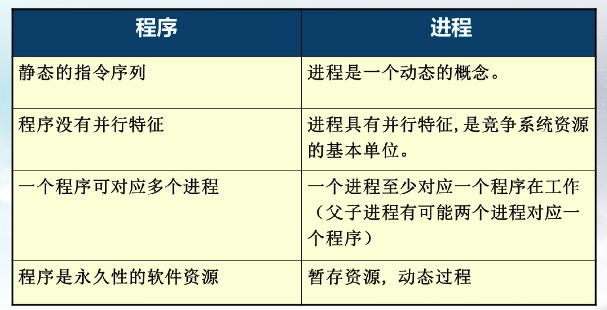
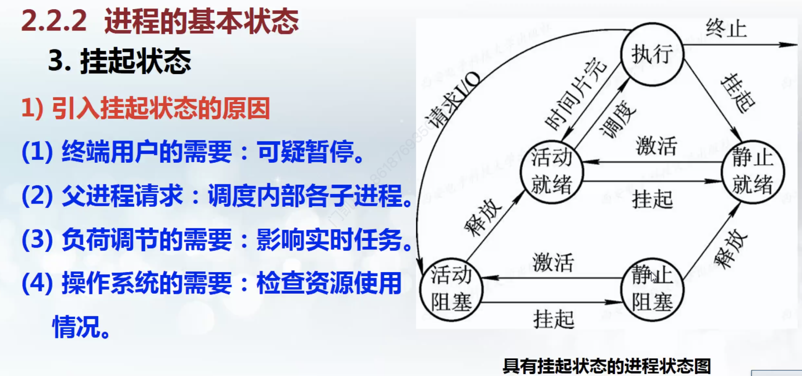
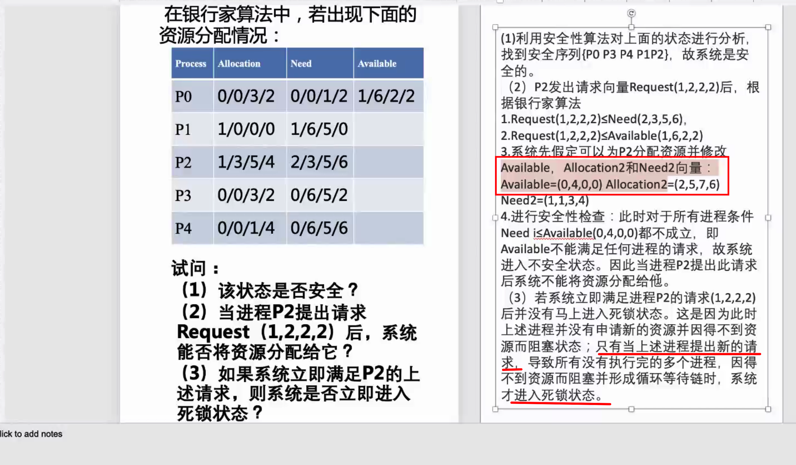
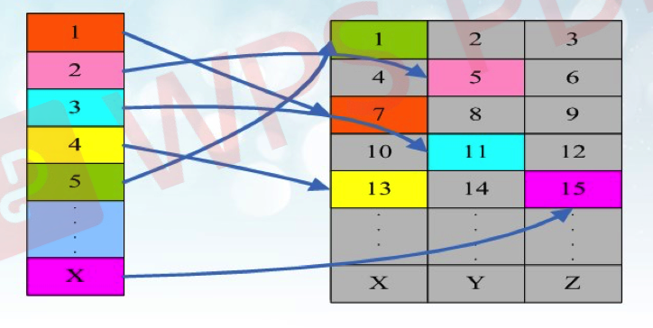
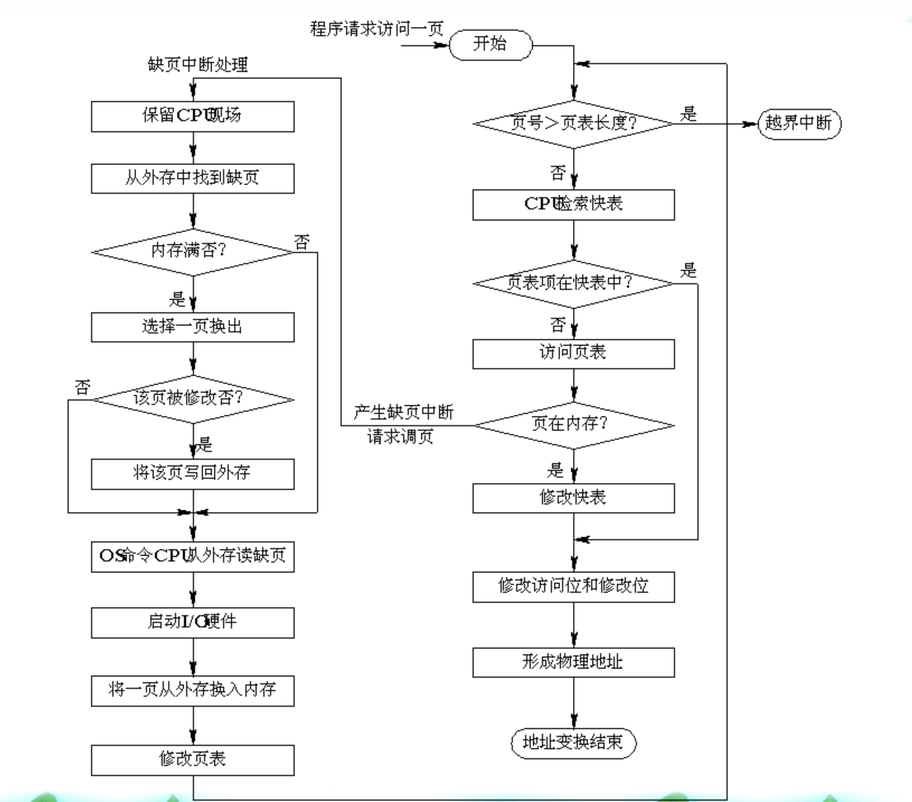
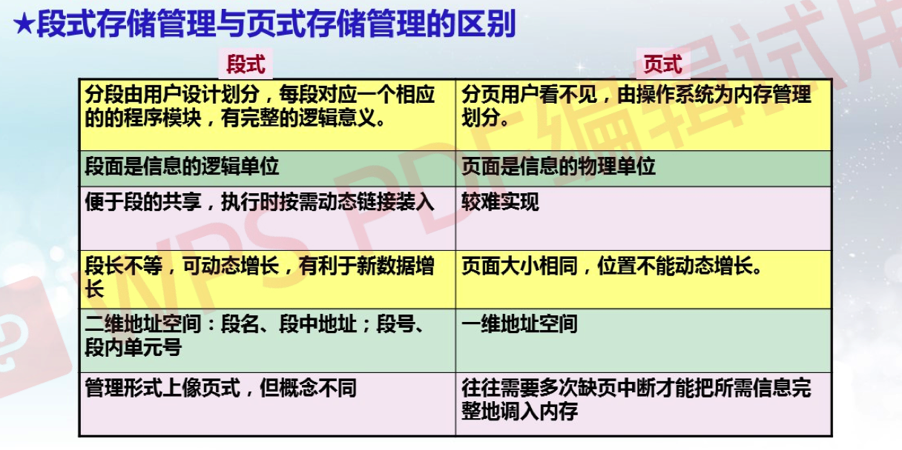
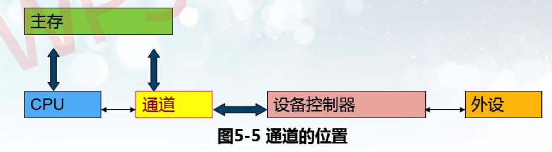
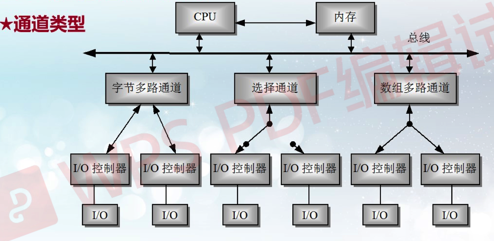
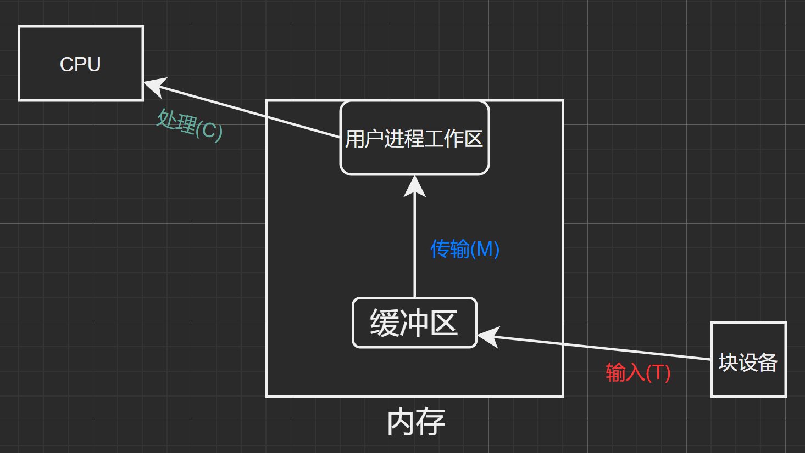

# 操作系统


## 第一章 操作系统引论


### 1.1 操作系统的目标和作用

通常在计算机硬件上配置的OS，主要有以下目标：

1. 有效性：资源利用率，系统吞吐量
2. 方便性：程序的使用方式
3. 可扩充性：新功能的添加
4. 开放性：兼容性

① OS作为用户与计算机硬件系统之间的接口。os 处于用户与计算机硬件系统之间。

注意：OS是一个系统软件，因而这种接口是 ==软件接口==。

操作系统控制方式：

1. 命令方式。
2. 系统调用方式。
3. 图形、窗口方式。

② OS作为计算机系统资源的管理者
​	归纳起来可将资源分为四类：处理器、存储器、I/0设备以及信息(数据和程序)。相应地，OS的主要功能也正是针对这四类资源进行有效的管理，即：
  1. **处理机管理**，用于分配和控制处理机；  （第三章）
  2. **存储器管理**，主要负责内存的分配与回收：（第四章）
  3. **I/0设备管理**，负责I/0设备的分配与操纵； （第五章）
  4. **文件管理**，负责文件的存取、共享和保护。 （第六章）

③ OS实现了对计算机资源的抽象
	如果我们在裸机上覆盖一层**I/0设备管理软件**，用户便可利用它所提供的1/0命令，来进行数据输入和打印输出。**通常把覆盖了软件的机器称为扩充机器或** ==虚机器==。


### 1.2 操作系统发展历程

无操作系统的计算机系统（人工、脱机输入输出） --  批处理系统（单道、多道批处理系统） --  分时系统  --  实时系统  --  通用操作系统

+ 多道程序设计的优点:
  1. 提高CPU的利用率。
  2. 可提高内存和I/O设备利用率。
  3. 增加系统吞吐量。
  
+ 多道批处理系统的优缺点:
  1. 资源利用率高：程序交替执行
  2. 系统吞吐量大：忙碌时间长
  3. 平均周转时间长：排队处理 （平均周转周期是指内存中一个作业从开始到结束，因为多道批处理时，一个作业结束未必能及时占用CPU，可能还在处理其他作业）
  4. 无交互能力：无法中断
  

实时系统(Real-Time System)是指系统能及时(或即时)响应外部事件的请求，**在规定的时间内**完成对该事件的处理，并控制所有实时任务协调一致地运行。


### 1.3 操作系统基本特性

#### 1.3.1并发性

注意：**并行性**是指两个或多个事件在**同一时刻**发生。 **并发性**是指两个或多个事件在**同一时间间隔内**发生。

单处理器多道批处理环境下：
+ 多道：内存中同时存放几个作业；
+ 宏观上并行运行：都处于运行状态，但都未运行完；
+ 微观上串行运行：各作业交替使用CPU。（看似都在运行，其实都在等待一个CPU进行处理）

多个处理机环境下：
+ 可以并发执行的程序便可被分配到多个处理机上，实现并行执行。

#### 1.3.2 共享

在操作系统环境下，所谓共享是指系统中的**资源**可供内存中**多个并发执行的进程(线程)共同使用**。由于资源属性的不同，进程对资源共享的方式也不同，目前主要有以下两种资源共享方式。
1. 互斥共享方式：学校的打印机等（别人在打印时，你只可以提交作业但是不能打印）
2. 同时访问方式（宏观意义上）：磁盘

并发和共享是操作系统的两个最基本的特征，它们又是互为存在的条件。

资源共享是以程序(进程)的并发执行为条件的，若系统不允许程序并发执行，自然不需要资源共享；

若系统不能对资源共享实施有效管理，协调好诸进程对共享资源的访问，也必然影响到程序并发执行的程度，甚至根本无法并发执行。

#### 1.3.3 虚拟

操作系统中的所谓“虚拟〞，是指通过某种技术**把一个物理实体变为若干个逻辑上的对应物**。物理实体(前者)是实的，即实际存在的；而后者是虚的，是用户感觉上的东西。用于实现虚拟的技术，称为虚拟技术。操作系统中利用两种方式实现虚拟技术：

1.  时分复用技术
2. 空分复用技术

#### 1.3.4 异步性

+ 由于资源等因素的限制，使进程的执行通常都不是〞一气呵成〞而是以“停停走走〞的方式运行。
+ 进程是以人们不可预知的速度向前推进，此即进程的异步性。
+ 异步运行方式是允许的，是操作系统的一个重要特征。


### 1.4 操作系统的主要功能

处理机管理功能

存储器管理功能

设备管理功能

文件管理功能


### 1.5 操作系统的结构设计

1. 无结构操作系统
    + 以追求功能实现和高效率，os内部没有任何结构
2. 模块化操作系统
    + 分解、模块化的原则
    + 每个模块具有某些方面的功能，如：进程管理模块、存储器管理模块、I/0设备管理模块和文件管理模块等
3. 分层操作系统
    + 分层式结构设计的基本原则是：每一层都仅使用其底层所提供的功能和服务，这样可使系统的调试和验证都变得容易，因为它与所有其高层的软件无关，而任意层以下的各层软件，又都经过仔细的调试。
    + 层次的设计：
        + 程序嵌套
        + 运行效率
        + 公用模块
        + 程序接口
4. 微内核os结构（现在使用的）
    1. 客户/服务器模式(Client-Server Model)的组成
        + 客户机：运行客户进程，发消息给服务器服务器；
        + 为客户提供服务，被动的接收请求网络系统；
        + 连接客户机和服务器，实现通信过程。
    2. 面向对象的程序设计技术
    3. 微内核技术


## 第二章 进程管理

### 2.1 进程的基本概念

#### 2.1.1 前驱图

前趋图(Precedence Graph)是一个有向无循环图，用于描述进程之间执行的前后关系。

#### 2.1.2 程序顺序/并发执行特征

程序顺序执行的特征：

+ 顺序性
+ 封闭性
+ 可再现性

程序并发性的特征：

+ 间断性：可能因等待某个任务结束而需要暂停
+ 失去封闭性：系统资源的状态受多个并发程序影响
+ 不可再现性：并发环境下，复现结果很难

#### 2.1.3 进程的特征

+ 结构特征(PCB)：描述进程的基本情况和活动过程
+ 动态性：程序的一次执行过程，**最基本特征** 
+ 并发性：多个进程同时运行 
+ 独立性：独立运行、分配资源和调度
+ 异步性：不可知的速度向前推进

#### 2.1.4 进程的定义：

+ 进程是程序的一次执行。
+ 进程是一个程序及其数据在处理机上顺序执行时所发生的
    活动。
+ 进程是程序在一个数据集合上运行的过程，它是系统进行资源分配和调度的一个独立单位。
+ 进程实体：由程序段、相关数据和PCB组成在引入了进程实体的概念后，我们可以把传统OS中的进程定义为：**“进程是进程实体的运行过程，是系统进行资源分配和调度的一个独立单位”** 

程序和进程的区别：



#### 2.1.5 进程控制块:

为了描述控制进程的运行，系统中存放进程的管理和控制信息的数据结构称为**进程控制块（PCB Process Control Block）**，它是进程实体的一部分，是操作系统中最重要的记录性数据结构。它是进程管理和控制的最重要的数据结构，每一个进程均有一个PCB，在创建进程时，建立PCB，伴随进程运行的全过程，直到进程撤消而撤消。

OS是根据PCB来对并发执行的进程进行控制和管理的。**进程控制块是系统感知进程的唯一实体，或者说PCB是进程存在的唯一标志。**

进程控制块的内容：

+ 描述信息：进程号...
+ 控制信息：进程当前状态...
+ 资源管理信息：占用内存大小...
+ CPU现场保护结构：通用寄存器...

进程控制块的两种组织方式：
+ 链接方式
+ 索引控制


### 2.2 进程控制

#### 2.2.1 有关进程控制的基本概念

进程控制：系统使用一些具有特定功能的 **程序段（原语）**来创建、撤销进程以及完成进程各状态间的转换，从而达到多进程高效率并发执行和协调实现资源共享的目的。

原语：在**系统态** 下执行的具有特定功能的**程序段** ，原语分为指令级原语和功能级原语。
+ 指令级原语：执行期间不允许中断，是不可分割的单位。
+ 功能级原语：执行期间不允许并发的程序段。

原语操作：即原子操作，一个操作中的所有动作要么全做，要么全不做。

原语的特点：
+ 具有独立的系统功能：
+ 在系统态运行；
+ 不允许中断或不允许并发。

#### 2.2.2. 进程的基本状态

+ 就绪状态
+ 执行状态
+ 阻塞状态


加入挂起状态后：



引起挂起的原因：

+ 终端用户的需要：可疑暂停。
+ 父进程请求：调度内部各子进程。
+ 负荷调节的需要：影响实时任务。
+ 操作系统的需要：检查资源使用情况。

#### 2.2.3 进程的创建

创建流程：

1. 申请空白PCB。	
2. 为新进程分配资源。
3. 初始化进程控制块。
4. 将新进程插入就绪队列。

引起创建进程的事件：

+ 用户登录
+ 作业调度
+ 操作系统提供服务
+ 进程本身应用请求

#### 2.2.4 进程的结束

1. 正常结束
2. 异常结束：包括越界错误、保护错（写只读文件）、算术运算错（除0）...
3. 外界干预：操作员或系统干预、父进程请求、父进程终止

#### 2.2.5 进程的阻塞与唤醒

阻塞：

1. 运行态中断CPU
2. CPU当前状态保存在PCB的现场保护中
3. 进程状态置为阻塞态
4. 插入到事件的阻塞队列

唤醒：

1. 从阻塞事件队列移出
2. PCB中状态置为就绪
3. PCB插入到就绪队列


### 2.3 进程的同步与互斥

#### 2.3.1 基本概念

互斥：并发进程之间为抢占独立性资源而产生的竞争制约关系

同步：并发进程之间为完成共同任务以协调执行次序而产生的协作制约关系

#### 2.3.2 信号量概念

互斥信号量：value只有0 or 1，实现进程互斥

计数信号量：value整型，实现进程同步

#### 2.3.3 PV原语

P原语用于**申请资源**，阻塞进程、上锁

```c
process P(semaphore s)
{
	s = s - 1; //信号量值减1
	i(s ＜ 0) 
    w(s)；//若信号量值小于0，调用进程被阻塞，并等待信号量s
}
```

V原语用于**释放资源**，解锁

```c
process V(semaphore s)
{
  s = s + 1; //信号量值加1
	i(s <= 0) 
    r(s)；//若信号量值小于等于0，释放一个等待信号量s的进程
}
```

仔细揣摩揣摩上面的代码部分。

1. PV操作与互斥问题

    + ```c
        semaphore mutex = 1;
        
        process
        {
          p(mutex)
        	operation...
        	v(mutex)
        }
        ```

2. PV操作与同步问题

    + ```c
        // 初始场所0人，最大容纳100人
        semaphore mutex_admit_in = 100;
        semaphore mutex_admit_out = 0;
        
        process in
        {
          p(mutex_admit_in)
        	operation_in...
        	v(mutex_admit_out)
        }
        
        process out
        {
          p(mutex_admit_out)
        	operation_out...
        	v(mutex_admit_in)
        }
        ```

### 2.4 经典进程的同步问题

#### 2.4.1 生产者-消费者问题

把并发进程的同步与互斥问题一般化，就可以得到一个抽象模型，即**生产者-消费者模型（producer-consumer problems）**

> **生产者消费者问题**（英语：Producer-consumer problem），也称**有限缓冲问题**（Bounded-buffer problem），是一个[多进程](https://zh.wikipedia.org/wiki/多进程)[同步](https://zh.wikipedia.org/wiki/同步)问题的经典案例。该问题描述了共享固定大小[缓冲区](https://zh.wikipedia.org/wiki/缓冲区)的两个进程——即所谓的“生产者”和“消费者”——在实际运行时会发生的问题。
>
> 生产者的主要作用是生成一定量的数据放到缓冲区中，然后重复此过程。
>
> 与此同时，消费者也在缓冲区消耗这些数据。
>
> 该问题的关键就是要保证生产者不会在缓冲区满时加入数据，消费者也不会在缓冲区中空时消耗数据。

```c
mutex_public = 1;                    // for both
critical_region_empty_size = n;      // for producer
critical_region_nonempty_size = 0;   // for consumer

producer() {
  p(critical_region_empty_size);     //这个在前，防止死锁
	p(mutex);
  
  
	producting..。
      
  v(mutex);                         //这个在前，防止死锁
  v(critical_region_nonempty_size);
  
}

consumer() {
  p(critical_region_nonempty_size);  //这个在前，防止死锁
	p(mutex);    
  
  consuming...
   
  v(mutex);
  v(critical_region_nonempty_size);
}
```


#### 2.4.2 哲学家就餐问题

>哲学家就餐问题可以这样表述，假设有五位哲学家围坐在一张圆形餐桌旁，做以下两件事情之一：吃饭，或者思考。吃东西的时候，他们就停止思考，思考的时候也停止吃东西。餐桌上有五碗意大利面，每位哲学家之间各有一只餐叉。因为用一只餐叉很难吃到意大利面，所以假设哲学家必须用两只餐叉吃东西。他们只能使用自己左右手边的那两只餐叉。哲学家就餐问题有时也用米饭和五根筷子而不是意大利面和餐叉来描述，因为吃米饭必须用两根筷子。
>
>这个问题不考虑意大利面有多少，也不考虑哲学家的胃有多大。假设两者都是无限大。
>
>问题在于如何设计一套规则，使得在哲学家们在完全不交谈，也就是无法知道其他人可能在什么时候要吃饭或者思考的情况下，可以在这两种状态下永远交替下去。

说个最简单的解法吧，锁死一个哲学家。（有个很好的解法是Chandy/Misra解法，自己可以看）

```
Philsospher i {
	while (1)
	{
		thinking...
		
		p(s)    // s信号量用于封锁第5个哲学家的行动
		p(fork[i]);
		p(fork[(i + 1) % 5]);
	
		eating...
	
		p(fork[(i + 1) % 5]);
		v(fork[i]);
		v(s);
	}
}
```


#### 2.4.3 读者写者问题

> 有一共享文件L，允许多个进程（读者reader）同时读L中的信息，但任何时刻最多只能有一个进程（写者writer）写或修改L中的信息。当有进程读时不允许任何进程写；当有进程写时不允许其它进程读或写。如何使读者和写者的行为同步呢？

这个地方讲的十分草率，看样子没有做重点。读者写者问题中，其实还牵扯到了读写是否公平竞争的问题（写者很容易饿死，而读者一直进行）

```c
// 这个程序就有可能导致读者一直读，然后写者饥饿，自己写的也不太确定
// 然后加入 help_write的信号量，就可以让读写尽可能公平。为什么会这样？模拟一个情况：“读者1 -> 写者1 -> 读者2” 在两种代码上就知道了。

int n = 0;
semaphore limit_write = 1;
semaphore mutex = 1;
semaphore help_write = 1;

Reader {
	while(1)
	{
		p(help_write);
	
	  p(mutex);
    if (n==0) p(limit_write);   // 第一个读者才可以加锁，不加判断条件就会困住友军
    n++;
    v(mutex);
    
    v(help_write);

    reading...

    p(mutex);
    n--;
    if (n == 0) v(limit_write)
    v(mutex)；
	}

}

Write {
	while (1)
	{
		p(help_write);
	  p(limit_write);

    writing...

    v(limit_write);
    v(help_write);
	}
}

```


### 2.5 进程通信的基本概念

#### 2.5.1 基本概念

#### 2.5.2 进程通信的类型

1. 共享存储器系统
2. 管道通信系统
3. 消息传递系统
    1. 消息缓冲机制 -- 直接通信
        + 两个通信原语
            1. 发送原语
            2. 接受原语
    2. 信箱通信 -- 间接通信
        + 原语
            1. 邮箱的创建和撤销
            2. 消息的发送和接受
        + 邮箱类型
            1. 私用邮箱
            2. 公用邮箱
            3. 共享邮箱
4. 客户机服务器系统
    1. 套接字
    2. 远程过程调用和远程方法调用
        + 远程过程调用PRC（Remote Procedure Call）,是一个通信协议。
        + 如果采用面向对象编程，那么远程过程调用也可称作远程方法调用。


### 2.6 线程

#### 2.6.1 线程的基本概念

线程的定义：线程是由**进程派生**出来的一组代码（指令组），**是一个进程内的基本调度单位**。

线程的特点：一个进程可以产生多个线程（**但是一个线程只能隶属于一个进程**），可与进程共享内存；多线程之间可以并发、异步执行。

采用线程的优点：一个程序有几个并发执行路径，提高执行速度；线程的开销比进程小。

线程的属性：**独立调度和分派的基本单位**；**共享进程资源；**可并发执行；轻型实体。

#### 2.6.2 线程与进程

##### 2.6.2.1 关系

进程下分

+ 进程控制块PCB
+ 用户地址空间
+ 线程控制块$TCB_i$，线程i
+ 程序，数据与文件

##### 2.6.2.2 区别

1. 进程是自愿分配的基本单位（所有与进程有关的资源都会被记录在PCB中）。
    + 而**线程与资源分配无关**，他从属于一个进程，与此进程中的其他线程共享进程的资源。
2. 进程是抢占处理机的调度单位，它拥有完整的虚拟地址空间。

    + **线程没有自己的地址空间**，同一个进程内的线程共享同一地址空间。

3. 进程切换时涉及到进程上下文的保存和恢复，工作量巨大。
    + 线程切换时，由于资源和地址均与从属的进程共享，所以没有地址空间的保存和恢复，减少开销。
4. 进程的调度由操作系统内核完成。
    + 线程的调度既可以**由系统内核完成**也可以由**用户程序进行**。

#### 2.6.3 线程的适用范围

**多处理机系统、网络系统、分布式系统**最适合线程。

典型应用：**服务器中的文件管理和铜须控制**。


## 第三章 处理机调度与死锁

### 3.1 处理机调度的层次

#### 3.1.1 处理机调度基本概念

处理机调度策略影响着计算机的性能。

不同操作系统和用户要求，处理机的管理策略有所不同

##### 3.1.1.1 衡量调度策略的指标

1. 周转时间：作业从投入计算机到结束——越小越好
2. 吞吐量：给定时间内计算机系统完成的工作量——越大越好
3. 响应时间：从用户向计算机发出指令到计算机返还结果给用户的时间——越小越好
4. 设备利用率：输入输出设备使用情况——越高越好

##### 3.1.1.2 程序的状态和调度方式

一个程序运行的相关概念，针对不同阶段：作业、进程、线程。不同运行阶段有不同的调度程序。

4种状态：

1. 提交状态：一个作业从输入设备进入外存的过程叫做提交状态，这时的作业不能被调度。
2. 后备状态：当一个作业的全部都己经进入了输入井，未运行之前叫做后备状态（收容状态）。
3. 运行状态：作业调度程序从后备作业中选择一个作业到内存运行，并为它创建进程和分配资源。这些被选中的作业处于运行状态，运行状态的作业井不一定占用处理机，哪个进程占用处理机由进程调度程序决定。这个状态中还包括：就绪状态、执行状态和等待状态。
4. 完成状态：当作业运行完毕后，它所占用的资源并未全部释放，此时系统中的终止作业程序会回收己分配给该作业的控制块和所有资源。

4种方式：

1. 作业调度：从作业输入井选择作业，为期创建进程、分配资源，结束后回收。
2. 交换调度：内外存交换
3. 进程调度
4. 线程调度

下面先讲作业调度，进程调度


#### 3.1.2 作业调度

##### 3.1.2.1 作业调度的功能

1. **记录已经进入系统的各个作业的情况。**作业调度要记录作业进入系统时的一些信息，并跟踪作业在运行中的状态变化情况。这些信息记录在**作业控制块JCB**，它建立和撤消都是由作业调度程序完成的。
2. **选择作业。**从输入井中选择符合“条件”的作业送到内存的作业缓冲区中，使这些作业的状态由“后备〞状态变为“运行〞状态。
3. **为被选中的作业做执行前的准备。**建立进程，分配作业运行需要的资源，如内存和外部设备。作业调度程序只能保证该作业具有使用处理机的资格，而不能分配处理机资源。
4. **作业运行结束后的善后处理和资源回收。**统计作业的运行时间，作业执行状态等信息的输出。撤消该作业的所有进程和该作业的JCB。

##### 3.1.2.2 作业调度算法——目标和性能衡量

1. 周转时间 = 作业完成时间 - 作业提交时间
    + 包含了等待和执行
2. 平均周转时间 = 周转时间 / 作业数量
3. 带权周转时间 = 作业周转时间 / 作业执行时间
    + 即 = 1 + 等待 / 执行
4. 平均带权周转时间 = 带权周转时间 / 作业数量


#### 3.1.3 进程调度

##### 3.1.3.1 进程调度的功能

1. 记录和保持系统中所有进程的有关情况和状态特征由进程调度模块管理PCB表的内容，记录进程状态。
2. 选择占用处理机的进程：在处理机空闲时，根据一定的原则选择一个进程来运行。
3. 进行进程上下文切换：上下文切换时首先检查是否可以做切换，然后保存被切换进程的上下文，由调度程序选择一个进程，装载该进程的上下文，控制转向该进程，从刚恢复的程序计数器所指示的指令地址开始执行。

##### 3.1.3.2 进程调度的时机

引起进程调度的原因有以下7类：

1. 一个进程完成其任务时。
2. 执行中的进程自己调用阻塞原语，进入等待状态。
3. 执行了一次P操作，资源不满足；执行V操作激活了等待队列的进程。
4. 执行的进程提出)/O请求后被阻塞。
5. 在分时系统中时间片己经用完。
6. 执行完系统调用，系统返回用户态之前，由于系统进程结束，需求调度新的进程。
7. 在采用**可剥夺调度方式**的系统中，当具有更高优先级的进程要求处理机时。


### 3.2 调度算法

#### 3.2.1 作业调度算法

1. 先来先服务
2. 短作业优先
3. 高响应比
4. 优先级算法
    1. 静态法
        1. 作业调度确定优先级原则
            1. 由用户根据作业的紧急程度输入一个适当的优先级：
            2. 由系统或操作员根据作业的类型确定；
            3. 系统根据作业要求的资源确定优先级。
        2. 进程调度确定优先级原则
            1. 按照进程的类型确定；
            2. 将作业的优先级作为它所含进程的优先级。
    2. 动态法
        1. 根据进程占有CPU时间长短确定
            + 占用的时间越长，下次调度的优先级越低；
            + 占用的时间越短，下次调度的优先级越高。
        2. 根据就绪进程等待CPU的时间长短确定
            + 等待时间越长，优先级越高：
            + 等待时间越短，优先级越低。
5. 轮转法
6. 多级反馈轮转法
    + 当一个新进程进入内存后，首先将它放入第一队列的末尾，按FCFS原则排队等待调度；
    + 当轮到该进程执行时，如宅能在该时间片内完成，便可准备撤离系统；
    + 如果它在一个时间片结束时尚未完成，调度程序便将该进程转入第二队列的末尾，再同样地按FCFS原则等待调度执行；
    + 如果它在第二队列中运行一个时间片后仍未完成，再依次将它放入第三队列，⋯，如此下去，当一个长作业(进程)从第一队列依次降到第n队列后，在第n队列中便采取按时间片轮转的方式运行。
        + 多级反馈轮转法与优先级法在原理上的区别是，一个进程在它执行结束之前，可能需要反复多次通过反馈循环执行，而不是优先级法中的一次执行。
        + 特点：复杂，实现困难；是FCFS，RR，HPF的综合应用。

### 3.3 实时调度

#### 3.3.1 实时调度算法分类

1. 非抢占式
    1. 非抢占式轮转调度算法
    2. 非抢占式优先调度算法
2. 抢占式
    1. 基于时钟中断的优先权调度算法
    2. 立即抢占的优先权调度算法

#### 3.3.2 常见实时调度算法

1. 最早截止时间优先
    + 顾名思义，ddl越早的先执行
2. 最低松弛度算法
    + 主要用于可抢占调度方式
    + 松弛度：当前距离ddl的时间 - 还需运行的时间


### 3.4 死锁的相关概念

#### 3.4.1 死锁产生原因

1. 资源竞争
    1. 竞争非剥夺资源
    2. 竞争临时性资源
2. 进程间推进顺序非法

#### 3.4.2 产生死锁的必要条件

产生死锁的四个必要条件

1. 互斥条件
    + 一个资源只能一个进程独自占用。
2. 不剥夺条件
    + 进程未使用完资源之前，不能被其他进程剥夺，只能自己释放。
3. 部分分配
    + 允许进程在不释放其已分得资源情况下，请求和等待新资源。也叫"请求和保持条件"。
4. 环路条件
    + 存在一个等待进程的合集。

可以通过破坏任意一个来预防死锁发生。

#### 3.4.3 处理死锁的方法

1. 预防
    + 破坏4个必要条件至少一个
2. 避免
    + 可能4个条件成立，但是在资源动态分配过程中通过某种手段避开死锁。
3. 检测与恢复解除
    + 产生死锁，然后使用检测算法及时发现并解除。

### 3.5 预防死锁的方法


### 3.6 死锁的避免

银行家算法※



### 3.7 死锁的检测与解除


## 第四章 存储器管理

### 4.1 存储器概述

存储器有内存和外存。

内存也称为主存，是cpu直接存取指令和数据的存储器。

内存类似一个大的字或字节构成的一维数组，每个单元都有自己的地址。各物理存储单元的地址是：从统一的基地址顺序编址，内存中这种地址称为**绝对地址**或者**物理地址**。


### 4.2 程序的装入和链接

装入：

1. 绝对装入： 程序使用绝对地址
2. 可重定位装入方式：装入模块装入内存后，将装入模块的相对地址立即转为绝对地址。
3. 动态运行时装入方式：等待程序真正需要执行的时候才进行相对地址转化为绝对地址。``

链接：

1. 静态链接
    + 静态链接是在生成可执行程序的时候就把库中的内容加入到程序中。
2. 装入时链接
    + 装入时动态链接是在将功能模块读入内存时把动态库中调用到的相关模块的内容载入内存。
3. 运行时链接
    + 运行时动态链接是在执行程序调用到模块内容时再将动态库中的相应模块载入到内存。

这里有两个时间问题。一是装入时间，二是执行时间。

1. 静态链接由于是在一开始就把所有模块都加载进入内存，所以如果模块很多的话效率就会被大大拉低。
2. 装入时动态链接是分别载入，当把一个模块载入内存时检查有调用关系的模块载入，比静态链接节省了许多开销。
3. 运行时动态链接则是把当前模块调用的模块推迟到调用的时候再载入。


下面讲内存的分配方式

**内存分配方式※**：

1. 连续分配
    1. 单一连续分配
    2. 固定分区分配
    3. 动态分区分配
    4. 动态重定位分区分配
2. 离散分配
    1. 分页存储管理方式
        1. 静态页式管理
        2. 动态页式管理
    2. 分段存储管理方式
    3. 段页式存储管理方式

### 4.3 连续分配方式

#### 4.3.1 单一连续

仅适用于单用户单任务的操作系统。

内存直接划分成系统区和用户区两大部分供os和用户单独使用

#### 4.3.2 固定分区法

将内存预先划分为若干大小不等的固定区域

#### 4.3.3 动态分区法

在作业执行前不建立分区，分区的建立是在作业的处理过程中进行的，其大小根据进程对内存要求改变。

动态分区时的分配与回收主要解决三个问题：

1. 对于请求表中的要求内存长度，从可用表或自由链中寻找出合适的空闲区分配程序。
2. 分配空闲区之后，更新可用表或自由链。
3. 进程或作业释放内存资源时，和相邻的空闲区进行链接合并，更新可用表或自由链。

##### 4.3.3.1 基于顺序搜索的动态分区的分配方法

四种方法

1. 最先适应法：从低向高找，找到即可   （回收速度）
2. 循环首次适应法：每次从上次的位置开始找
3. 最佳适应法：按空白区大小，从小到大
4. 最坏适应法：按空白区大小，从大到小   （查找速度快）

##### 4.3.3.2 基于索引搜索的动态分区的分配方法

1. 快速适应算法
    + 单独设立一个空闲分区链表，对相同空闲空间大小的进行统一链接
    + 内存中再设立一个管理索引表，一个索引表项对应了一种空闲分区类型，并且记录了给空闲分区链表表头。
2. 伙伴系统
    + 该算法规定，无论已分配或者空闲：其大小均为$2^x$
    + 当需求为n的存储空间时，计算一个i值，使得$2^{i-1}$＜ n ≤ $2^i$。
    + 在空闲分区为$2^i$的空闲分区链表中查找，找到则分配
    + 否则，在$2^{i+1}$的空闲分区链表中查找。如找到，则将其分为两半，称为伙伴，一个用于分配，一个用于存储。


动态分区优缺点：无内部碎片，但是有外部碎片。

在内存管理中：

+ 内部碎片 是已经被分配出去的的内存空间大于请求所需的内存空间。

+ 外部碎片 是指还没有分配出去，但是由于大小太小而无法分配给申请空间的新进程的内存空间空闲块。


### 4.4 基本分页管理方式

> 虚拟内存
>
> 虚拟内存是一种存储模式，通过这种模式能让我们有种感觉，即：我们的内存本身能够处理远比内存大的多的数据或者文件。
>
> 虚拟内存里面，我们可以开辟一个固定大小的区域用来处理相关的数据，在加载数据时，如果这个区域没有满，就直接读满，如果满了之后，系统要读取新的page时，会发现这个page不在虚拟内存里面，就会发起一个缺页信号，为了读取新的数据进入内存，我们可以释放掉前面已经处理过的数据，然后加载新的page替代被淘汰数据的page占的位置，被淘汰page的处理，我们可以直接丢弃，也可以将其再次保存在磁盘上存储，防止将来还需要读取。 

#### 4.4.1 静态页式管理

页式管理实现：

+ 虚拟空间等长划分为**页**，记录页号
+ 物理内存空间划分为**存储块**，记录块号（也称页框号）
+ 页装入不连续的块中



地址变换：

+ 引入页表，记录页号对应的块号，实现虚拟地址到物理地址变换
+ 逻辑地址是A，页面大小是L：
    + 页号：p = int [A / L]     （锁定到列表中的某一整部分）
    + 页内地址：d = [A] mod L     （找到比该整部分多出的部分）
    + 物理地址 = 块号 * 块长 + 页内地址

页面大小影响：小 -> 页表长，页内碎片小；大 -> 页表短，页内碎片大。

页表：页号P + 页内地址D

基本思想：在进程运行前把该进程的程序段和数据段全部装入到内存的各存储块中，并通过页表和硬件地址变换机构实现虚拟地址到物理地址的地址映射。

页表太大？使用多级页表。但是总体思想不变，通过虚拟地址（逻辑地址）找到物理地址就找到了块。

存储保护：页式管理可以为内存提供下面两种保护

+ 地址越界保护 
    + 地址越界保护可由地址变换机构中的控制寄存器的值——页表长度和所要访问的虚地址相比较来完成。
+ 控制对内存的存取操作方式
    + 
        存取控制保护的实现则是在页表中增加相应的保护位即可。
        

### 4.5 动态页式管理

#### 4.5.1 概述

**程序在运行时不需要一开始全部装入内存，**更不应该把最近较长一段时间不用的信息装入内存。而只是装入被认为经常执行的部分。其他部分则在执行过程中动态装入。

特点：动态页式存储管理将不常用的页面调出内存，使内存的利用率高；虚拟的容量大，用户不必担心内存不够：不要求作业连续存放，有效地解决了”碎片〞问题。

类型：

1. 请求页式管理
    + 如果所需页面不存在，产生缺页中断，需要从外存调入。
2. 预调入也是管理
    + 对外存中的页进行调入顺序预估，按照预估访问顺序调入。

**请求页式管理的地址变换过程与静态页式管理时的相同，由页面号与页内相对地址得到实际物理地址。但是，在执行过程中，不可避免地会出现某些虚页不在内存中的问题。**

#### 4.5.2 请求分页存储管理方式



#### 4.5.3 内存物理块分配策略

在请求分页系统中，可采取两种内存分配策略，即**固定**和**可变分配策略**。在进行置换时，也可采取两种策略，即**全局置换**和**局部置换**。于是可组合出以下三种适用的策略。

1. 固定分配局部置换
2. 可变分配全局置换
3. 可变分配局部置换

三种分配算法：

1. 平均分配：将内存平均分配给进程
2. 按比例分配：根据各个进程所需页面在总进程中的占比分配内存
3. 考虑优先权的分配

#### 4.5.4 请求也是管理的置换算法

1. 最优淘汰算法
    + 理想的淘汰，使得缺页率最小
2. FIFO先进先出算法
    + 未必很好，Belady现象：分配给进程的页面增加，缺页率反而升高
3. LRU Least Recently Used 最近最少使用算法
4. LFU Least Frequent Used 最少使用算法
    + 淘汰到目前为止访问最少的
5. Clock算法
    + 简单型：维护一个指针，对于每一个页设置一个访问位。指针移动过程中：访问位0说明最近未访问，替换；访问位若是1，则置为0
    + 改进型：
    + 由访问位A和修改位M，可以组合成下面四种类型的页面
        + 1类(A=0, M=0)：表示该页最近既未被访问，又未被修改，是最佳淘汰页。
        + 2类(A=0, M=1)：表示该页最近未被访问，但已被修改，并不是很好的淘汰页。
        + 3类(A=1, M=0)：最近已被访问，但未被修改，该页有可能再被访问。
        + 4类(A=1, M=1)：最近已被访问且被修改，该页可能再被访问。

#### 4.5.5 页式存储管理的优缺点：

1. 优点：
    1. 虛存量大，适合多道程序运行，用户不必担心内存不够的调度操作。
    2. 内存利用率高，不常用的页面尽量不留在内存。
    3. 不要求作业连续存放，有效地解决了“碎片”  问题。
2. 缺点：
    1. 要处理缺页中断，系统开销较大；
    2. 有可能产生“抖动”
        + 系统抖动，解释为在请求分页存储管理中，从主存（DRAM）中刚刚换出（Swap Out）某一页面后（换出到Disk），根据请求马上又换入（Swap In）该页，这种反复换出换入的现象。
    3. 地址变换机构复杂，采用硬件实现，增加了机器成本
    4. 不便于信息共享

### 4.6 段式管理

#### 4.6.1 段式存储管理的基本思想

+ 把程序**按内容或过程关系分成段**，每段有自己的名字，一个进程所包含的段对应于一个**二维线性虛拟空间**。
+ 段式管理程序**以段为单位分配内存**，然后通过地址映射机制把段式虚拟地址转换成实际内存地址
+ 段式管理也只是将**经常访问的段留在内存**，而把那些在将来一段时间内不被访问的段放入外存，等待需要时自动调入。

段号S + 段内地址W。

段内地址是连续的，段与段之间可以不用连续存放。段的长度是不固定的。

#### 4.6.2 段管理的实现

根据虛地址中的段号查段表

+ 此段在内存：若存取方式正确，则将此段在内存的首地址与段内相对地址相加得物理内存地址
+ 此段不在内存：调该段进内存，如果空闲区不够，则淘汰老段

段式管理的优缺点：

1. 优点
    + 便于共享
    + 便于动态链接
    + 便于动态申请内存
2. 缺点
    + 产生碎片




### 4.7 段页式管理

+ 段页的划分

    + 把段划分为不同的页，每个段一个页表
    + 最后不足一页的部分仍占一页
+ 段页的存储
    + 每段在内存中可以分开存放
    + 段的大小不再受内存可用区的限制
    
+ 虛地址的构成
    + 由段号s、页号p和页内地址d组成
    + 二维地址空间
        + 程序员可见的仍是段号s和段内相对地址w
        + 由地址变换机构把w解析成页号p和页内地址d


段页式访问三次内存：

1. 段表
2. 页表
3. 物理内存中的数据

特点：

1. 每一段分为若干页，再按页式管理，页间不要求连续；
2. 用分段方法分配管理进程，用分页方法分配管理内存：
3. 兼有段式和页式管理的优点,系统复杂性和开销增大.


### 4.8 虚拟存储器

所谓虚拟存储器，是指具有请求调入功能和置换功能能从逻辑上对内存容量加以扩充的一种存储器系统。

虚拟存储器实现方法：

1. 硬件支持。
    1. 请求分页的页表机制（分段）
    2. 缺页（段）中断机构：
    3. 地址变换机构。
2. 实现请求分页（段）的软件。

虚拟存储器特征：

1. 多次性：允许一个作业多次调入内存
2. 对换性：允许作业运行过程中换出
3. 虚拟性：逻辑上扩容


## 第五章 设备管理

### 5.1 I/O系统

任务：完成用户提出的I/O请求，提高I/O速率和设备利用率。

功能：设备分配；设备控制；缓冲的管理功能；虚拟设备。

分类：

1. 按使用特性
    1. 存储设备
    2. I/O设备
2. 按数据传输率
    1. 高速
    2. 中速
    3. 低速
3. 信息交换单位
    1. 字符设备
    2. 块设备
4. 设备共享属性
    1. 独占设备
    2. 共享设备

#### 5.1.1 设备控制器

通常，设备不是直接与CPU进行通信的，而是与设备控制器通信


### 5.2 I/O控制方式

#### 5.2.1 程序I/O方式

+ **设备控制器**设置**状态寄存器**以表示外部设备的工作状态。
+ CPU通过不断读取**状态寄存器**以查询外部设备的状态。
+ 在外部设备准备就绪的时候，CPU通过控制器中的数据寄存器与外设完成数据交换。

特点：

1. I/O操作由CPU直接完成，外设与CPU串行工作
2. 外设速度慢，CPU速度快。外设准备过程中，CPU不断查询，效率浪费

#### 5.2.2 中断驱动I/O方式

在I/O设备输入数据的过程中，无须CPU干预，因而CPU与I/O设备可并行工作。仅当输完一个数据时，设备控制器以中断的方式通知CPU取数据。

特点：

1. I/O操作仍有CPU完成
2. 外设准备阶段，外设与CPU并行
3. 与程序I/O相比大大提高了CPU的利用率，但是从外部设备读取一块数据到存储器时，每读一个字的数据产生一次中断。

#### 5.2.3 直接存储器访问（DMA）I/O方式

+ 数据传输基本单位是数据块
+ 从设备直接送入内存或相反。
+ 整块数据的传输是在控制器（DMA控制器在I/O设备与主存之间）的控制下完成的。仅在开始和结束时才需CPU干预

特点：

1. CPU与I/O设备在更大的程度上并行工作，效率更高。
2. DMA方式适合高速批量的数据传输，如视频显示刷新、磁盘存储系统的读写，存储器到存储器的传输等。
3. DMA控制器取代CPU接管地址总线的控制权。使CPU访问总线时速度会变慢。

#### 5.2.4 I/O通道控制方式

DMA容易造成总线冲突，解决方法就是搭建通道。



+ 通道有自己的指令系统,专门负责输入/输出工作的处理机。
+ 通过通道程序控制I/O设备完成复杂的I/O操作
+ 没有内存，和CPU共享内存。
+ I/O分类：字节多路通道，数组选择通道，数组多路通道



|   通道类型   |   字节多路   |   数组多路   |      选择通道      |
| :----------: | :----------: | :----------: | :----------------: |
|   数据宽度   |    单字节    | 定长块（字） |   不定长块（字）   |
|   适用范围   | 大量低速设备 | 大量高速设备 | 优先级高的高速设备 |
|   工作方式   |   字节交叉   |   成组交叉   |      独占通道      |
|    共享性    |   分时共享   |   分时共享   |        独占        |
| 选择设备次数 |     多次     |     多次     |        一次        |

工作过程：

1. CPU向I/O通道发出一条I/O指令，给出所要执行的通道程序的首地址和要访问的I/O设备
2.  通道接到CPU发来的指令后，通过执行通道程序便可完成CPU指定的I/O任务


### 5.3 缓冲管理

缓冲区引入：

+ 缓和CPU与I/O设备间速度不匹配的矛盾。
+ 减少对CPU的中断频率，放宽对CPU中断响应时间的限制。
+ 提高CPU和I/O设备之间的并行性。

#### 5.3.1 单缓冲




#### 5.3.2 双缓冲


### 5.4 I/O软件


### 5.5 设备分配


### 5.6 磁盘存储器的管理


## 第六章 文件管理

### 6.1 基本概念


### 6.2 文件和文件系统


### 6.3 文件的逻辑结构


### 6.4 目录管理


### 6.5 文件共享和文件保护


### 6.6 外存分配方式


### 6.7 文件存储空间的管理


### 6.8 数据一致性控制


