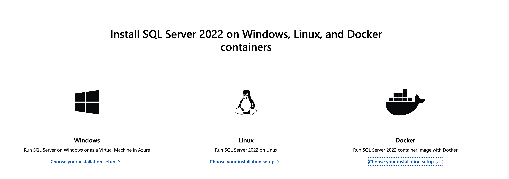

# 数据库


## Mac下使用SQL Server

SqlServer作为Microsoft家的数据库产品，只支持Windows系统，在17版本后支持了Linux。Mac用户当然是无法使用。下面提供一种解决方法。

（为啥非要用这个，用点跨平台的数据库不行吗？因为要完成上古时代的宝贝实验。）

### 使用docker挂载SqlServer



[如何在docker容器中使用SQL Server](https://learn.microsoft.com/zh-cn/sql/linux/quickstart-install-connect-docker?view=sql-server-ver16&pivots=cs1-bash)

### SQLServer的数据库管理软件

这个有很多。微软家有个很配套的[SSMS](https://learn.microsoft.com/en-us/sql/ssms/download-sql-server-management-studio-ssms?view=sql-server-ver16)。但是不好意思，还是Windows的。不过它有个相似的轻量版：Azure Data Studio。如果你使用了SSMS，那么他是内嵌的。


这里我用的是[Azure Data Studio](https://learn.microsoft.com/zh-tw/sql/azure-data-studio/download-azure-data-studio?view=sql-server-ver16&tabs=redhat-install%2Credhat-uninstall)

[使用方法，Azure Data Studio 怎么连接 SQL Server](https://learn.microsoft.com/zh-tw/sql/azure-data-studio/quickstart-sql-server?view=sql-server-ver16)

### 操作Azure Data Studio

如果你的docker也完成了，SQLServer的镜像也已经使用docker挂上了，Azure Data Studio也安装完成了。

那么如下是一些操作的实例。

#### 建立连接

打开Azure，新建连接，连接到你的SQLServer上。


有两点需要注意：

+ 你的docker需要已经运行了该容器镜像

+ 如果你按照docs里面所说

    + ```bash
        sudo docker run -e "ACCEPT_EULA=Y" -e "MSSQL_SA_PASSWORD=<YourStrong@Passw0rd>" \
           -p 1433:1433 --name sql1 --hostname sql1 \
           -d \
           mcr.microsoft.com/mssql/server:2022-latest
        ```

    + 那么你的用户就是`SA`，密码是`<YourStrong@Passw0rd>`，注意尖括号

##### 创建数据库

```sql
USE master;
GO

IF NOT EXISTS(
    SELECT name
    FROM sys.databases
    WHERE name = N'Academic'
)
    CREATE DATABASE [Academic]
GO

-- 用于判断当前SQL Server实例的版本是否大于12，如果是，则开启TutorialDB数据库的查询存储功能。
IF SERVERPROPERTY('ProductVersion') > '12'
    ALTER DATABASE [Academic] SET QUERY_STORE = ON;
GO
```


#### 创建表

上面执行成功后，在Azure上`refresh`一下，就能看见你新建的数据库了。那么现在建几张表

> 注意，你可以将代码片段直接附在运行过的代码后。但是下次运行时，请将想要运行的代码选中，就可以只运行选中的代码片段 。

```sql
-- create 'Student' table

IF OBJECT_ID('dbo.Student', 'U') IS NOT NULL
    DROP TABLE dbo.Student;
GO

CREATE TABLE dbo.Student (
    Sno NVARCHAR(50) NOT NULL PRIMARY KEY,
    Sname NVARCHAR(50) NOT NULL,
    Ssex NVARCHAR(50) NOT NULL,
    Sdept NVARCHAR(50),
    Sage int
)
```


#### 插入几行数据

```sql
-- Insert rows into table 'Student'
INSERT INTO dbo.Student (
   [Sno],
   [Sname],
   [Ssex],
   [Sdept],
   [Sage]
)
VALUES
   (N'96001', N'马小燕', N'女', N'CS', 21),
   (N'96002', N'黎明', N'男', N'CS', 18),
   (N'96003', N'刘东明', N'男', N'MA', 18),
   (N'96004', N'赵志勇', N'男', N'IS', 20),
   (N'97001', N'马蓉', N'女', N'MA', 19),
   (N'97002', N'李成功', N'男', N'CS', 20),
   (N'97003', N'黎明', N'女', N'IS', 19),
   (N'97004', N'李丽', N'女', N'CS', 19),
   (N'96005', N'司马志明', N'男', N'CS', 18)
GO
```


#### 其他的例子

```sql
-- create 'Score' table
IF OBJECT_ID('dbo.Score', 'U') IS NOT NULL
    DROP TABLE dbo.Score;
GO

CREATE TABLE dbo.Score (
    Sno NVARCHAR(50) NOT NULL,
    Cno NVARCHAR(50) NOT NULL,
    Grade INT,
    PRIMARY KEY (SNO, CNO),
    FOREIGN KEY (Sno) REFERENCES Student(Sno),
    FOREIGN KEY (Cno) REFERENCES Course(Cno)
)

-- Insert rows into table 'Score'
INSERT INTO dbo.Score (
   [Sno],
   [Cno],
   [Grade]
)
VALUES
   (N'96001', N'001', 77),
   (N'96001', N'003', 89),
   (N'96001', N'004', 86),
   (N'96001', N'005', 82),
   
   (N'96002', N'001', 88),
   (N'96002', N'003', 92),
   (N'96002', N'006', 90),

   (N'96005', N'004', 92),
   (N'96005', N'005', 90),
   (N'96005', N'006', 89),
   (N'96005', N'007', 76), 

   (N'96003', N'001', 69), 

   (N'97001', N'001', 96),
   (N'97001', N'008', 95), 

   (N'96004', N'001', 87), 

   (N'96003', N'003', 91), 

   (N'97002', N'003', 91),
   (N'97002', N'004', NULL),
   (N'97002', N'006', 92),
   
   (N'97004', N'005', 90),
   (N'97004', N'006', 85)
GO

```


## Mac下使用 .NET 

当前的目的是使用`.net`的web框架链接服务器。那么第一步肯定是先研究一下这个东西是什么。

[.NET](https://dotnet.microsoft.com/en-us/)原来就听闻过一些，是个`C Sharp`适配性很棒的东西（其实理论上C#是为了宣传.NET而创立的）。看一下official docs，发现这个框架对不同平台很友好。

> 跨语言：即只要是面向.NET平台的编程语言((C#、Visual Basic、C++/CLI、Eiffel、F#、IronPython、IronRuby、PowerBuilder、Visual COBOL 以及 Windows PowerShell))，用其中一种语言编写的类型可以无缝地用在另一种语言编写的应用程序中的互操作性。
>
> 跨平台：一次编译，不需要任何代码修改，应用程序就可以运行在任意有.NET框架实现的平台上，即代码不依赖于操作系统，也不依赖硬件环境。


### .NET 的简单理解

微软创造的一个开发者平台。它有着面向该平台的编程语言（C#, Visual Basic...）；用于该平台下开发人员的技术框架体系（.NET Frame, .Net Core, Mono...）以及用于支持开发的软件工具（即SDK：VS, VS Code）。

#### .NET Framework 是什么?

.NET Framework就是.NET 技术框架组成在Windows系统下的具体的实现，和Windows系统高度耦合，平时说的.NET系统，就是指.NET Framework。

#### .NET Core 是什么?

操作系统不止Windows，还有Mac和类Linux等系统， .NET的实现 如果按操作系统来横向分割的话，可以分为 Windows系统下的 .NET Framework 和 兼容多个操作系统的 .NET Core。它是其它操作系统的.NET Framework翻版实现。

#### .NET Standard 是什么？

应对各式各样的平台，各式各样的奇数层提出的一套API规范


### 下载安装.NET Software Development Kit

[Download .NET 7 SDK (64-bit)](https://download.visualstudio.microsoft.com/download/pr/8cf422e2-ae69-4285-944f-b685058be7b1/811763e4723370528b3097c5c1c8ad92/dotnet-sdk-7.0.302-osx-x64.pkg)