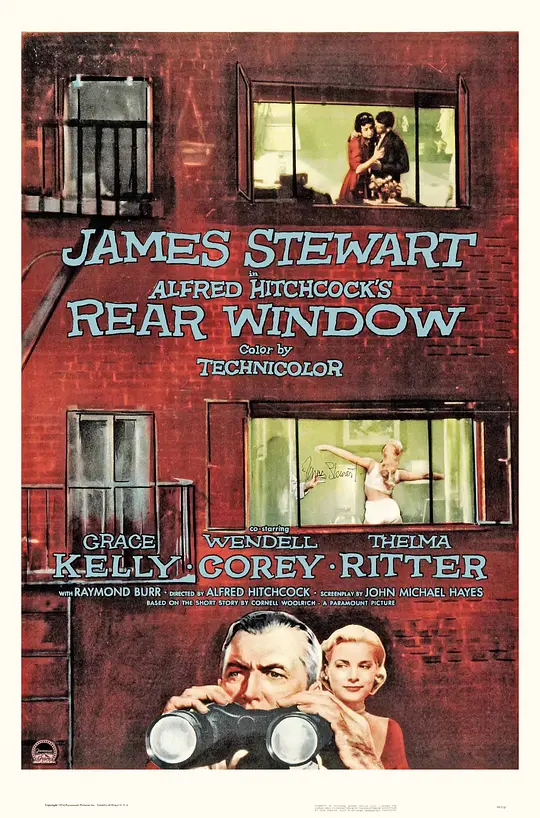

# 阿尔弗雷德·希区柯克

## _Alfred Hitchcock's Rear Window_

后窗

> -- We've progressed emotionally.
>
> -- Baloney. Once it was see somebody, get excited, get married. Now it's read a lot of books, fence with a lot of four-syllable words, psychoanalyze each other…until you can not tell the difference between a petting party and a civil service exam.

## _Dial M for Murder_

电话谋杀案

> --Do you really believe in the perfect murder?
>
> --Yes, absolutely. On paper, that is. And I think I could plan better more than most people… But I doubt I could carry it out.
>
> --Oh? Why not?
>
> --Well because in story, thing turn out the way the author wants. And in really life, they don't, always. No, I'm afraid my murders would be like my bridge: I'd make some stupid mistake and never realize till I find everybody look at me. 