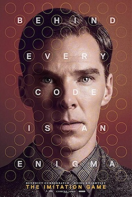
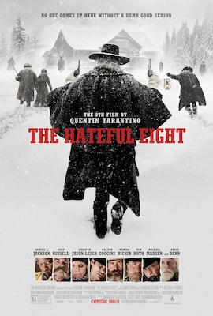

# 推荐

## _The Imitation Game_

模仿游戏

> -- Message that anyone can see, but no one knows what they mean unless you have the key.
>
> -- How's that different from talking? When people talk to each other, they never say what they mean. They say something else, and you are expected to just know what they mean. Only I never do.
>
> 
>
> -- Why are you helping me?
>
> -- Sometimes it's the very people who no one imagines anything of who do the things that no one can imagine.

## _ฉลาดเกมส์โกง (Bad Genius)_

天才枪手

> 中文译作：天才枪手，还有一种不错的翻译：模犯生。我还是冲着悬疑标签来的。
>
> Wikipedia：捉刀**，指代别人行事、作文，从事此行为者俗曰“捉刀人”、“枪手”、“替枪”，是一种以代别人行事、作文，或代笔文学作品，如书、记事、剧本等为生的著作家。“枪手”、“捉刀人”也可指受他人委托，冒充他人出席考试的人。 
>
> 这部电影就没做摘抄了，随着电影后半段好戏开场，紧张的气氛渲染让人久久没有从考场上“脱离”出来。
>
> 后半段的升华高度确实夸张，去看了看影评，有两句话挺契合的：青春里失去的宝贵东西、极致的讽刺但保留了温情和爱。

## _The Hateful Eight_

八恶人

> -- The good part about frontier justice is it's very thirst quenching. The bad part is it's apt to be wrong as right.
>
> -- The bastard's work is never done.

## _ANDHADHUN_

调音师

> --What is life?
>
> --It depends on the liver (肝脏/生活的人)

## _Contratiempo_

The Invisible Guest

> If you want to find out. If you want me to get you out of this without jail time, don't lie to me again.

## _Django Unchained_

被解救的姜戈

> Frankly， I've never give anybody freedom before. And now that I have, I feel vaguely responsible for you.
>
> 
>
> You know what they are going to call you? "The fastest gun in the South."

## Elementary

基本演绎法

> -- How do you do it?
>
> -- Do what?
>
> -- Guess things.
>
> -- I don't guess. I observe. And once I've observed, I deduce.